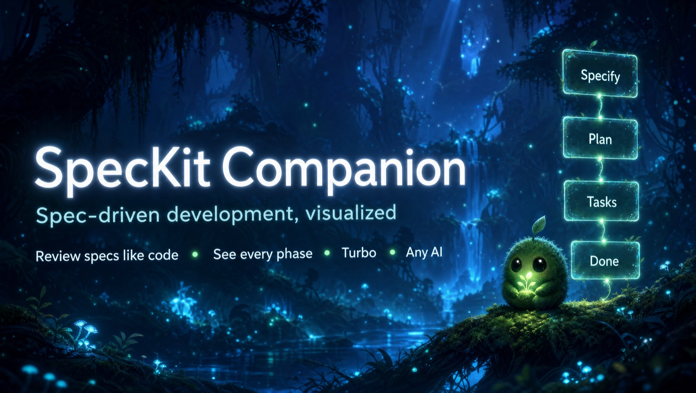
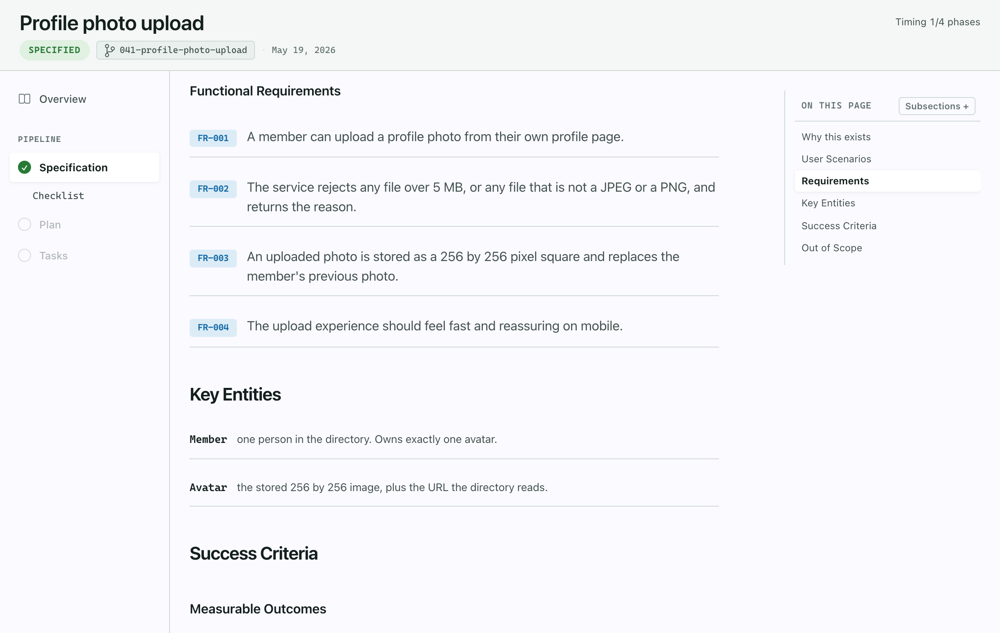
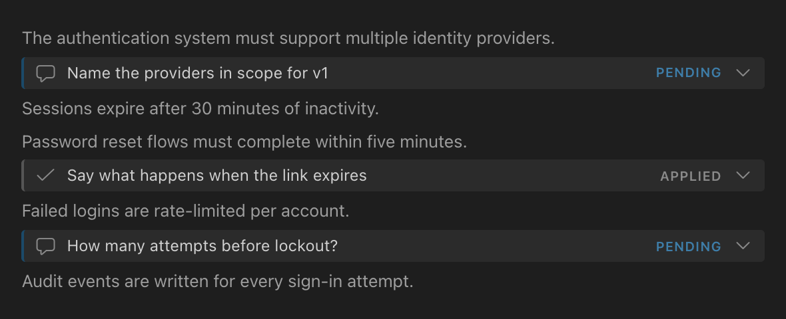
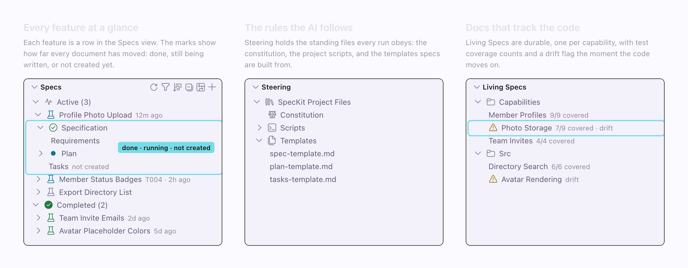

# SpecKit Companion: see and steer everything your AI builds, from first spec to shipped code

<!-- Headline alternates (swap the H1 above for one of these if preferred):
  1. SpecKit Companion: the whole spec lifecycle, visible and under your control
  2. SpecKit Companion: know what your AI is doing before, during, and after it writes code
-->

**One workspace for the whole life of a spec, not just the review.** SpecKit Companion is a spec workspace inside VS Code for developers running AI agents through spec-driven development. See where every feature stands at a glance, read specs as real documents, review and correct them the way you review pull requests, watch runs move live, keep a record of what the AI actually did, and keep living specs that stay true after the code ships. A vague requirement still dies here before it becomes 200 lines of wrong implementation.

<!-- Walkthrough video link pulled pending Alfredo's review of the video itself. The plan is per-section GIFs (media/feature-clips) instead of one long walkthrough; the file itself stays at docs/media/walkthrough.mp4. -->

## Features

### Visual Spec Viewer

Specs render as rich, structured pages, not walls of markdown: requirements as labeled rows, acceptance scenarios as clean Given/When/Then sentences, tasks grouped under their phases, and mermaid diagrams inline with zoom. A quiet footer advances the spec one click at a time, and it never advances ahead of a running step. The markdown stays in your repo, never on a server.

<!-- TODO: swap this still for the spec-viewer feature clip (media/feature-clips/spec-viewer) once the GIFs are promoted. -->

### Inline Review Comments

Comment on specific lines of a spec, exactly like a pull request review. Comments persist the moment you add them, survive closing the tab, and are committable, so a half-finished review picks up next session or on another machine. Click **Refine** and the pending comments are dispatched to your AI for an in-place edit of the source.

<!-- TODO: swap this still for the inline-comments feature clip (media/feature-clips/inline-comments) once the GIFs are promoted. -->

### Overview: the run's story

A spec with recorded activity opens on its Overview: why the spec exists, its constraints, the decisions made (with rejected alternatives), what was verified, and a requirement-to-test traceability table. It is the dossier a future session, a reviewer, or a teammate reads instead of re-asking you.

<!-- Animated clip built from media/feature-clips/overview-readme; the still overview-annotated.png stays on disk as the docs fallback. -->

### A sidebar that scales

Specs grouped by lifecycle with live status per document, resume-where-you-left-off on hover, filter and sort, multi-select bulk actions, and views for living capability specs and AI steering documents. A workspace with hundreds of finished specs opens to a short, readable list.

<!-- TODO: swap this still for the specs-sidebar feature clip (media/feature-clips/specs-sidebar) once the GIFs are promoted. -->

### Pick a pipeline once, run it end to end

Choose stock Spec Kit or the leaner **SpecKit Companion** workflow in a single setting, and every step of the run dispatches that choice. The Companion pipeline writes specs roughly 60 to 68% smaller, produces zero throwaway side files, and right-sizes itself: a small change skips the ceremony, a large one keeps the full specify, plan, tasks, implement flow. In our benchmark, correctness was a tie; the difference is ceremony, not outcomes. Details and the measured numbers: [Workflow choice](./docs/configuration.md#workflow-choice).

### Also in the box

- **Bring your own SDD process.** Custom phases, custom commands, custom output files; the sidebar and viewer adapt. [Custom workflows](./docs/configuration.md#custom-workflows)
- **Living specs.** Durable per-capability documents that stay current as the code evolves, with drift detection and one-pass sync. [Living specs](./speckit-extension/docs/living-specs.md)
- **Offline-first and careful by default.** Fonts and icons ship in the `.vsix`, destructive actions need confirmation or offer undo, and Reduce Motion is honored. [Viewer reference](./docs/viewer.md)

## No lock-in, no server

Everything lives in plain files in your repo: the spec markdown plus a `.spec-context.json` per spec. The viewer and your terminal are two front-ends over the same files, so a step driven from either surface shows up in the other, and there is no extension-owned database to migrate away from. The extension dispatches command text to the AI you configure and reads what lands on disk; your prompts and specs never pass through anyone's server. How the pieces fit: [Getting started](./docs/getting-started.md).

## Install

1. Install **SpecKit Companion** from the VS Code Marketplace.
2. Click the SpecKit icon in the activity bar and open a folder.
3. Click **+** in the Specs view, describe your feature, and pick the AI you already use.

That's it: the viewer, review comments, and sidebar work on their own. To also get the lean Companion pipeline, live progress capture, and the Resume button, add the [companion Spec Kit extension](./docs/getting-started.md#install-the-spec-kit-extension): the sidebar offers a one-click install when it's missing.

## Works with your AI

Dispatches to Claude Code, GitHub Copilot, Gemini, Codex, and more, in a terminal or in your editor's chat panel. Full compatibility matrix: [Supported AI providers](./docs/providers.md).

## Docs

- [Getting started](./docs/getting-started.md): full install story, required vs. optional pieces, platform support
- [Spec viewer reference](./docs/viewer.md): reading, reviewing, creating, safety affordances
- [Sidebar reference](./docs/sidebar.md): every view, icon, and action
- [Configuration](./docs/configuration.md): all settings, custom workflows, custom commands
- [Supported AI providers](./docs/providers.md): the compatibility matrix and dispatch styles
- [Living specs](./speckit-extension/docs/living-specs.md): durable capability specs, drift, sync, adoption
- [Telemetry](./docs/telemetry.md): exactly what is and isn't collected, and both off switches
- [`.spec-context.json` schema](./docs/spec-context-schema.md): the on-disk state file
- [How it works](./docs/how-it-works.md): architecture walkthrough
- [Contributing](CONTRIBUTING.md) · [Changelog](./CHANGELOG.md)

## Telemetry

The extension sends anonymous, PII-free usage telemetry (provider choice, phase dispatched, lifecycle counts; never prompt content, paths, or names). Two switches gate it, and if either is off nothing is sent: `speckit.telemetry` and VS Code's global telemetry level. Full disclosure: [Telemetry](./docs/telemetry.md).

## Support

SpecKit Companion is free and open source. If it saves you time, you can support its development through [GitHub Sponsors](https://github.com/sponsors/alfredoperez). You'll also find a "Sponsor" button on the Marketplace listing and a "Support this project" link in the Specs sidebar.

## Acknowledgments

This project started from the amazing work at https://github.com/notdp/kiro-for-cc

## License

MIT License
