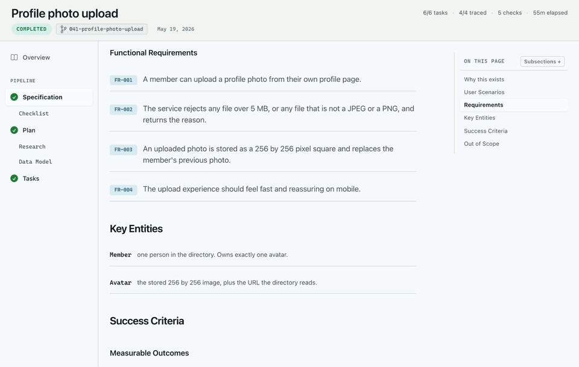
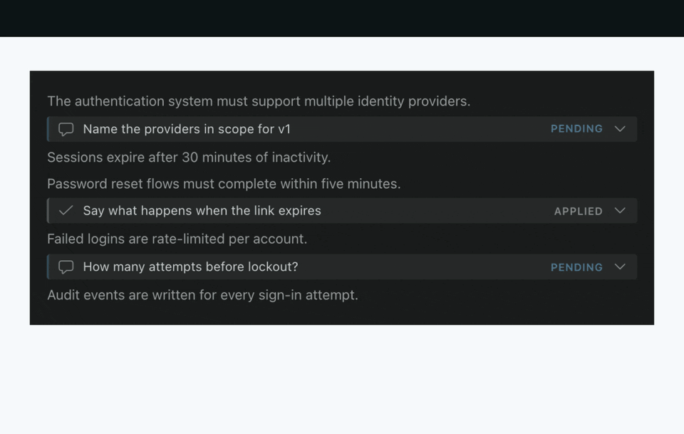
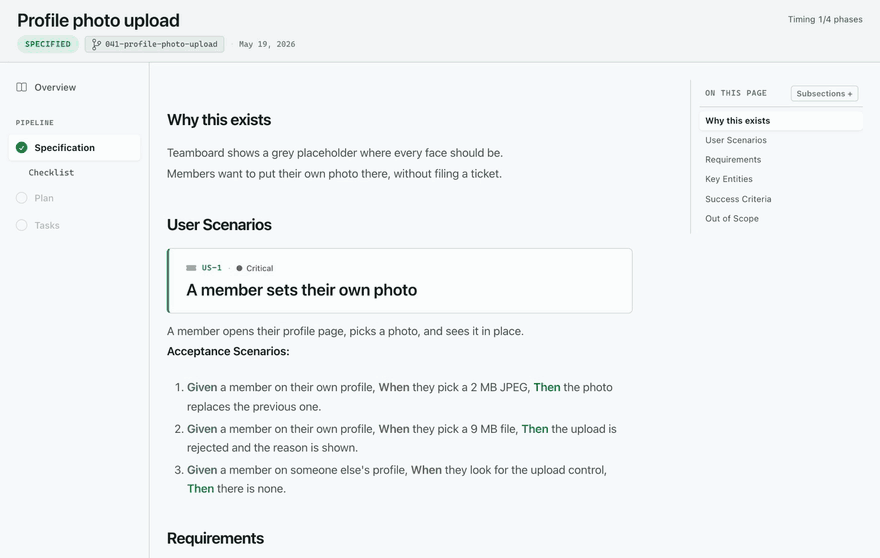
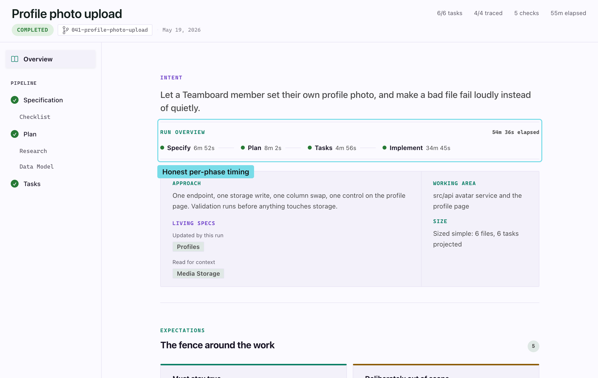
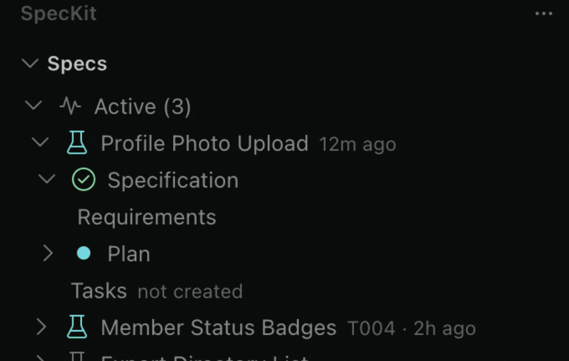
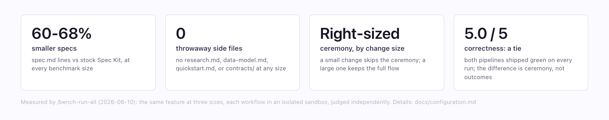
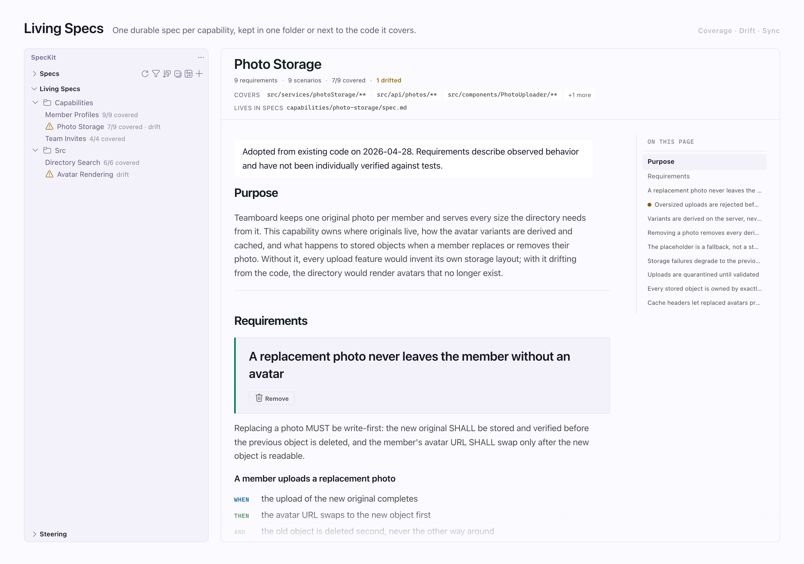
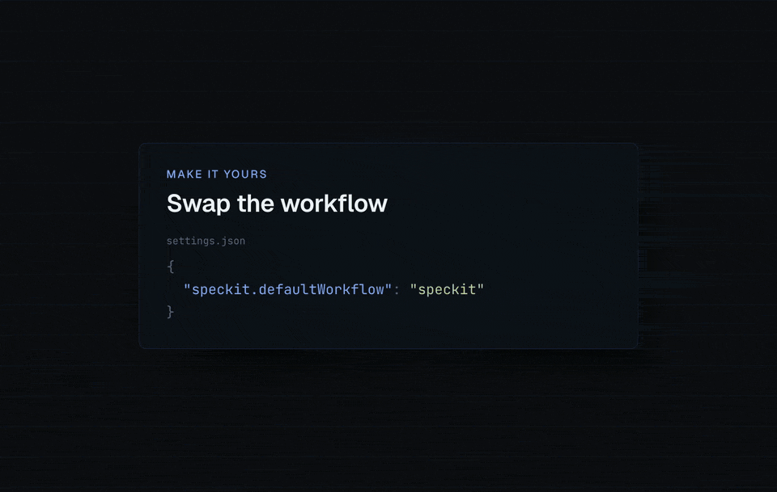

# SpecKit Companion: see and steer everything your AI builds, from first spec to shipped code

<!-- Headline alternates (swap the H1 above for one of these if preferred):
  1. SpecKit Companion: the whole spec lifecycle, visible and under your control
  2. SpecKit Companion: know what your AI is doing before, during, and after it writes code
-->

**One workspace for the whole life of a spec, not just the review.** SpecKit Companion is a spec workspace inside VS Code for developers running AI agents through spec-driven development. See where every feature stands at a glance, read specs as real documents, review and correct them the way you review pull requests, watch runs move live, keep a record of what the AI actually did, and keep living specs that stay true after the code ships. Its own pipeline writes specs **60 to 68% leaner with the same correctness** ([the measured numbers](./docs/configuration.md#workflow-choice)) — and a vague requirement still dies here before it becomes 200 lines of wrong implementation.

<!-- IMAGE PATHS: this README keeps RELATIVE paths on purpose. It is rendered by GitHub
     and by vsce for the Marketplace, and both resolve relative paths (vsce rewrites them
     to absolute raw URLs at package time). Only speckit-extension/README.md uses absolute
     raw.githubusercontent URLs, because the Spec Kit community catalog renders it from
     main and cannot resolve relative paths. -->
<!-- The hero is the Overview GIF (built from media/feature-clips/overview-readme): frame
     zero is a representative still by design, so it reads even paused. The composed C1
     still stays regenerable at docs/screenshots/generated/hero.png (no longer referenced
     here); the retired illustrated hero stays on disk at docs/screenshots/hero.jpg. -->

<!-- Walkthrough video link pulled pending Alfredo's review of the video itself. The plan is per-section GIFs (media/feature-clips) instead of one long walkthrough; the file itself stays at docs/media/walkthrough.mp4. -->

## Features

### Visual Spec Viewer

Specs render as rich, structured pages, not walls of markdown: requirements as labeled rows, acceptance scenarios as clean Given/When/Then sentences, tasks grouped under their phases, and mermaid diagrams inline with zoom. A quiet footer advances the spec one click at a time, and it never advances ahead of a running step. The markdown stays in your repo, never on a server.

### Inline Review Comments

Comment on specific lines of a spec, exactly like a pull request review. Comments persist the moment you add them, survive closing the tab, and are committable, so a half-finished review picks up next session or on another machine. Click **Refine** and the pending comments are dispatched to your AI for an in-place edit of the source.

### Watch a run in flight

A run is not a black box you check on afterwards. The pipeline rail unlocks phase by phase, one button always offers the next step, tasks tick over live while implement runs, and the actions stay locked until the step settles — then the Overview shows exactly how long each phase took.

<!-- Rendered from media/feature-clips/run-in-flight (see its STORYBOARD.md); frame zero
     is the specified-state rail at rest, so it reads even paused. -->

### Overview: the run's story

A spec with recorded activity opens on its Overview: why the spec exists, its constraints, the decisions made (with rejected alternatives), what was verified, and a requirement-to-test traceability table. It is the dossier a future session, a reviewer, or a teammate reads instead of re-asking you.

<!-- The animated Overview tour (overview.gif) moved to the top of this README as the hero;
     this section keeps the annotated still (A6 story + the capture script's callout pass). -->

### A sidebar that scales

Specs grouped by lifecycle with live status per document, resume-where-you-left-off on hover, filter and sort, multi-select bulk actions, and views for living capability specs and AI steering documents. A workspace with hundreds of finished specs opens to a short, readable list.

### Pick a pipeline once, run it end to end

Choose stock Spec Kit or the leaner **SpecKit Companion** workflow in a single setting, and every step of the run dispatches that choice. The Companion pipeline writes specs roughly 60 to 68% smaller, produces zero throwaway side files, and right-sizes itself: a small change skips the ceremony, a large one keeps the full specify, plan, tasks, implement flow. In our benchmark, correctness was a tie; the difference is ceremony, not outcomes. Details and the measured numbers: [Workflow choice](./docs/configuration.md#workflow-choice).

<!-- Numbers quoted from docs/configuration.md#workflow-choice; change them there
     first, then regenerate this image (C2 in ReadmeCapture.stories.tsx). -->

### Living specs: one per capability, wherever you keep them

Feature specs describe one change and then go quiet. **Living specs** are durable: one per capability (checkout, auth, billing), loaded into the AI's context when a feature touches that area, and folded back up to date when the feature ships. Keep them together in a central `capabilities/` folder, or colocated, each spec right next to the feature it covers, with one reversible command to move between the two. Either way the sidebar shows per-capability test coverage and flags drift the moment the code moves on, and one sync pass updates every affected spec from your current changes. Opt-in, append-only, and never a failed run. [Living specs](./speckit-extension/docs/living-specs.md)

<!-- This composition (Storybook story C3 in ReadmeCapture.stories.tsx, captured by
     scripts/capture-docs-images.mjs) is also the storyboard seed for the future Living
     Specs GIF: sidebar row → click → viewer opens → drift → Update. -->

### Also in the box

- **Bring your own SDD process.** Custom phases, custom commands, custom output files; the sidebar and viewer adapt. [Custom workflows](./docs/configuration.md#custom-workflows)
- **Offline-first and careful by default.** Fonts and icons ship in the `.vsix`, destructive actions need confirmation or offer undo, and Reduce Motion is honored. [Viewer reference](./docs/viewer.md)

<!-- Rendered from media/feature-clips/make-it-yours (see its STORYBOARD.md). Every key
     and value on screen is real: change the contributed configuration in package.json
     and this composition is stale. -->

<!-- Cross-promo banner (C5 in ReadmeCapture.stories.tsx, captured by
     scripts/capture-docs-images.mjs). The whole image is a link to the engine
     extension's install guide; the extension README carries the mirror banner
     (C6) pointing back at this extension. -->

### See the pipeline your project runs

The Companion pipeline is assembled from blocks: steps hold **phases**, phases hold **nodes**, and a project can rearrange them, attach its own work at any boundary, reshape a document template, or change where the size verdict routes — all from `.specify/companion.yml`.

Open it from the **circuit** icon at the top of the Specs sidebar, or from the palette. The four steps are columns in run order, with `auto` above the row because it runs the others rather than taking a turn among them. Inside each step: its phases, the nodes in them, and the hooks attached — each drawn on the side it runs, with a connector into the block it acts on.

**One colour means yours.** Hooks, nodes you rewrote and template sections you replaced all carry the same mark, and nothing else does, so what your project changed is answerable at a glance. Click a node to read its instructions right there, with what it writes, what it needs, and whether it can be moved.

**Several ways of working.** A workflow is a whole named configuration in `.specify/companion/workflows/`. Switch between them from the header and everything swaps at once — node order, hooks, templates, routing — so a one-line fix and a client deliverable can run different pipelines out of the same repository. Nodes and fragments are shared across all of them, and "as it ships" is always there to compare against.

**Rearrange it.** Drag a node to move it within its phase. A node free to move shows a grip; one held in place by something that reads it shows a lock and names what is holding it, so nothing looks draggable and then refuses. The new order is saved to `companion.yml` with the rest of the file untouched.

**Attach your own work.** **Attach** on any phase asks what should happen there — invoke a **skill** you already have, follow an **instruction**, or run a **command**. Reach for the skill first: a skill you have written already holds the instructions, so the pipeline points at it instead of keeping a copy that drifts.

**Rewrite a node in your own words.** Press **Replace** on any node and its instructions are copied to `.specify/companion/nodes/<step>/<node>.md`, where you can edit them. Build, and your version is what your assistant reads; the node is marked **YOURS** in the panel until you press **Use shipped** to hand it back. Nothing under `speckit-extension/` is touched, so an upgrade never overwrites your copy — and never silently reverts it either.

Build from the same panel, or from the palette:

| Command | What it does |
|---|---|
| **Open Pipeline Builder** | Draw the pipeline your configuration resolves to |
| **Preview Pipeline Build** | Show what a build would change, writing nothing |
| **Build Pipeline from companion.yml** | Apply the configuration |

When `companion.yml` is newer than the commands built from it, the extension says so once per session — otherwise the file says one thing while your assistant reads another, and nothing about a run looks wrong. Requires the [spec-kit extension](./docs/getting-started.md#install-the-spec-kit-extension), which holds the pipeline sources.

## No lock-in, no server

Everything lives in plain files in your repo: the spec markdown plus a `.spec-context.json` per spec. The viewer and your terminal are two front-ends over the same files, so a step driven from either surface shows up in the other, and there is no extension-owned database to migrate away from. The extension dispatches command text to the AI you configure and reads what lands on disk; your prompts and specs never pass through anyone's server. How the pieces fit: [Getting started](./docs/getting-started.md).

## Install

1. Install **SpecKit Companion** from the VS Code Marketplace.
2. Click the SpecKit icon in the activity bar and open a folder.
3. Click **+** in the Specs view, describe your feature, and pick the AI you already use.

That's it: the viewer, review comments, and sidebar work on their own. To also get the lean Companion pipeline, live progress capture, and the Resume button, add the [companion Spec Kit extension](./docs/getting-started.md#install-the-spec-kit-extension): the sidebar offers a one-click install when it's missing.

## Works with your AI

Dispatches to Claude Code, GitHub Copilot, Gemini, Codex, and more, in a terminal or in your editor's chat panel. Full compatibility matrix: [Supported AI providers](./docs/providers.md).

## Docs

- [Getting started](./docs/getting-started.md): full install story, required vs. optional pieces, platform support
- [Spec viewer reference](./docs/viewer.md): reading, reviewing, creating, safety affordances
- [Sidebar reference](./docs/sidebar.md): every view, icon, and action
- [Configuration](./docs/configuration.md): all settings, custom workflows, custom commands
- [Supported AI providers](./docs/providers.md): the compatibility matrix and dispatch styles
- [Living specs](./speckit-extension/docs/living-specs.md): durable capability specs, drift, sync, adoption
- [Telemetry](./docs/telemetry.md): exactly what is and isn't collected, and both off switches
- [`.spec-context.json` schema](./docs/spec-context-schema.md): the on-disk state file
- [How it works](./docs/how-it-works.md): architecture walkthrough
- [Contributing](CONTRIBUTING.md) · [Changelog](./CHANGELOG.md)

## Telemetry

The extension sends anonymous, PII-free usage telemetry (provider choice, phase dispatched, lifecycle counts; never prompt content, paths, or names). Two switches gate it, and if either is off nothing is sent: `speckit.telemetry` and VS Code's global telemetry level. Full disclosure: [Telemetry](./docs/telemetry.md).

## Support

SpecKit Companion is free and open source. If it saves you time, you can support its development through [GitHub Sponsors](https://github.com/sponsors/alfredoperez). You'll also find a "Sponsor" button on the Marketplace listing and a "Support this project" link in the Specs sidebar.

## Acknowledgments

This project started from the amazing work at https://github.com/notdp/kiro-for-cc

## License

MIT License
