# SpecKit Companion: see and steer everything your AI builds, from first spec to shipped code


**[speckit-companion.dev](https://speckit-companion.dev)** · **[Docs](https://speckit-companion.dev/docs/)** · **[Install](https://speckit-companion.dev/docs/install)** · **[Your first spec](https://speckit-companion.dev/docs/start/your-first-spec/)** · **[Changelog](https://speckit-companion.dev/changelog/)**

SpecKit Companion is a VS Code extension for developers who build with an AI assistant and [Spec Kit](https://github.com/github/spec-kit). It shows every spec in your project, renders each one as a page you can read and comment on, follows a run while it happens, and keeps a record of what the AI did and why. Your specs stay plain markdown in your repo.

<!-- The hero is the Overview GIF (built from content/media/feature-clips/overview): frame
     zero is a representative still by design, so it reads even paused. The composed C1
     still stays regenerable at docs/screenshots/generated/hero.png (no longer referenced
     here); the retired illustrated hero stays on disk at docs/screenshots/hero.jpg. -->


**What's new in 0.36.0:** follow a Spec Kit run from inside Claude Code with the new mod, which pins your spec above the prompt and ticks off steps and tasks beside the transcript. Bugs and ideas get their own sidebar panes and open as pages: a bug reads as a story, a decided idea as a decision. The viewer gains buttons to answer an open question, run Converge and create GitHub issues from the task list, and the Copilot app board now follows any Spec Kit project. Full notes: [Changelog](https://speckit-companion.dev/changelog/).

## Install

Search for **SpecKit Companion** in the Extensions view, or run:

```bash
code --install-extension alfredoperez.speckit-companion
```

Open a folder, click the SpecKit icon in the activity bar, and pick your AI assistant when it asks. That is enough to read, review and run specs. It is on Open VSX too.

### Install the Spec Kit extension

This second half is optional. It records each run (step times, decisions, checks) and brings the leaner Companion pipeline, the Resume button and living specs. Add it from your project root:

```bash
specify extension add companion --from https://github.com/alfredoperez/speckit-companion/releases/download/companion-latest/companion.zip --force
```

That command needs a Spec Kit CLI that has extensions. The full walkthrough, with what to do when a step fails, is on the [install page](https://speckit-companion.dev/docs/install).

## What you get

### Specs you can read

A spec opens as a page, not a wall of markdown. Requirements are labeled rows, acceptance scenarios read as Given, When, Then, tasks sit under their phases, and mermaid diagrams render inline with zoom. A footer offers the next step, and never moves ahead of a step that is still running.

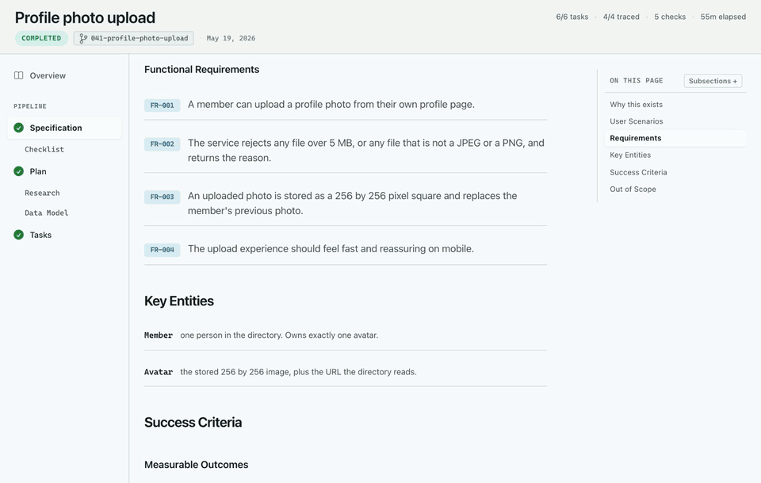

### Review comments on any line

Comment on a line of a spec the way you review a pull request. A comment is saved the moment you add it and can be committed, so a review picks up next session or on another machine. Click **Refine** and your pending comments go to your assistant, which edits the spec in place.

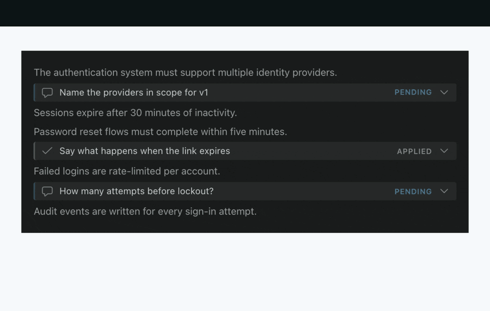

### A run you can watch

The pipeline rail unlocks step by step, one button always offers the next step, and tasks tick over while implement runs. The actions stay locked until the step settles.

<!-- Rendered from content/media/feature-clips/run-in-flight (see its STORYBOARD.md); frame zero
     is the specified-state rail at rest, so it reads even paused. -->
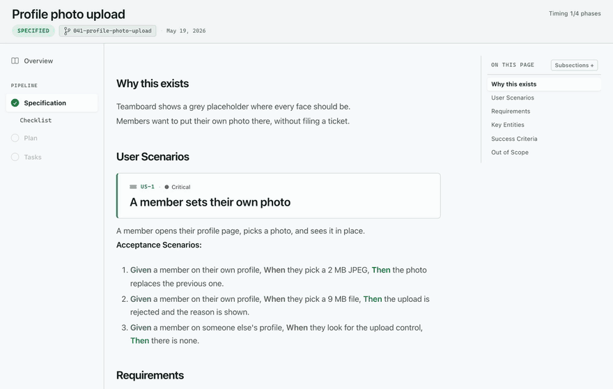

### An Overview of what the run did

A spec with a recorded run opens on its Overview: why the spec exists, how long each step took, the decisions made and what each one rejected, what was verified, and which requirement is covered by which test. A reviewer or a later session reads it and does not have to ask you. It needs the Companion Spec Kit extension, which writes the record.

<!-- The animated Overview tour (overview.gif) is the hero at the top of this README;
     this section keeps the annotated still (A6 story + the capture script's callout pass). -->
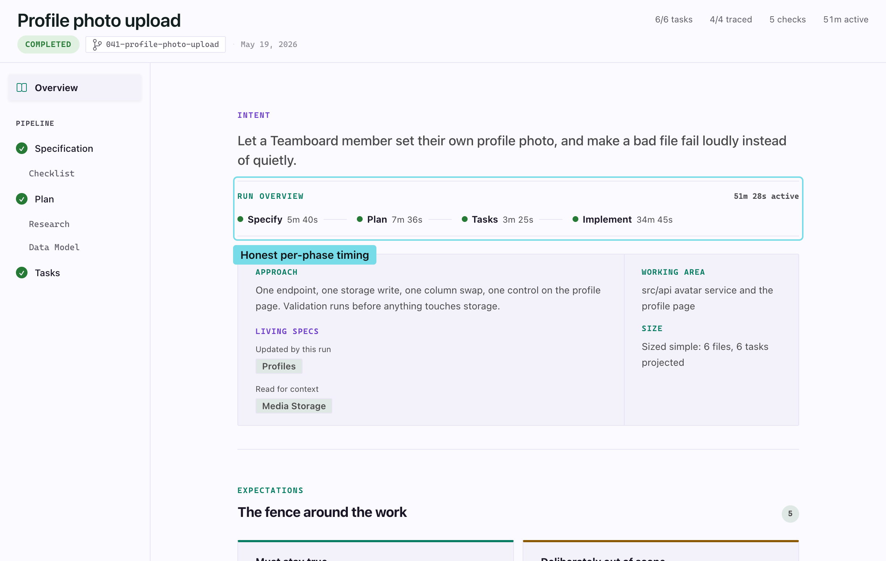

### A sidebar for every spec

Specs are grouped by where they stand, with live status on each document and the assistant each spec was last sent to. Hover a spec to resume it. Filter, sort, or select several at once. A workspace with hundreds of finished specs still opens to a short list.

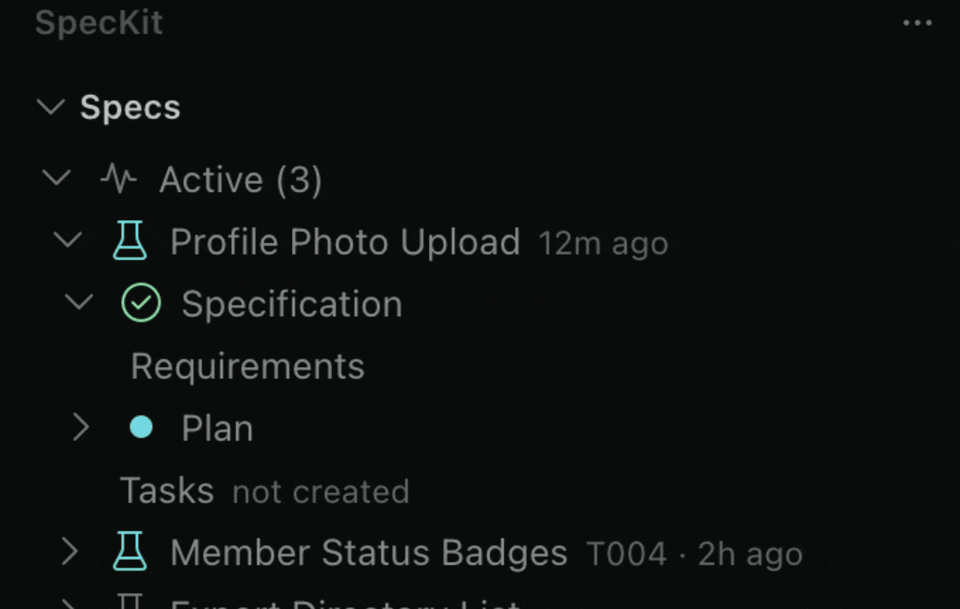

### Bugs and ideas beside your specs

Spec Kit's bug flow and its idea assessment each get a pane under Specs. Bugs are grouped as To fix, To test, Verified and Closed. Ideas are grouped as Assessing and Decided, with the verdict on each row. Press **+** on a pane to open **New Bug** or **New Idea**, describe it, and send it to your assistant. A pane offers to install its Spec Kit extension when it is missing.

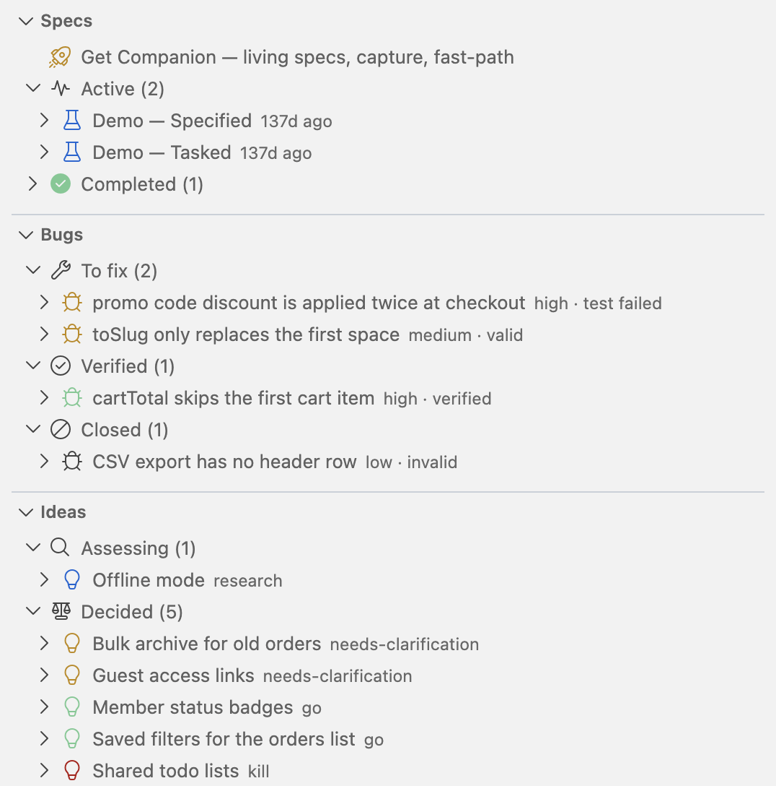

A bug opens on its **Story**: one sentence saying where it stands, then what was wrong, what changed and how it was verified. The button at the foot of the page is the next step: **Fix bug**, then **Test fix**.

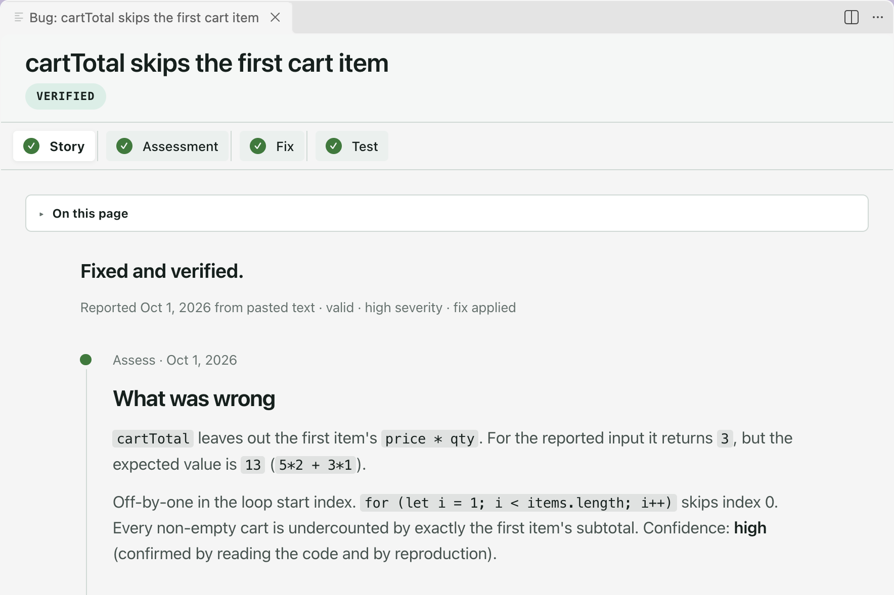

A decided idea opens on its **Decision**: the verdict, the reason for it, and a scorecard. From a go decision you can create the spec.

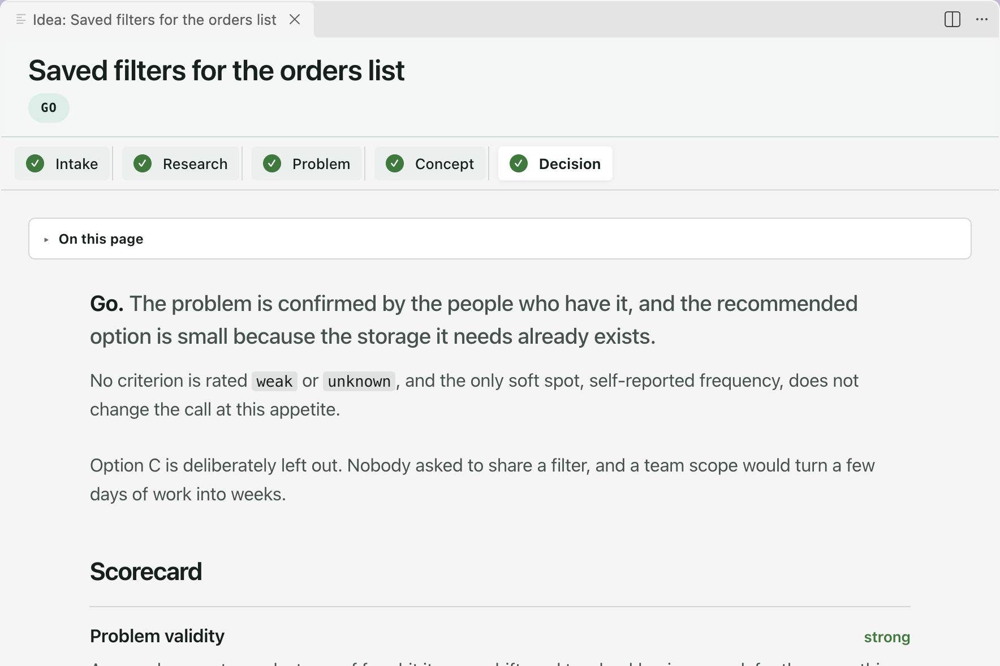

When a report has an open question, click **Answer**, type your reply and send it. Your assistant runs the report's command again with your answer, and the report comes back settled.

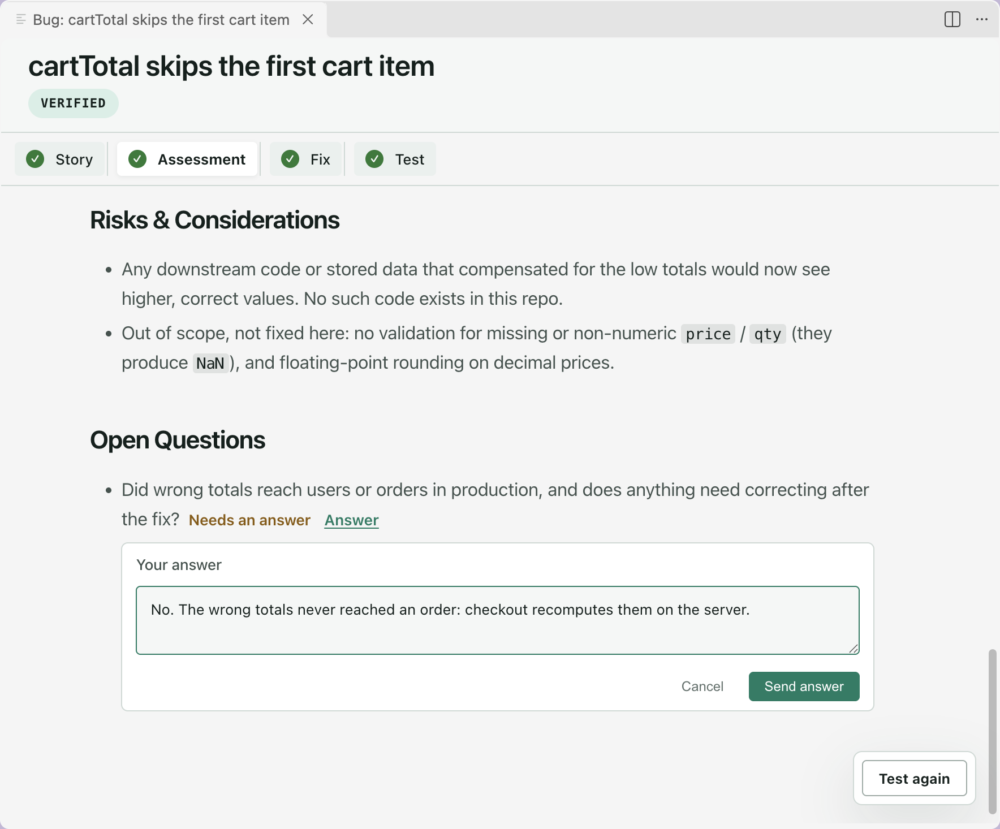

Guides: [Fix a bug](https://speckit-companion.dev/docs/ide/fix-a-bug) and [Assess an idea](https://speckit-companion.dev/docs/ide/assess-an-idea).

### After the tasks: GitHub issues and Converge

On the Tasks tab, **Other actions** has **Create GitHub issues**: one issue per task, sent as Spec Kit's `/speckit.taskstoissues`. Companion asks first, because the issues are real. It needs a GitHub remote and the GitHub MCP server.

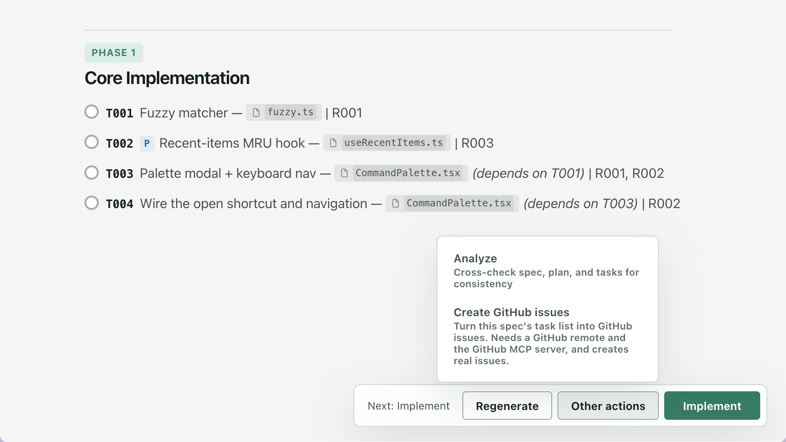

A spec whose build is done has a **Converge** button in the footer and in its sidebar menu. It sends Spec Kit's `/speckit.converge`, which checks the code against the spec and adds any work still missing to the task list.

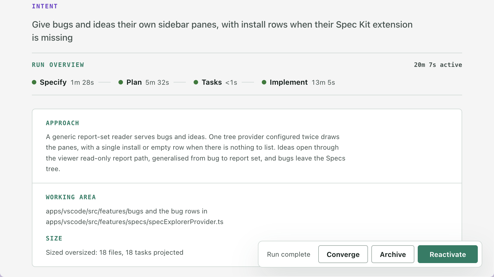

### Stock Spec Kit or the leaner Companion pipeline

Choose the workflow once in `speckit.defaultWorkflow`, and every step of a run sends that choice. The Companion pipeline writes specs about 60 to 68% smaller, leaves no throwaway side files, and sizes itself to the change: a small one skips the ceremony, a large one keeps the full specify, plan, tasks, implement flow. In our benchmark correctness was a tie. The numbers are under [Workflow choice](https://speckit-companion.dev/docs/reference/configuration#workflow-choice).

<!-- Numbers quoted from the website's Configuration reference (workflow-choice section); change them there
     first, then regenerate this image (C2 in ReadmeCapture.stories.tsx). -->
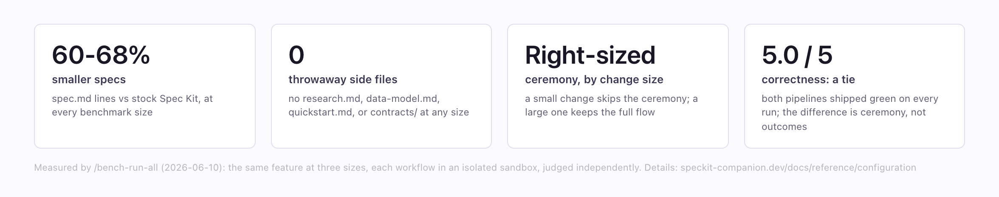

### Living specs

A feature spec describes one change and then goes quiet. A **living spec** describes one capability, such as checkout or billing, and stays current. Your assistant reads it when a feature touches that area, and it is updated when the feature ships. Keep living specs in one folder or next to the code they describe.

The sidebar shows test coverage for each capability and flags drift when the code moves on. The viewer shows each requirement as a card you can approve or remove, and the status bar says how many living specs describe the file you have open. Living specs are opt-in. Guide: [Living specs](https://speckit-companion.dev/docs/results/living-specs).

<!-- This composition (Storybook story C3 in ReadmeCapture.stories.tsx, captured by
     tooling/scripts/capture-docs-images.mjs) is also the storyboard seed for the future Living
     Specs GIF: sidebar row → click → viewer opens → drift → Update. -->
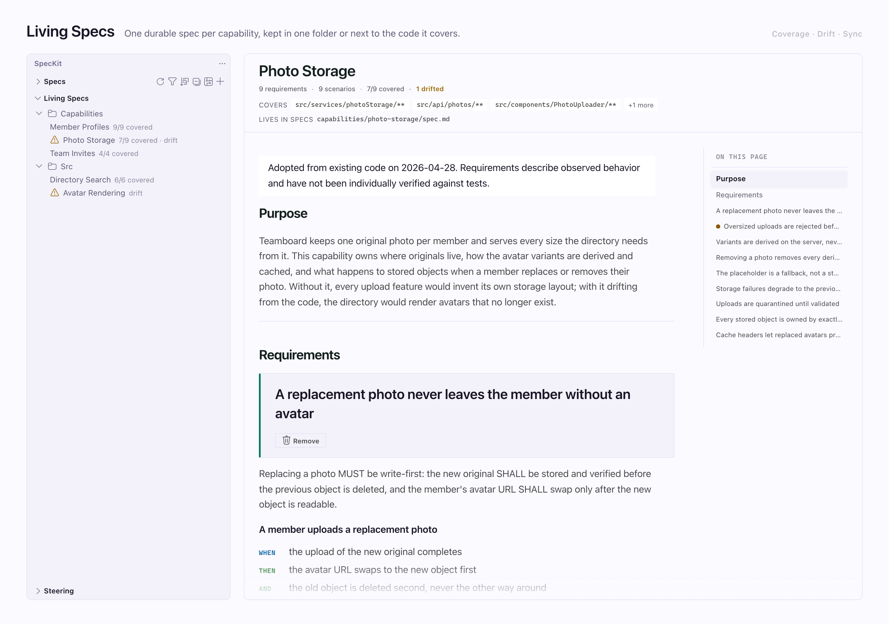

### A pipeline you can see and change

The **Workflow Builder** draws the Companion pipeline your project runs: each step as a column, its phases, the nodes in them, and the hooks attached. Open it from the circuit icon at the top of the Specs sidebar.

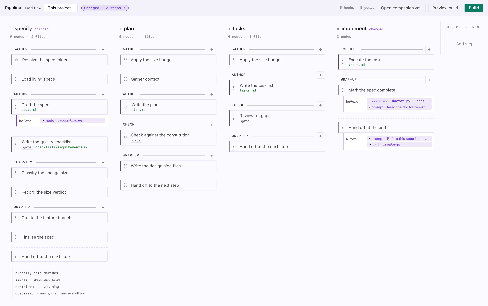

From the board you can:

- **Attach your own work** before or after any phase: a skill, an instruction, a shell command or a node of your own.
- **Rearrange nodes** by dragging, or move one to another phase.
- **Rewrite a node** in your own words. An upgrade never overwrites your copy.
- **Add a step** of your own, with its own `/speckit.companion.<name>` command.
- **Change where a decision routes**: pick which steps each answer to "how big is this change?" skips, and what it warns first.
- **Turn living specs on or off** and choose where the specs live, with the capabilities you registered listed beside them.
- **Keep several workflows** and switch between them, starting from what you run today or from one Companion ships.

Everything your project changed carries one colour, so you can tell at a glance what is yours. Changes are saved to `.specify/companion.yml`, and **Build** applies them. Guide: [Workflow Builder](https://speckit-companion.dev/docs/customize/workflow-builder). It needs the Companion Spec Kit extension.

| Command | What it does |
|---|---|
| **Open Workflow Builder** | Draw the pipeline your configuration resolves to |
| **Preview Pipeline Build** | Show what a build would change, writing nothing |
| **Build Pipeline from companion.yml** | Apply the configuration |

### Also in the box

- **Your own process.** Custom phases, custom commands and custom output files, written in VS Code settings rather than on the Workflow Builder board, and the sidebar and viewer adapt. [Custom workflows](https://speckit-companion.dev/docs/reference/configuration#custom-workflows)
- **Which assistant has which spec.** A spec you run from Companion shows the assistant's name on its sidebar row and in the viewer header, and **Show Terminal** brings its terminal to the front while that terminal is open. [Sidebar reference](https://speckit-companion.dev/docs/navigate/the-sidebar)
- **Multi-root workspaces.** Companion picks the folder that holds your Spec Kit files, or the one you name in `speckit.projectFolder`. [Configuration](https://speckit-companion.dev/docs/reference/configuration)
- **Works offline, careful by default.** Fonts and icons ship with the extension, destructive actions ask first or offer undo, and Reduce Motion is honored. [Viewer reference](https://speckit-companion.dev/docs/navigate/inside-the-viewer)

<!-- Rendered from content/media/feature-clips/make-it-yours (see its STORYBOARD.md). Every key
     and value on screen is real: change the contributed configuration in package.json
     and this composition is stale. -->
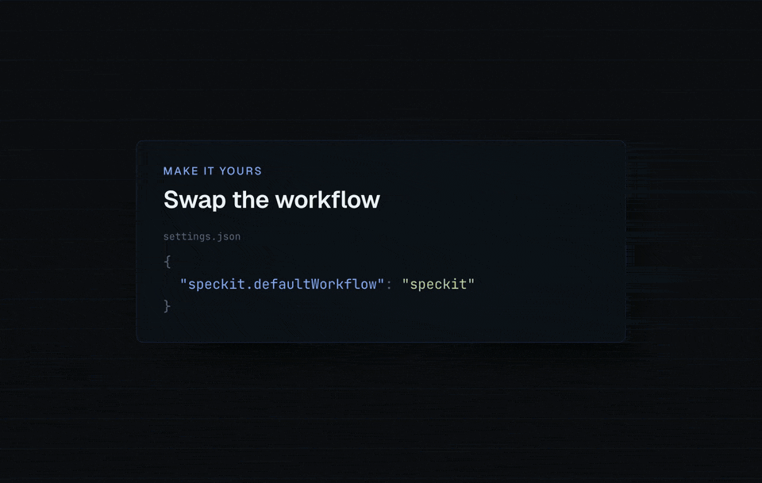

## Works with your AI

Companion sends each step to the assistant you choose in `speckit.aiProvider`: Claude Code, Oh My Pi, Gemini CLI, GitHub Copilot CLI, Codex CLI, Qwen Code, OpenCode, Wibey or Antigravity in a terminal, or the chat panel of your editor (Copilot, Cursor, Windsurf, the Claude Code panel). What each one supports: [Supported AI providers](https://speckit-companion.dev/docs/reference/providers).

It works with stock Spec Kit. Without the Companion Spec Kit extension a spec still renders, comments still work and each step runs the stock `/speckit.*` commands. A run just has less recorded about it.

## Outside VS Code

The same specs and the same run record show up in two other places. Neither needs the VS Code extension.

### In the GitHub Copilot app

The spec board opens as a canvas next to the chat. It lists every spec with its pipeline and tasks, updates as the agent writes, and runs the next step from a button. [Install the board](https://speckit-companion.dev/docs/copilot-app/install/)


A recreation of a run, sped up. The board is the real one, and the window around it is a stand-in for the Copilot app.

### In Claude Code

The SpecKit Companion mod shows where the run stands in a band above the prompt and a pane beside the transcript, with `/speckit-tracker` to switch specs. [Install the mod](https://speckit-companion.dev/docs/claude-code/install/)

```bash
claude plugin marketplace add https://speckit-companion.dev/plugins/marketplace.json
claude plugin install speckit-companion@speckit-companion
```


<!-- Cross-promo banner (C5 in ReadmeCapture.stories.tsx, captured by
     tooling/scripts/capture-docs-images.mjs). The whole image is a link to the engine
     extension's install guide; the extension README carries the mirror banner
     (C6) pointing back at this extension. -->
[](https://speckit-companion.dev/docs/install)

## No lock-in, no server

Everything lives in plain files in your repo: the spec markdown, and a `.spec-context.json` run record beside each spec. The viewer and your terminal read the same files, so a step you run in one shows up in the other. The extension sends command text to the assistant you chose and reads what lands on disk. Your prompts and specs never pass through a server of ours.

## Docs

The docs live at [speckit-companion.dev/docs](https://speckit-companion.dev/docs/).

- **Start**: [Install](https://speckit-companion.dev/docs/install), [Your first spec](https://speckit-companion.dev/docs/start/your-first-spec/) and [Spec-driven development](https://speckit-companion.dev/docs/start/spec-driven-development/)
- **In your IDE**: [the sidebar](https://speckit-companion.dev/docs/navigate/the-sidebar), [inside the viewer](https://speckit-companion.dev/docs/navigate/inside-the-viewer), [each step](https://speckit-companion.dev/docs/steps/specify), [the Overview](https://speckit-companion.dev/docs/results/the-overview), [living specs](https://speckit-companion.dev/docs/results/living-specs) and the [Workflow Builder](https://speckit-companion.dev/docs/customize/workflow-builder)
- **In the Copilot app**: [install the board](https://speckit-companion.dev/docs/copilot-app/install/) and [run the steps](https://speckit-companion.dev/docs/copilot-app/run-the-steps)
- **In Claude Code**: [install the mod](https://speckit-companion.dev/docs/claude-code/install/) and [what it shows](https://speckit-companion.dev/docs/claude-code/what-it-shows)
- **Reference**: [configuration](https://speckit-companion.dev/docs/reference/configuration), [commands](https://speckit-companion.dev/docs/reference/commands), [AI providers](https://speckit-companion.dev/docs/reference/providers) and [telemetry](https://speckit-companion.dev/docs/reference/telemetry)
- **In this repo**: [Getting started from source](./docs/getting-started.md), [Architecture](./docs/architecture.md), [Contributing](CONTRIBUTING.md) and the [Changelog](./CHANGELOG.md)

## Telemetry

The extension sends anonymous, PII-free usage telemetry (provider choice, phase dispatched, lifecycle counts; never prompt content, paths, or names). Two switches gate it, and if either is off nothing is sent: `speckit.telemetry` and VS Code's global telemetry level. Full disclosure: [Telemetry](https://speckit-companion.dev/docs/reference/telemetry).

## Support

SpecKit Companion is free and open source. If it saves you time, you can support its development through [GitHub Sponsors](https://github.com/sponsors/alfredoperez). You'll also find a "Sponsor" button on the Marketplace listing and a "Support this project" link in the Specs sidebar.

## Acknowledgments

This project started from the amazing work at https://github.com/notdp/kiro-for-cc

## License

[MIT](./LICENSE)
