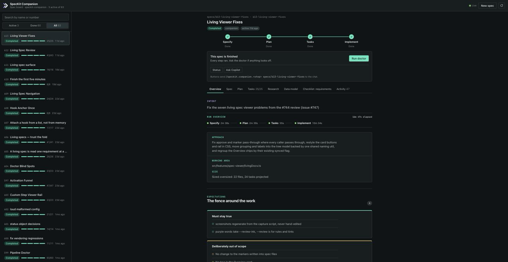

# SpecKit Companion spec board for the GitHub Copilot app

A [canvas extension](https://docs.github.com/en/copilot/how-tos/github-copilot-app/working-with-canvas-extensions) for the GitHub Copilot app. It opens a live board of every spec in your workspace, next to the chat.



- **Board.** Every spec folder under `specs/` (or your `speckit.specDirectories`), most recently active first. Each row shows its status, a four-step rail (specify → plan → tasks → implement), and task progress. Filter by Active, Done or All, or search by name or number.
- **Spec detail.** The pipeline rail, the next step with a button that runs it, and the spec's documents rendered in tabs: spec, plan, tasks with per-phase progress, research, data model and checklists. An Activity tab shows the run history, decisions and what was verified.
- **Live.** The board watches the spec folders. When the agent writes `plan.md` or ticks a task, the board updates without a refresh.
- **Run from the board.** Buttons send the same line the VS Code sidebar dispatches, such as `/speckit.companion.plan specs/042-export-csv`, into the chat. When the Companion commands aren't installed, the board falls back to the stock `/speckit.*` commands. **New spec** sends `/speckit.companion.specify <description>`.
- **Agent actions.** The agent can drive the board too: `list_specs`, `get_spec`, `focus_spec`, `run_step`, `refresh`. Ask "what specs are still open?" or "show me the export spec" and the board follows.

The board only reads. It never writes `.spec-context.json` or any spec file; the SpecKit commands it sends do that.

## Install

**In this repo** it already works. `.github/extensions/speckit-companion/extension.mjs` loads this folder, and the Copilot app picks up project extensions from `.github/extensions/`.

**In another project**, copy this folder to either place:

```bash
# for one project, shared with the team
cp -R apps/copilot-canvas <project>/.github/extensions/speckit-companion
# for every project on your machine
cp -R apps/copilot-canvas ~/.copilot/extensions/speckit-companion
```

Then open the project in the Copilot app, start a session, and ask for the **SpecKit Spec Board** canvas. It also appears under **Customize → Canvas**.

The run buttons need the Companion commands in the project (`specify extension add companion …`, see the [spec-kit extension README](../speckit-extension/README.md)). Without them the buttons send the stock `/speckit.plan`, `/speckit.tasks` and `/speckit.implement`.

## Develop

```bash
npm run canvas:dev     # from the repo root: serves the board for this repo and prints its URL
npm run test:canvas    # node:test suites for parsing, rendering and the server
```

`canvas:dev` runs the same server the canvas uses, without the Copilot app. Run buttons print the prompt and copy it to the clipboard instead of sending it. Add `&theme=light` or `&theme=dark` to the URL to force a theme.

Clicking through the demo specs (`specs/_0N_demo-*`) can change their `.spec-context.json`. Restore them with `git restore specs/_0*` before committing.

## How it's built

| File | Job |
|---|---|
| `extension.mjs` | Declares the canvas and its actions with `@github/copilot-sdk/extension`. Wiring only. |
| `server.mjs` | Loopback HTTP server per open canvas: the page, a token-guarded JSON API, and a server-sent event stream fed by a file watcher. |
| `specs-core.mjs` | Scans spec folders, reads `.spec-context.json`, and works out each step's state. It uses the same rules as the VS Code viewer. |
| `tasks.mjs` | Task checkbox parsing. It agrees with the VS Code extension through the shared `apps/vscode/tests/fixtures/task-grammar/` cases. |
| `markdown.mjs` | A small markdown renderer that escapes everything first. |
| `prompts.mjs` | The chat lines the buttons send. |
| `public/` | The board page: plain HTML, CSS and JS, with no build step. |

The folder has the same layout as an entry in [awesome-copilot's extensions](https://github.com/github/awesome-copilot/tree/main/extensions). To list it there, add a `plugins/speckit-companion/plugin.json` whose `logo` points at `assets/preview.png`, then follow their [contributing guide](https://github.com/github/awesome-copilot/blob/main/CONTRIBUTING.md#adding-canvas-extensions).
