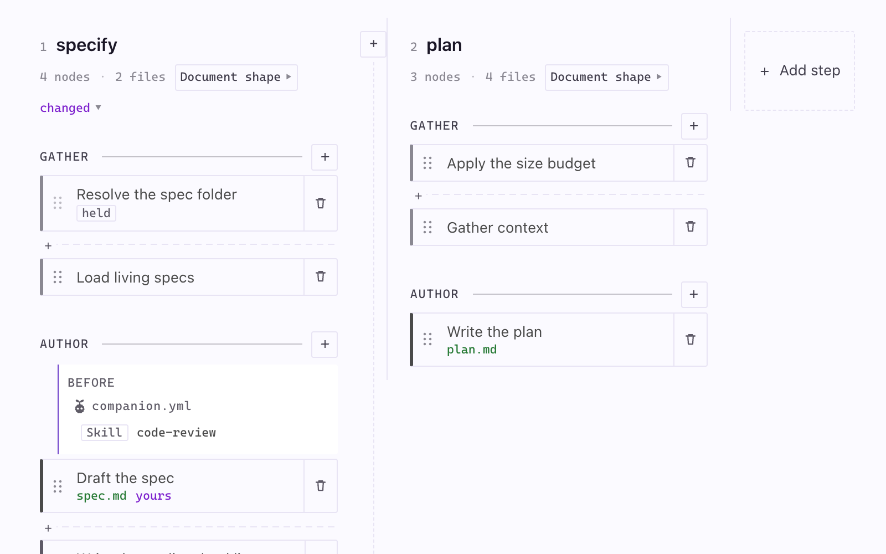
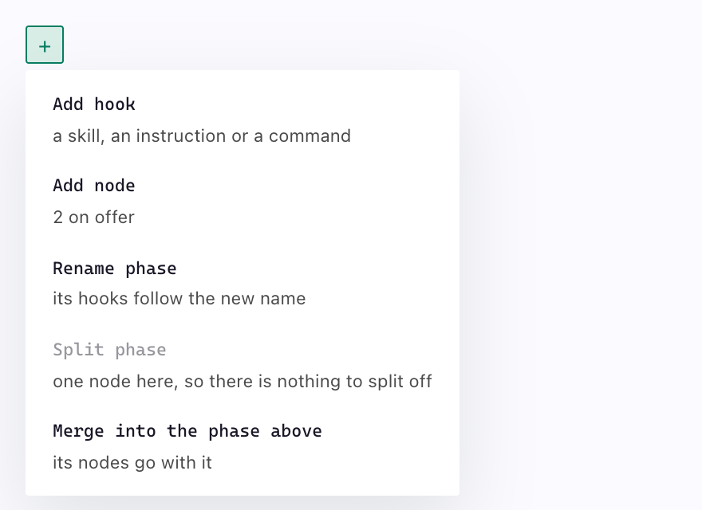
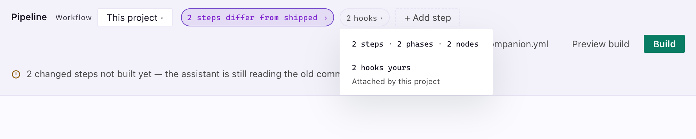
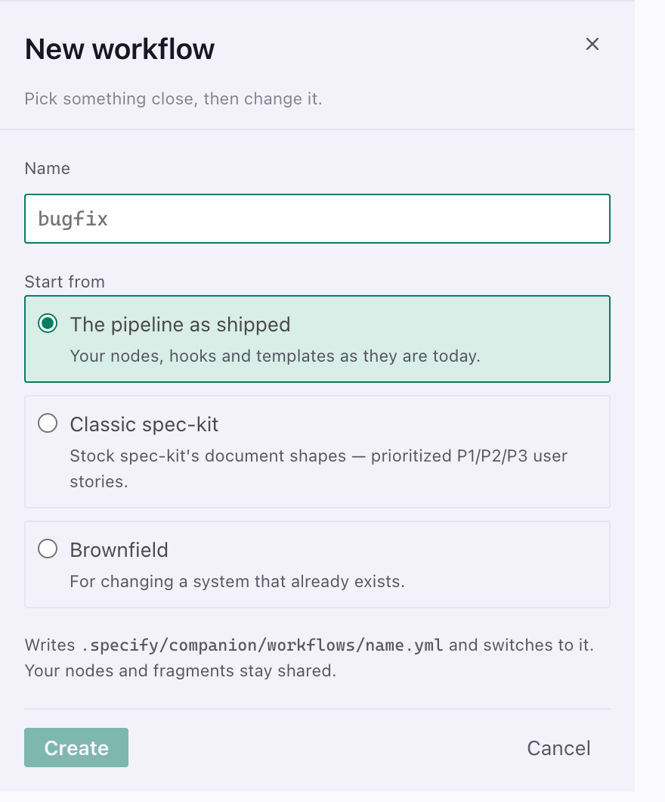

The Pipeline Builder shows your assistant's workflow as a board. Each step is built from **nodes**, small blocks of instruction. Open it from the circuit icon at the top of the Specs sidebar, or run **SpecKit Companion: Open Pipeline Builder**. It needs the Companion Spec Kit extension. [The Pipeline Builder guide](/docs/guides/pipeline-builder) shows how to change something.

The run reads left to right, in the order it happens. Four steps ship, and a project can add more. At the far right, **Outside the run** holds what doesn't take a turn, such as `auto`, which runs the other steps hands-off.

## What the marks on a lane mean

| Mark | What it means |
|---|---|
| **specify**, **plan** | A step. Click the name to read its preamble, the text every node in it sits under. |
| `changed` | This step differs from the workflow as it ships. |
| `4 nodes · 2 files` | How many nodes it runs and how many files a run produces. Hover names the files. |
| `Document shape` | The shape of the document this step writes. Click to change it. |
| **GATHER**, **AUTHOR** | A phase, a group of nodes. |
| A card | A node: one piece of instruction the assistant reads. |
| The bar on a card's left edge | Node kind. Heavy writes a deliverable, light reads context or sets up. |
| `gate` | This node can stop the run. |
| `held` | This node can't be reordered, because something after it reads what it writes. |
| `yours` | You rewrote this node. |
| `spec.md` in green | A file this node produces. |
| `before`, `after` | Work attached on that side of a node. |
| `+` on a dashed rule between cards | Attach work exactly there. |
| `+` in the gap between two lanes | Add a step there. |

Anything the project changed carries one color and nothing else does, so "what did we change here" needs no reading.

## Change a phase with the + menu

The `+` on every phase rule is the one control the board never hides. A row that can't run is greyed with the reason, such as "one node here, so there is nothing to split off".

## The header

- **Workflow.** The configuration you are on. It is also the switcher.
- **Changes chip.** `No changes` or `2 steps differ from shipped`. Click it to scroll to the first lane that differs.
- **Hooks chip.** `5 hooks`, opening the tally of steps, phases, nodes, your hooks and extension hooks.
- **Add step.** Appends a step. Docked narrow, **Open companion.yml** and **Preview build** move under `⋯`.

## Switch workflows and start from a preset

A **workflow** is a whole named configuration. Switching swaps node order, hooks, templates and routing at once, so a one-line fix and a client deliverable can run different workflows in one repository. Nodes and fragments are shared across them.

A new workflow starts from what you run today, or from one of two presets:

| Preset | For |
|---|---|
| **Classic spec-kit** | Stock spec-kit document shapes: prioritized P1/P2/P3 stories, the full Technical Context block. Changes how documents look, not what the run does. |
| **Brownfield** | Changing an existing system: the spec as a delta, folders numbered against every branch, the task list attacked before it runs, a person opening the result before it counts as done. |

A preset is copied in and yours to change. [Pick a pipeline](/docs/discussions/pick-a-pipeline) covers the two workflows Companion ships as commands.

## Files it reads and writes

| Path | What it holds |
|---|---|
| `.specify/companion.yml` | Your configuration, the source of truth |
| `.specify/companion/workflows/<name>.yml` | A named configuration you can switch to |
| `.specify/companion/nodes/<step>/<node>.md` | A node you rewrote, or a step you added |
| `.specify/companion/fragments/<name>.md` | A document section you wrote |
| `.specify/extensions/companion/commands/` | What a build produces. Derived, not edited. |

## Next

[The Pipeline Builder guide](/docs/guides/pipeline-builder) walks through attaching a hook, editing a node and building a change.
