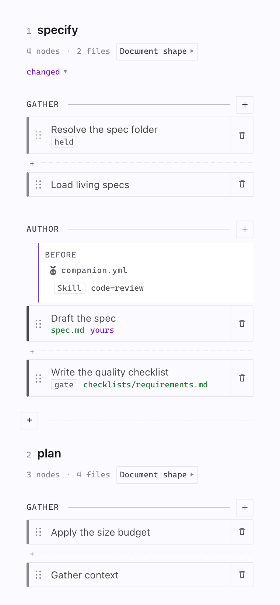
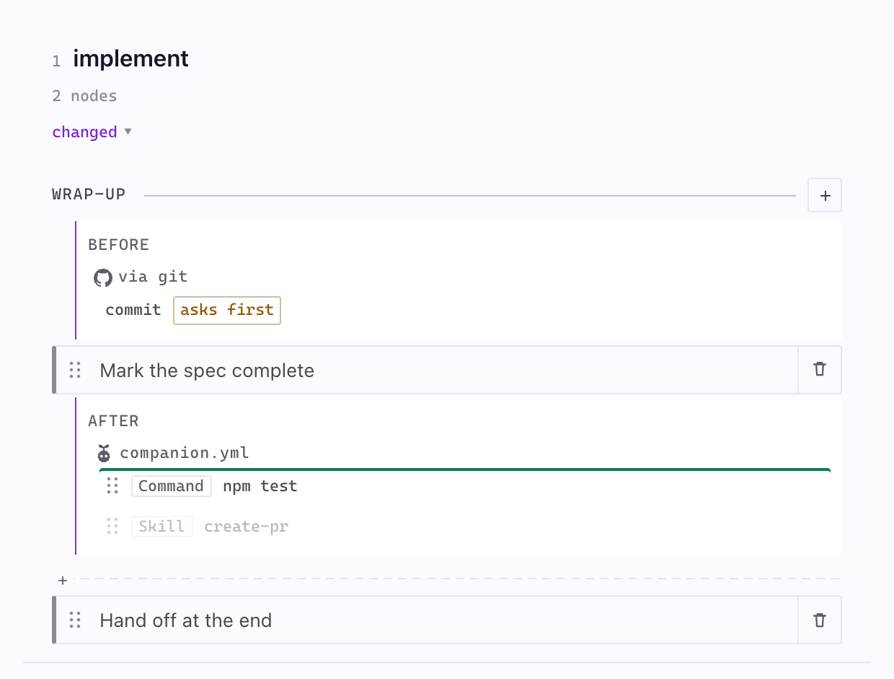
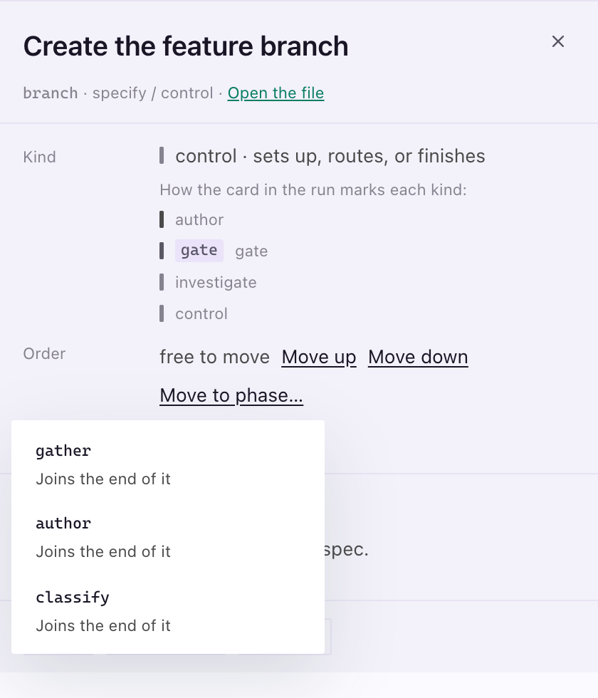

**I want to change what my assistant does at each step.** The Pipeline Builder draws your Companion workflow as lanes of small instruction blocks called **nodes**. You change them on the board, then build. [Anatomy of the Pipeline Builder](/docs/anatomy/anatomy-of-the-pipeline-builder) names every mark on it.

Open it from the circuit icon at the top of the Specs sidebar, or run **SpecKit Companion: Open Pipeline Builder**. It needs the Companion Spec Kit extension.

Dock it beside the editor and the steps stack one under the next at the panel's width, with a dashed rule between them where the lanes would meet. Nothing is cut off or hidden behind a sideways scroll, and every control works the same.

## Change something in four steps

1. Click a node to read what it tells your assistant.
2. Press **Edit**, change the text and **Save**. Your version is written to `.specify/companion/nodes/` and marked `yours`. The shipped file is untouched.
3. Press **Preview build** to list which commands would change. Nothing is written.
4. Press **Build**. The header says what it wrote and when.

Nothing takes effect until you build. Every write says what it did at the foot of the panel, with an **Undo** until the next write.

## Attach a hook

A hook is your own work that runs before or after a node, a phase or a whole step. Use **Add hook** from a phase's `+` menu, a node's panel, or the dotted slot between nodes.

Pick where it runs, then the kind.

| Kind | What it is |
|---|---|
| **Skill** | A skill you already have. Try this first. |
| **Instruction** | One instruction kept in `companion.yml`. |
| **Command** | A shell line. Your assistant needs a terminal. |
| **Node** | A file from `.specify/companion/nodes/`, reusable in more than one place. |

Your hooks show under the Companion mascot. Hooks from an installed extension show as `via <extension>`. The same hooks written by hand are in [Custom commands and hooks](/docs/guides/customize).

## Move a hook

Drag one of your hooks to move it. Drop it on the top or bottom half of a node to run it before or after that node, on a dotted slot or a block of hooks to add it last there, or between two hooks to change their order. Hooks at one place run top to bottom. From the keyboard, open the hook and use **Move up** and **Move down** on its **Order** row, or change where it runs and save. Each move is one change to `companion.yml` and keeps the rest of the file as you wrote it.

A hook moves within its own step. Hooks from an installed extension, and hooks parked while the pipeline runs as it ships, stay where they are, and dragging one says why.

## Edit a node, and go back

The node panel shows the instructions plus what the node writes, what it needs first and whether it can move. To go back, open **More** and choose **Use the shipped node**. The status line offers **Undo**.

## Move a node to another phase

Drag a node to reorder it, or use the **Order** row in its panel. **Move up** and **Move down** step it through the phase, and **Move to phase…** lists the other phases of the step. The node joins the phase you pick at the edge nearest where it was: the end of an earlier phase, or the start of a later one. A node marked `held` has to stay where it is, and its row says why.

## Replace or add a node

A node with alternatives has a **Replace** menu, and your hooks move with it.

**Add node** in a phase's `+` menu offers add-ons that ship switched off, and nodes you removed earlier.

## Reshape a document

The **Document shape** chip on a step lists each `##` section of its template. Pick an alternative for a section, or **As shipped**.

## Add a step

Press **Add step** in the header, or the `+` between two lanes. Give it a name and say where it runs and what it writes. After the next build, your assistant can run it as `/speckit.companion.<name>`.

## Build

**Build** writes the command files your assistant loads, with your hooks, nodes and reshaped templates in place. **Show the log** opens the detail.

## Good to know

- **Compare with the shipped workflow.** Choose **As shipped** in the **Workflow** dropdown. Your configuration is parked, not deleted.
- **Your configuration is one file.** `.specify/companion.yml` is the source of truth. Build output lives in `.specify/extensions/companion/commands/` and is never edited by hand.
- **A failed build changes nothing.** It names the step and leaves the working workflow as it was.
- **If the panel cannot draw,** it offers repairs as buttons, narrowest first. **Open companion.yml** is always there.
- **Extension hooks run, but the panel only shows them.** A hook marked `asks first` does not run unless you ask.

## Next

[Configuration](/docs/reference/configuration) lists every `speckit.*` setting.
