**I want to change what my assistant does at each step.** The Pipeline Builder draws your Companion workflow as lanes of nodes. You change it there, then build. [Anatomy of the Pipeline Builder](/docs/anatomy/anatomy-of-the-pipeline-builder) names every mark on the board.

Open it from the circuit icon at the top of the Specs sidebar, or run **SpecKit Companion: Open Pipeline Builder**.


## Quick start

1. Click a node to read what it tells the assistant, then press **Edit**.
2. **Save.** Your version is written to `.specify/companion/nodes/` and marked `yours`. The shipped file is untouched.
3. **Preview build** lists which commands would change. Nothing is written.
4. **Build.** The header says what it wrote and when.

A project that has changed nothing sees exactly what ships. Every change goes into `.specify/companion.yml`, and nothing takes effect until you build. Each write says what it did at the foot of the panel, with an **Undo** until the next write.

## Attach a hook

Attach your own work before or after a node, a phase or a whole step. The same hooks written by hand are in [Custom commands and hooks](/docs/guides/customize).

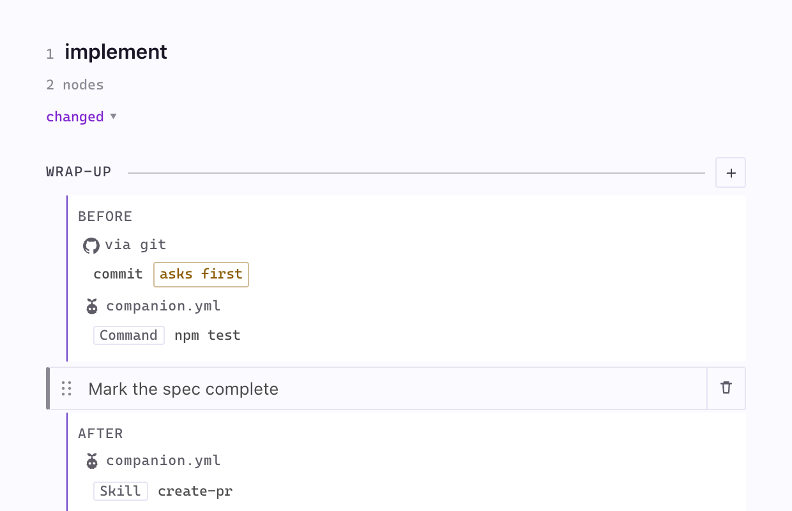

Hooks sit in one block per anchor, headed by the side they run on and grouped by who registered them. Yours show under the Companion mascot and `companion.yml`. An installed extension's show as `via <extension>`. Extension hooks run too, but the panel only shows them. One marked `asks first` does not run without being asked.

Use **Add hook** from a phase's `+` menu, a node's panel, or the dotted slot between nodes.

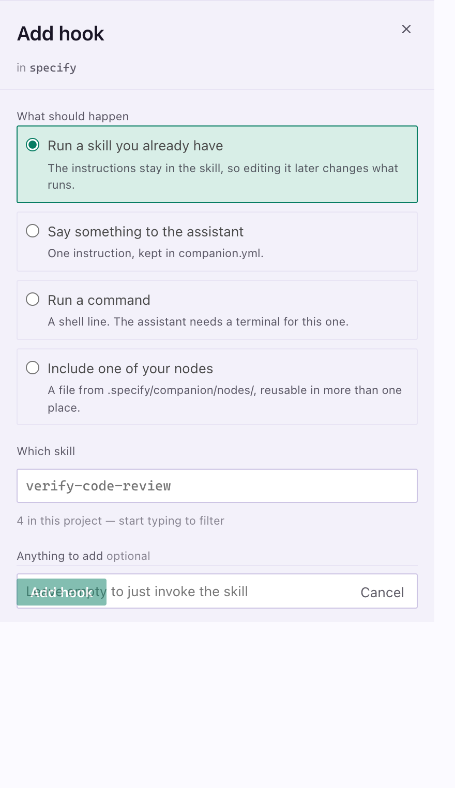

Pick where it runs, then the kind.

| Kind | What it is |
|---|---|
| **Skill** | A skill you already have. Editing the skill later changes what runs. Try this first. |
| **Instruction** | One instruction kept in `companion.yml`. Also how you ask for a registered hook command such as spec-kit's `git` commit. |
| **Command** | A shell line. The assistant needs a terminal. |
| **Node** | A file from `.specify/companion/nodes/`, reusable in more than one place. |

**Choose...** lists what this project actually has, so a typed name cannot invoke nothing. Click an existing hook to change or remove it.

## Edit a node, and go back

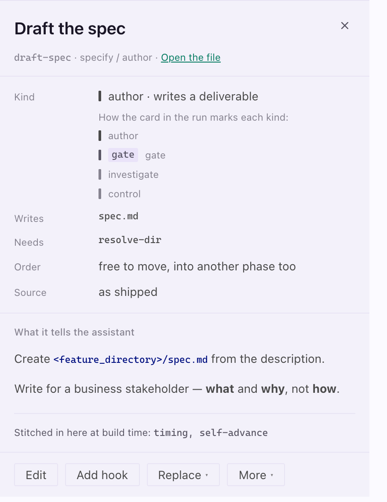

The node panel shows what the node tells the assistant, plus:

| Fact | Meaning |
|---|---|
| **Kind** | What the node is for |
| **Writes** | Files it produces |
| **Needs** | Nodes that must run first |
| **Order** | Whether it can move (**Move up**, **Move down**) |
| **Source** | Shipped with Companion, or yours |

**Edit** opens the instructions. Saving writes `.specify/companion/nodes/<step>/<node>.md`, so saving is what makes the copy. An upgrade never overwrites or reverts it.

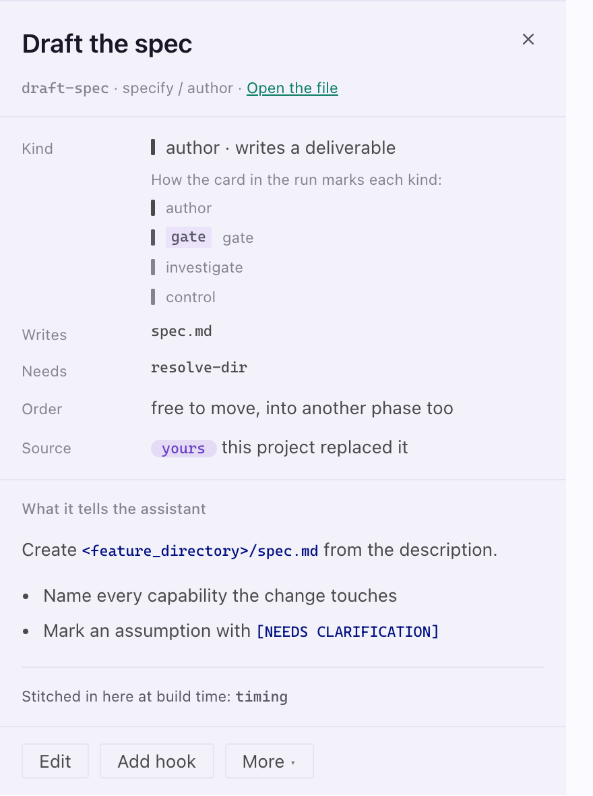

To go back, open **More** and choose **Use the shipped node**. The status line then offers **Undo**. **More** also has **Remove from the run**, which keeps the file so the node stays under **Add node**.

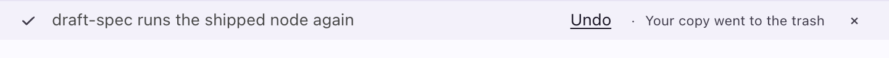

## Replace or add a node

A node with alternatives has a **Replace** menu. Your hooks on the old node move with it.

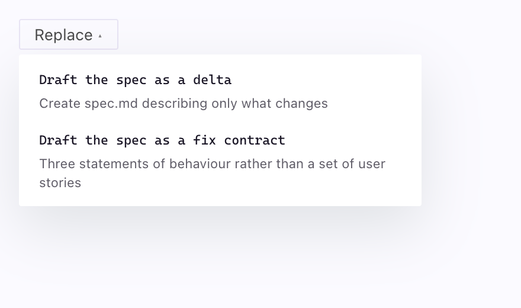

**Add node** in a phase's `+` menu offers add-ons that ship with a step but are off by default, and nodes the project dropped.

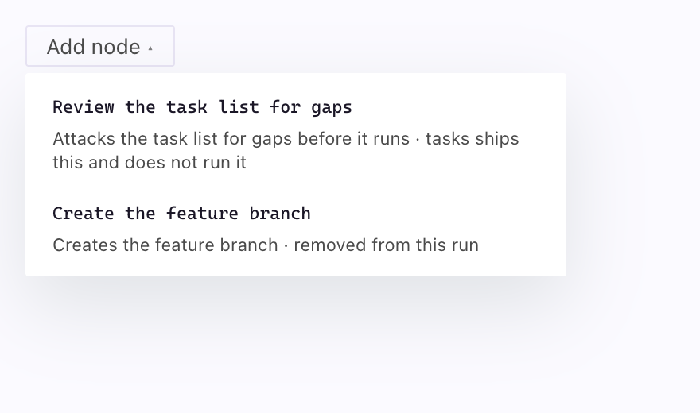

## Reshape a document

The **Document shape** chip on a step opens a row per `##` section of its template. Sections with alternatives offer them plus **As shipped**. Sections without alternatives say so and draw no control.

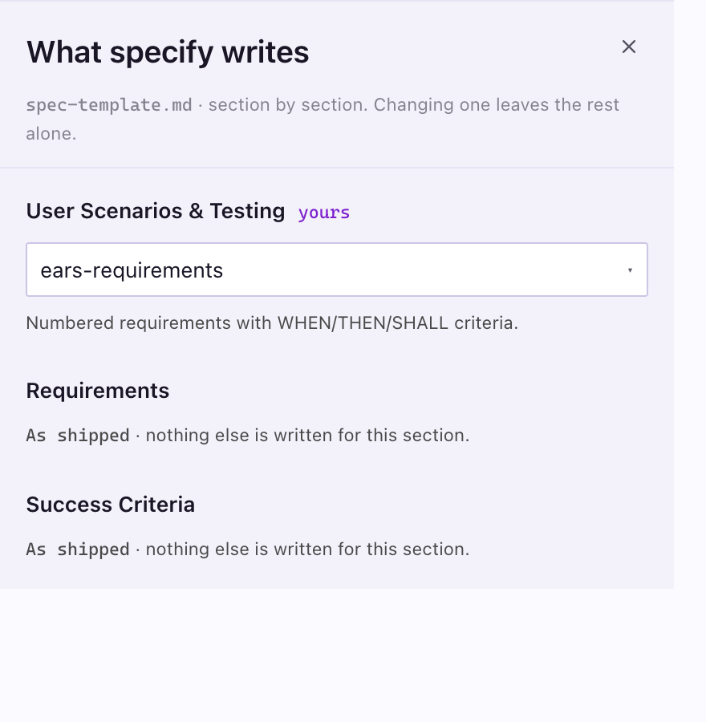

## Add a step

**Add step** in the header appends a step. Click the `+` between two lanes to insert one there.

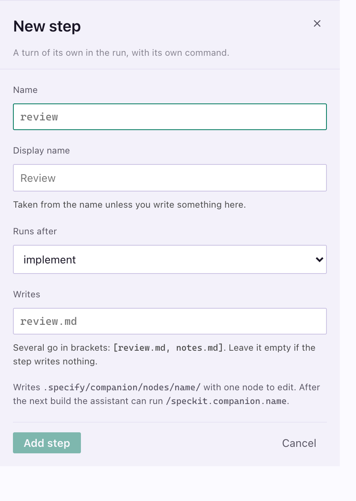

The panel writes `.specify/companion/nodes/<name>/` with a frame, an order file and one node, then opens that node.

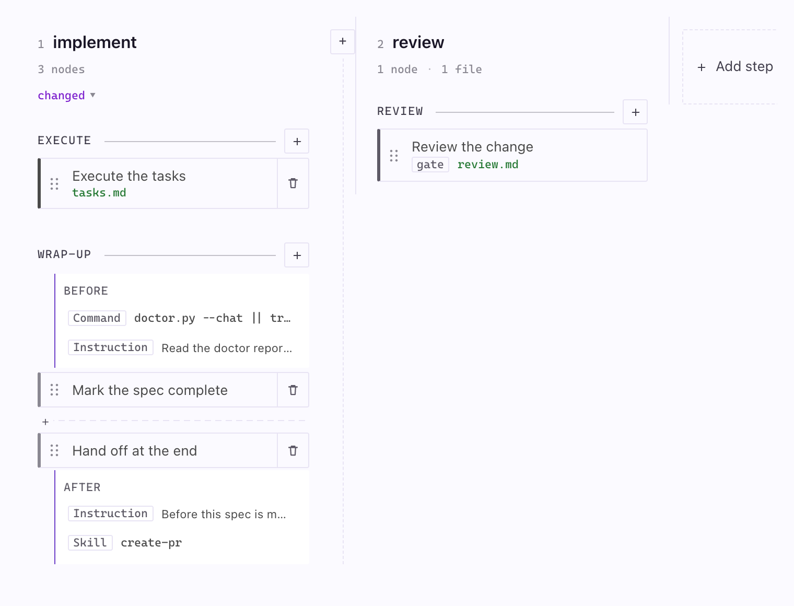

```yaml
# Omit this line for a step you launch when you want it.
after: implement
```

With `after:` the step takes its turn in the run. Without it, it is drawn under **Outside the run**. After the next build your assistant can dispatch `/speckit.companion.<name>`.

## Compare with the shipped workflow

Choose **As shipped** in the **Workflow** dropdown to see Companion with nothing changed. Your configuration is parked, not deleted. Its hooks show dashed and labelled `parked`. **Use this project's pipeline** (or **This project** in the dropdown) switches back.

## Build

**Preview build** writes nothing. **Build** resolves the nodes each step runs, splices in your hooks, applies reshaped templates and writes the command bodies where your assistant loads them. **Show the log** opens the detail.

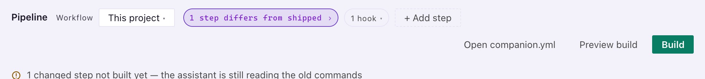

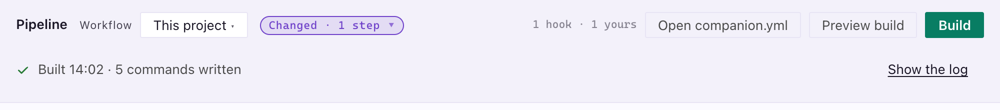

A build that cannot finish names the step and leaves the working workflow as it was.

## When the panel cannot draw

A phase with nothing in it, or a node naming something that does not exist, stops the drawing. The panel offers repairs as buttons, narrowest first, each saying what it costs. Your hooks survive all of them. **Open companion.yml** is always there.

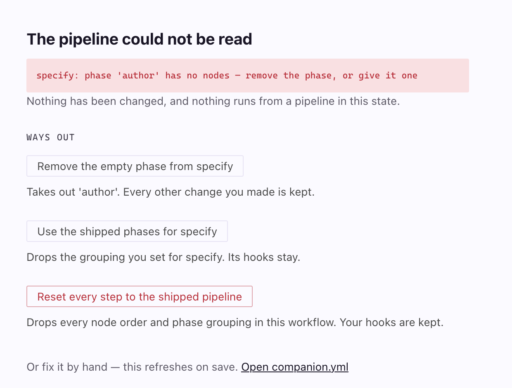

## Files

| Path | What it holds |
|---|---|
| `.specify/companion.yml` | Your configuration, the source of truth |
| `.specify/companion/workflows/<name>.yml` | A named configuration you can switch to |
| `.specify/companion/nodes/<step>/<node>.md` | A node you rewrote, or a step you added |
| `.specify/companion/fragments/<name>.md` | A document section you wrote |
| `.specify/extensions/companion/commands/` | Build output. Derived, never edited. |

The shipped alternatives, add-ons, fragments and presets are listed in the `commands-*` and `workflows-*` living specs.
