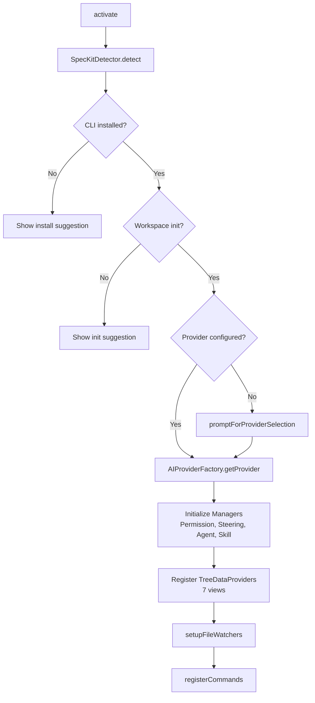
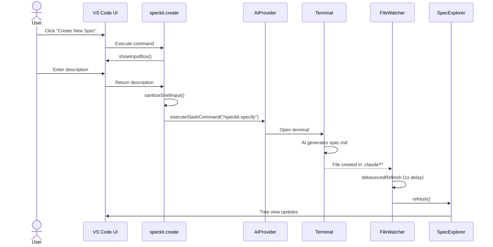
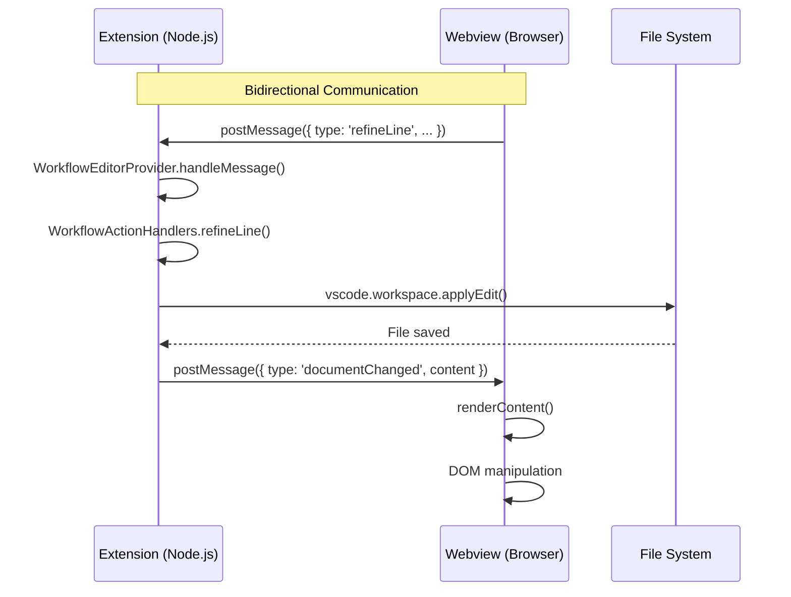

# How This Works

A comprehensive guide to the SpecKit Companion VS Code extension architecture.

## Overview

SpecKit Companion is a VS Code extension that enhances AI CLI tools (Claude Code, Gemini CLI, GitHub Copilot CLI) with structured spec-driven development features. It provides visual management of specs (requirements, design, tasks) and steering documents.

### Architecture Diagram

```mermaid
graph TB
    subgraph UI["VS Code Extension UI"]
        AB[Activity Bar<br/>SpecKit]
        TV[Tree Views<br/>Specs | Steering | MCP | Agents | Skills | Hooks]
        CE[Custom Editor<br/>Workflow Editor]
    end

    subgraph Providers["AI Provider Layer (Factory Pattern)"]
        Claude[Claude Code]
        Gemini[Gemini CLI]
        Copilot[Copilot CLI]
    end

    subgraph Managers["Feature Managers (Business Logic)"]
        SM[SteeringManager]
        AM[AgentManager]
        SKM[SkillManager]
        PM[PermissionManager]
    end

    subgraph Core["Core Utilities & Types"]
        CM[ConfigManager]
        FW[FileWatchers]
        CON[Constants]
        NU[NotificationUtils]
    end

    subgraph Storage["File System Storage"]
        DC[.claude/]
        DS[.specify/]
        SP[specs/]
        CMD[CLAUDE.md]
    end

    UI --> Providers
    Providers --> Managers
    Managers --> Core
    Core --> Storage
```

### Supported AI Providers

| Provider | Steering | Agents | Skills | Hooks | MCP |
|----------|----------|--------|--------|-------|-----|
| Claude Code | Full | Full | Full | Full | Full |
| GitHub Copilot CLI | Full | Full | - | - | Full |
| Gemini CLI | Full | Limited | - | - | Full |

---

## Project Structure

```
src/
├── extension.ts              # Entry point, command registration
├── ai-providers/             # AI provider abstraction layer
│   ├── aiProvider.ts         # Interface & provider paths config
│   ├── aiProviderFactory.ts  # Factory pattern implementation
│   ├── claudeCodeProvider.ts # Claude Code implementation
│   ├── geminiCliProvider.ts  # Gemini CLI implementation
│   └── copilotCliProvider.ts # GitHub Copilot CLI implementation
├── core/                     # Core utilities & infrastructure
│   ├── constants.ts          # Commands, ConfigKeys, Views, Timing
│   ├── types.ts              # Message types (Extension <-> Webview)
│   ├── fileWatchers.ts       # File system monitoring with debouncing
│   ├── errors/               # Error handling utilities
│   │   └── index.ts          # SpecKitError, handleError()
│   ├── managers/             # Base classes for managers
│   │   └── BaseManager.ts    # Common manager functionality
│   ├── providers/            # Base classes for tree providers
│   │   └── BaseTreeDataProvider.ts  # Abstract base for all tree views
│   ├── types/                # Shared type definitions
│   │   └── config.ts         # ClaudeConfig, HookInfo, etc.
│   └── utils/
│       ├── configManager.ts  # Settings management (singleton)
│       ├── fileSystemUtils.ts # File system helpers
│       ├── notificationUtils.ts
│       ├── fileOpener.ts
│       └── sanitize.ts
├── features/                 # Feature modules (independent)
│   ├── specs/                # Spec explorer and commands
│   ├── steering/             # Steering document management
│   ├── agents/               # Agent discovery and initialization
│   ├── skills/               # Skill management (Claude only)
│   ├── hooks/                # Hooks view
│   ├── mcp/                  # MCP server view
│   ├── permission/           # Claude permission management
│   ├── settings/             # Overview/settings provider
│   └── workflow-editor/      # Custom markdown editor
└── speckit/                  # SpecKit CLI integration
    ├── detector.ts           # CLI installation detection
    ├── cliCommands.ts        # CLI commands (install, init)
    ├── updateChecker.ts      # Version update detection
    └── taskProgressService.ts # Tasks.md completion tracking

webview/                      # Workflow editor webview (browser)
├── src/
│   └── workflow.ts           # Webview TypeScript
└── styles/
    └── workflow.css          # Theme-aware styles
```

---

## Architecture Deep Dive

### Entry Point & Activation Flow

**File:** `src/extension.ts`

The extension activates on `onStartupFinished` or when opening spec files. The activation sequence:



**Key initialization steps (lines 36-174):**

1. **Output Channel** (line 38): Creates "SpecKit Companion" debug channel
2. **SpecKit Detection** (lines 40-48): Detects CLI and workspace state
3. **AI Provider Selection** (lines 68-77): Prompts if not configured
4. **Manager Initialization** (lines 79-92): Creates managers in order
5. **Provider Registration** (lines 93-113): Registers 7 tree views
6. **File Watchers** (lines 138-142): Sets up monitoring
7. **Workflow Editor** (lines 148-155): Conditional custom editor

### AI Provider System

**Files:** `src/ai-providers/`

Uses **Factory + Strategy patterns** to support multiple AI providers.

#### Provider Interface (`aiProvider.ts:15-48`)

```typescript
interface IAIProvider {
    readonly name: string;
    isInstalled(): Promise<boolean>;
    executeInTerminal(prompt: string, title?: string): Promise<Terminal>;
    executeHeadless(prompt: string): Promise<AIExecutionResult>;
    executeSlashCommand(command: string, title?: string, autoExecute?: boolean): Promise<Terminal>;
}
```

#### Provider Paths (`aiProvider.ts:82-116`)

Each provider has different file structures:

| Provider | Steering File | Steering Dir | Agents Dir |
|----------|--------------|--------------|------------|
| Claude | `CLAUDE.md` | `.claude/steering` | `.claude/agents` |
| Gemini | `GEMINI.md` | (hierarchical) | - |
| Copilot | `.github/copilot-instructions.md` | `.github/instructions` | `.github/agents` |

#### Factory Pattern (`aiProviderFactory.ts`)

```typescript
AIProviderFactory.getProvider(context, outputChannel)
  → Reads 'speckit.aiProvider' setting
  → Returns cached provider instance (or creates new one)
```

### Feature Modules Pattern

**Location:** `src/features/`

Each feature follows a consistent structure:

```
features/{feature}/
├── index.ts                    # Public exports
├── {feature}Manager.ts         # Business logic
├── {feature}ExplorerProvider.ts # TreeDataProvider
├── {feature}Commands.ts        # Command handlers
└── types.ts                    # Feature-specific types
```

#### Manager Pattern

Managers encapsulate business logic:
- File system operations
- Data transformation
- State management

**Example:** `SteeringManager` (`steering/steeringManager.ts`)
- `createCustomDocument()`: Creates steering files
- `deleteDocument()`: Removes files and updates references
- `getSteeringFiles()`: Returns list of steering documents

#### Provider Pattern (TreeDataProvider)

All tree views extend `BaseTreeDataProvider<T>` (`core/providers/BaseTreeDataProvider.ts`):

| View ID | Provider | Purpose |
|---------|----------|---------|
| `speckit.views.explorer` | SpecExplorerProvider | Specs tree |
| `speckit.views.steering` | SteeringExplorerProvider | Steering docs |
| `speckit.views.agents` | AgentsExplorerProvider | Agent files |
| `speckit.views.skills` | SkillsExplorerProvider | Skills (Claude) |
| `speckit.views.mcp` | MCPExplorerProvider | MCP servers |
| `speckit.views.hooks` | HooksExplorerProvider | Hooks |
| `speckit.views.settings` | OverviewProvider | Settings |

**Base class provides:**
- `refresh()` - Fires tree data change event
- `getTreeItem()` - Returns element as TreeItem
- `isLoading` - Loading state management
- `log()` - Output channel logging
- `dispose()` - Cleanup event emitters

**Implementation pattern:**
```typescript
class ExplorerProvider extends BaseTreeDataProvider<Item> {
    constructor(context: vscode.ExtensionContext, outputChannel: vscode.OutputChannel) {
        super(context, { name: 'ExplorerProvider', outputChannel });
    }

    // Override refresh() for custom loading behavior
    refresh(): void {
        this.isLoading = true;
        this._onDidChangeTreeData.fire();
        setTimeout(() => {
            this.isLoading = false;
            this._onDidChangeTreeData.fire();
        }, 100);
    }

    // Required: implement getChildren()
    async getChildren(element?: Item): Promise<Item[]> { ... }

    // Optional: override dispose() for cleanup
    dispose(): void {
        this.fileWatcher?.dispose();
        super.dispose();
    }
}
```

---

## Data Flow Examples

### 1. Creating a New Spec



### 2. Webview Communication (Workflow Editor)

**Files:**
- `src/features/workflow-editor/workflowEditorProvider.ts`
- `webview/src/workflow.ts`
- `src/core/types.ts`

#### Message Types (`core/types.ts:6-23`)

```typescript
// Extension → Webview
type ExtensionToWebviewMessage =
    | { type: 'documentChanged'; content: string }
    | { type: 'updatePhaseInfo'; specInfo: SpecInfo };

// Webview → Extension
type WebviewToExtensionMessage =
    | { type: 'editSource' }
    | { type: 'refineLine'; lineNum: number; content: string; instruction: string }
    | { type: 'editLine'; lineNum: number; newText: string }
    | { type: 'removeLine'; lineNum: number }
    | { type: 'approveAndContinue' }
    | { type: 'regenerate' }
    | { type: 'navigateToPhase'; phase: string }
    | { type: 'enhance'; command: string }
    | { type: 'switchTab'; fileName: string };
```

#### Message Flow



### 3. File Watcher System

**File:** `src/core/fileWatchers.ts`

Watches multiple patterns with debouncing (1 second):

| Pattern | Triggers |
|---------|----------|
| `**/.claude/**/*` | Specs, steering, agents, skills refresh |
| `~/.claude/settings.json` | Hooks, MCP refresh |
| `**/CLAUDE.md` | Steering refresh |
| `**/.specify/**/*` | SpecKit files refresh |
| `**/specs/**/tasks.md` | Phase completion notifications |

**Debounce implementation (`fileWatchers.ts:62-76`):**
```typescript
let refreshTimeout: NodeJS.Timeout | undefined;
const debouncedRefresh = (event: string, uri: vscode.Uri) => {
    if (refreshTimeout) clearTimeout(refreshTimeout);
    refreshTimeout = setTimeout(() => {
        specExplorer.refresh();
        steeringExplorer.refresh();
        // ... other providers
    }, 1000);
};
```

---

## Key Components Reference

### Constants (`core/constants.ts`)

| Constant | Purpose |
|----------|---------|
| `Commands` | All command IDs (`speckit.*`) |
| `ConfigKeys` | VS Code settings keys |
| `DefaultPaths` | Default file locations |
| `Timing` | Delays and timeouts (ms) |
| `Views` | Tree view IDs |
| `TreeItemContext` | Context menu identifiers |

### Configuration Keys

```typescript
speckit.aiProvider          // 'claude' | 'gemini' | 'copilot'
speckit.workflowEditor.enabled  // boolean
speckit.claudePath          // Custom Claude CLI path
speckit.geminiInitDelay     // Gemini startup delay (ms)
speckit.notifications.phaseCompletion // boolean
```

### Timing Constants (milliseconds)

| Constant | Value | Purpose |
|----------|-------|---------|
| `terminalVenvActivationDelay` | 800 | Wait for venv activation |
| `tempFileCleanupDelay` | 30000 | Clean prompt temp files |
| `fileWatcherDebounce` | 1000 | Batch file change events |
| `geminiInitDelay` | 8000 | Gemini CLI startup time |

---

## Extension Points for Contributors

### Adding a New AI Provider

1. **Create provider class** implementing `IAIProvider`:

```typescript
// src/ai-providers/myNewProvider.ts
export class MyNewProvider implements IAIProvider {
    readonly name = 'My New Provider';

    async isInstalled(): Promise<boolean> { ... }
    async executeInTerminal(prompt: string, title?: string): Promise<vscode.Terminal> { ... }
    async executeHeadless(prompt: string): Promise<AIExecutionResult> { ... }
    async executeSlashCommand(command: string, title?: string): Promise<vscode.Terminal> { ... }
}
```

2. **Add to factory** (`aiProviderFactory.ts`):
```typescript
case 'mynew':
    return new MyNewProvider(context, outputChannel);
```

3. **Add paths configuration** (`aiProvider.ts`):
```typescript
PROVIDER_PATHS['mynew'] = {
    steeringFile: 'MYNEW.md',
    steeringDir: '.mynew/steering',
    // ...
};
```

4. **Update selection prompt** (`aiProvider.ts:153-176`)

### Adding a New Feature Module

1. **Create directory** under `src/features/{feature}/`

2. **Create manager** for business logic:
```typescript
export class FeatureManager {
    constructor(private outputChannel: vscode.OutputChannel) {}
    // Business methods
}
```

3. **Create provider** extending `TreeDataProvider`:
```typescript
export class FeatureExplorerProvider implements vscode.TreeDataProvider<FeatureItem> {
    // Standard TreeDataProvider implementation
}
```

4. **Export via `index.ts`**

5. **Register in `extension.ts`**:
   - Import manager/provider
   - Instantiate in `activate()`
   - Register tree provider
   - Add commands

6. **Update `package.json`**:
   - Add view under `contributes.views`
   - Add commands under `contributes.commands`
   - Add context menus under `contributes.menus`

### Adding a New Command

1. **Add to constants** (`core/constants.ts`):
```typescript
export const Commands = {
    // ...
    myNewCommand: 'speckit.myNewCommand',
};
```

2. **Register in extension or command file**:
```typescript
context.subscriptions.push(
    vscode.commands.registerCommand(Commands.myNewCommand, async () => {
        // Implementation
    })
);
```

3. **Add to `package.json`**:
```json
"contributes": {
    "commands": [
        {
            "command": "speckit.myNewCommand",
            "title": "My New Command",
            "category": "SpecKit"
        }
    ]
}
```

### Adding Webview Functionality

1. **Define message type** (`core/types.ts`):
```typescript
export type WebviewToExtensionMessage =
    // ...existing
    | { type: 'myNewAction'; data: string };
```

2. **Handle in provider** (`workflowEditorProvider.ts`):
```typescript
case 'myNewAction':
    await this.actionHandlers.myNewAction(document, message.data);
    break;
```

3. **Implement handler** (`actionHandlers.ts`):
```typescript
async myNewAction(document: vscode.TextDocument, data: string): Promise<void> {
    // Implementation
}
```

4. **Add UI trigger** (`webview/src/workflow.ts`):
```typescript
button.addEventListener('click', () => {
    vscode.postMessage({ type: 'myNewAction', data: 'value' });
});
```

---

## Data Storage Structure

### Provider-Specific Directories

The extension supports three AI providers, each with its own configuration paths:

| Provider | Workspace Dir | Global Dir | Config File |
|----------|---------------|------------|-------------|
| Claude Code | `.claude/` | `~/.claude/` | `CLAUDE.md` |
| Gemini CLI | `.gemini/` | `~/.gemini/` | `GEMINI.md` |
| GitHub Copilot CLI | `.github/` | `~/.github/` | N/A |

### Workspace Structure

```
Workspace Root/
├── .claude/                       # Claude Code provider
│   ├── agents/                    # Agent definitions
│   │   └── kfc/                   # Built-in agents (auto-copied)
│   ├── skills/                    # Skill definitions (Claude only)
│   │   └── {skill}/SKILL.md
│   ├── steering/                  # Steering documents
│   │   ├── product.md
│   │   ├── tech.md
│   │   └── structure.md
│   ├── system-prompts/            # System prompts
│   └── settings/
│       └── speckit-settings.json  # Extension settings
│
├── .gemini/                       # Gemini CLI provider
│   ├── settings.json              # Gemini settings
│   └── steering/                  # Steering documents
│
├── .github/                       # Copilot CLI provider
│   └── copilot/
│       └── instructions.md        # Copilot instructions
│
├── .specify/                      # SpecKit CLI config (shared)
│   ├── memory/
│   │   └── constitution.md        # Project constitution
│   ├── scripts/                   # Automation scripts
│   └── templates/                 # Document templates
│
├── specs/                         # Spec directories (shared)
│   └── {spec-name}/
│       ├── spec.md                # Requirements
│       ├── plan.md                # Design
│       └── tasks.md               # Implementation tasks
│
├── CLAUDE.md                      # Project rules (Claude)
├── GEMINI.md                      # Project rules (Gemini)
```

### Global (User-Level) Structure

```
~/.claude/                         # Claude Code global config
├── CLAUDE.md                      # Global rules
├── agents/                        # User-level agents
├── skills/                        # User-level skills
├── settings.json                  # Claude CLI settings
└── plugins/installed_plugins.json # Installed plugins

~/.gemini/                         # Gemini CLI global config
├── GEMINI.md                      # Global rules
└── settings.json                  # Gemini settings

~/.config/github-copilot/          # Copilot global config
└── instructions.md                # Global instructions
```

### Provider Capabilities Matrix

| Feature | Claude Code | Gemini CLI | Copilot CLI |
|---------|-------------|------------|-------------|
| Agents | ✓ | ✓ | - |
| Skills | ✓ | - | - |
| Hooks | ✓ | - | - |
| MCP Servers | ✓ | - | - |
| Steering Docs | ✓ | ✓ | ✓ |
| Workflow Editor | ✓ | ✓ | ✓ |
| Permission Bypass | ✓ | - | - |

---

## Debugging

### Output Channel

All extension logging goes to the "SpecKit Companion" output channel:
- File watcher events
- Command execution
- Provider refreshes
- Errors

### Common Issues

1. **Tree view not updating**: Check file watcher debounce (1 second delay)
2. **Provider not configured**: Check `speckit.aiProvider` setting
3. **Workflow editor not showing**: Check `speckit.workflowEditor.enabled`
4. **Permission flow triggered**: Claude Code only, check bypass mode

### Extension Development

```bash
# Watch mode for development
npm run watch

# Compile and test
npm run compile

# Package extension
npm run package

# Press F5 in VS Code to launch Extension Development Host
```
