# The Pipeline Builder

Your assistant runs a pipeline: a handful of steps, each assembled from **nodes** of instruction. The builder shows you that pipeline and lets you change it. Swap a node for a different one, attach your own work at any boundary, change the shape of the documents a step writes, add a step of your own. None of it forks anything.

Open it from the **circuit** icon at the top of the Specs sidebar, or from the palette: **SpecKit Companion: Open Pipeline Builder**. The icon appears once the Companion spec-kit extension is installed — it is what the panel reads the pipeline from.

---

## Quick start

1. **Open the panel.** You are looking at the pipeline your project runs right now, drawn from your configuration. A project that has changed nothing sees exactly what ships.
2. **Click a node** to read what it tells the assistant, then press **Edit**.
3. **Save.** Your version is written to `.specify/companion/nodes/`, and the node is marked `yours`. The shipped file is untouched.
4. **Preview build.** The header says which commands would change. Nothing is written.
5. **Build.** The header says what it wrote and when.
6. **Confirm.** The chip beside the workflow name reads `1 step differs from shipped`; the amber "not built yet" line is gone. Your assistant is now reading the new commands.

## Before you change anything

A change touches one file: `.specify/companion.yml`, which is the source of truth for everything the panel writes. Nothing you do here runs until you press **Build**, which is what turns that configuration into the commands your assistant actually reads. Every write says what it did in a line at the foot of the panel, and the ones that can be taken back carry an **Undo** there until the next write. Anything more permanent has a named way back: a node you rewrote returns with **Use the shipped node**, a document section returns with **As shipped**, and a configuration too broken to draw offers the retreats as buttons, each saying what it costs.

---

## What you see

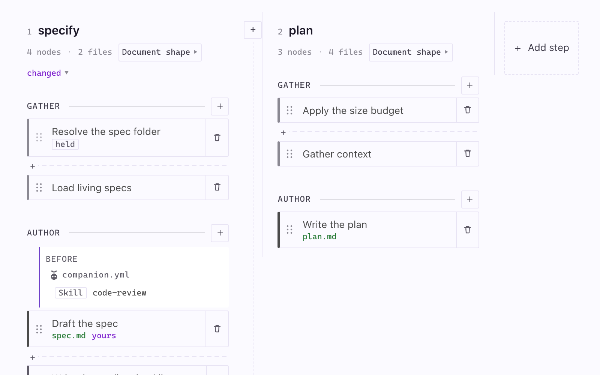

The run reads left to right, in the order it happens in. Four steps ship, and a project can add more. Here is every mark in that crop:

| Mark | What it means |
|---|---|
| **specify**, **plan** | A step. Click the name to read the step's own preamble, the text every node in it sits under. |
| `changed` | This step differs from the pipeline as it ships. The header's chip lists how. |
| `4 nodes · 2 files` | How many nodes it runs, and how many files a run of it produces. The file count names them on hover. |
| `Document shape` | The shape of the document this step writes. Click it to change that shape; a count beside it says how many sections you have swapped. |
| **GATHER**, **AUTHOR** | A phase. It groups nodes and gives work a coarser place to attach than a single node. |
| `+` | Everything a phase can do, in one menu. |
| A card | A node. One piece of instruction the assistant reads. |
| The bar down a card's left edge | What kind of node it is. A heavy bar writes a deliverable, a light one reads context or sets things up. |
| `gate` | This node can stop the run. |
| `held` | This node cannot be reordered. Something after it reads what it writes, and the panel names what. |
| `yours` | You rewrote this node. |
| `spec.md` in green | A file this node produces. |
| `before`, `after` | A heading over the work attached on that side. A node's `before` block sits above its card and its `after` block below, so the words match the order. |
| `+` on a dashed rule between two cards | Attach work exactly there. |
| `+` in the gap between two lanes | Add a step in that place. |

Anything the project changed carries one colour and nothing else does, so *"what did we change here"* is answerable without reading.

The whole board, at the width it really has:

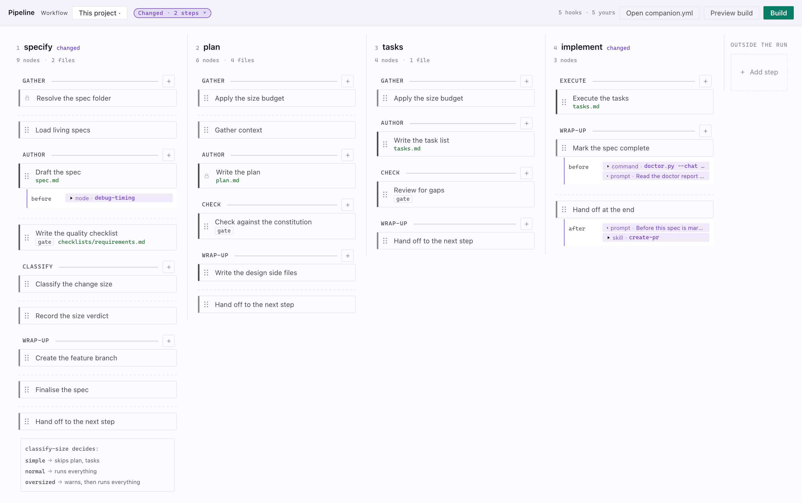

At the far right, **Outside the run** holds what does not take a turn: `auto`, which runs the other steps hands-off.

The header names the configuration you are on under **Workflow**. Beside it, a chip reading `No changes` or `2 steps differ from shipped` — click that one and the first lane that differs scrolls into view. Next to it, a chip reading `5 hooks`, which opens onto what the pipeline holds: how many steps, phases and nodes there are, how many hooks are yours, and how many an installed extension registered. **Add step** is the last of the three; it appends, and a seam between two lanes adds a step in that place instead. Docked narrow, the band folds and **Open companion.yml** and **Preview build** move under the `⋯`, where **Add step** also appears; **Add step** stays on the band as well.

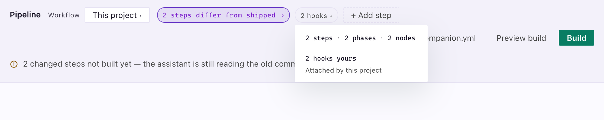

### A step, close up

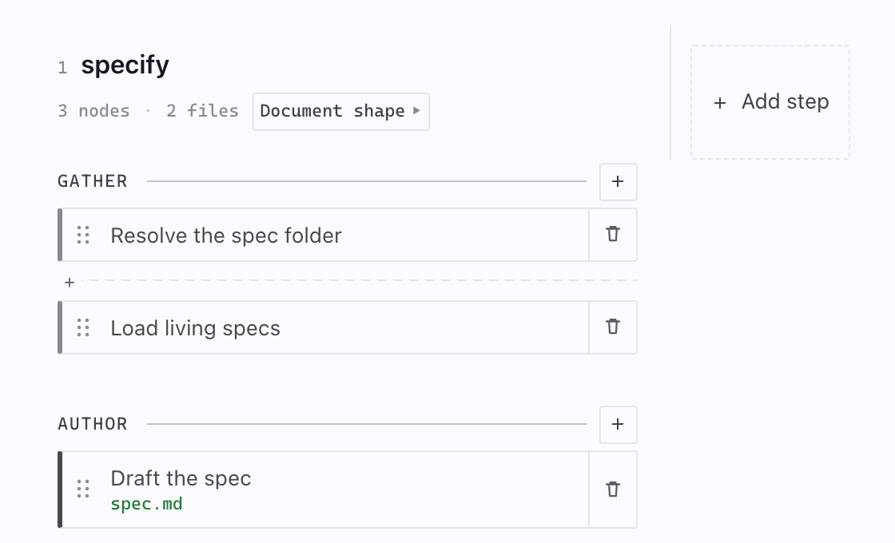

The name is the step. Under it, quietly: how many nodes it runs, how many files a run of it produces, and the template it writes into.

### What a phase can do

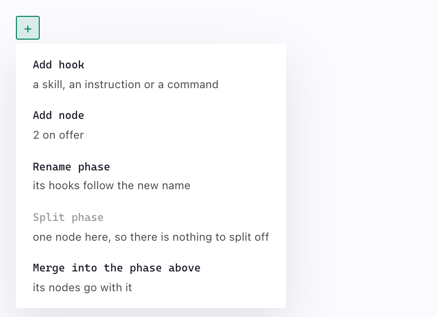

The `+` on every phase rule is the one control the board never hides. A row that cannot run here is shown greyed with the reason, because that is what teaches the capability: *"one node here, so there is nothing to split off"* says a phase can be split at the same moment it says why this one cannot.

---

## Attach a hook

Attaching your own work is the commonest change, and it is the one that needs no files. Work can attach at any boundary: before or after a node, a phase, or a whole step.

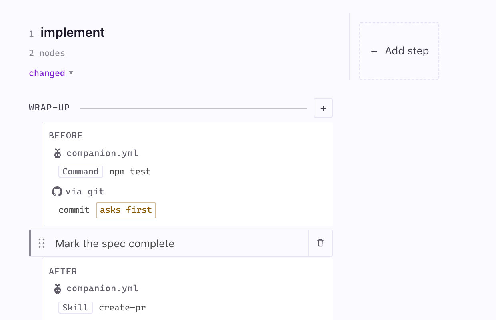

Everything attached to one anchor sits in one block, headed by the side it runs on. Under that, the hooks are grouped by whoever registered them, and each group leads with that source's mark: yours under the Companion mascot and the file they are actually written in — `companion.yml`, or `<workflow>.yml` when the project is on a named workflow, since that is where all of its hooks live; the ones an installed extension registers under `via <extension>`, marked GitHub only for spec-kit's own `git` and neutrally for anybody else's. Hooks stay in the order the registry declares them, which is the order they run in, so a source's mark repeats where two extensions alternate at one anchor. A row is then left to say the work — for yours, what kind it is and then its name; for an extension's, the command's own name rather than the `speckit.` prefix every one of them carries, with the whole of it on the tooltip. Extension hooks run too. This panel shows them and does not edit them; one marked `asks first` will not run without being asked.

**Add hook** from any phase's `+` menu, from the **Add hook** button in a node's panel, or from the dotted slot between two nodes.

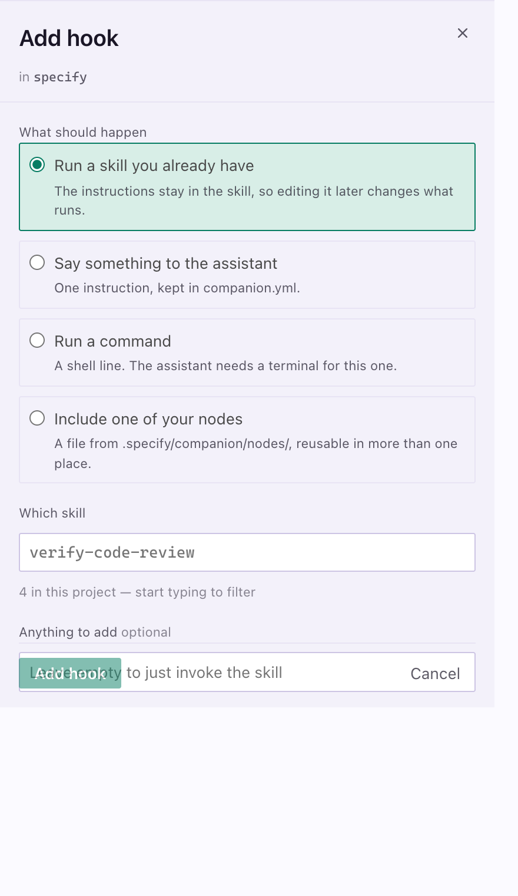

Placement comes first, so the form reads as the sentence it writes: *runs **before** the **author** phase*. Then the kind, as four segments:

| Kind | What it is |
|---|---|
| **Skill** | A skill you already have. The instructions stay in the skill, so editing it later changes what runs. Reach for this first. |
| **Instruction** | One instruction, kept in `companion.yml`. |
| **Command** | A shell line. The assistant needs a terminal for this one. |
| **Node** | A file from `.specify/companion/nodes/`, reusable in more than one place. |

The skill and node fields offer what this project actually has, so a name typed from memory cannot become a hook that invokes nothing. Click a hook that is already there to change it or take it out.

---

## Edit a node, and go back

Click any node.

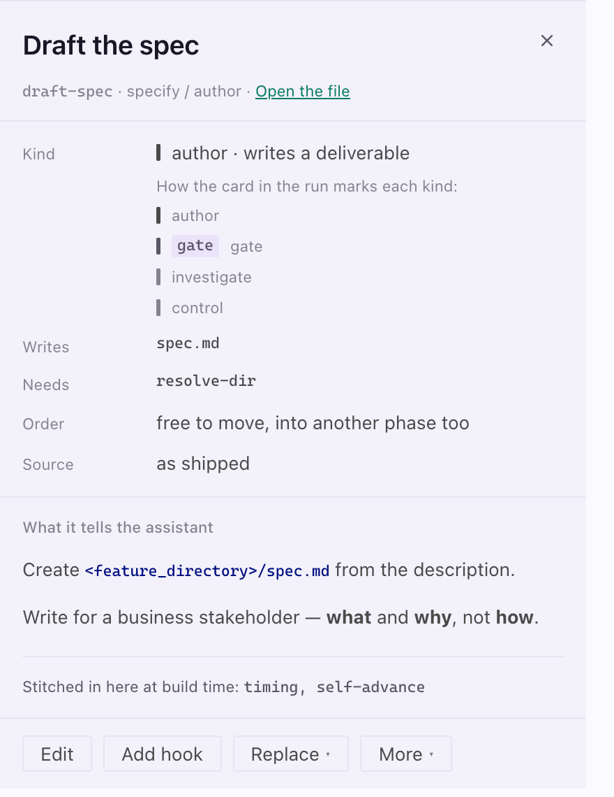

The panel renders what that node actually tells the assistant. No frontmatter, no empty comment fences, and shared blocks named rather than shown as blanks. Beside it:

| Fact | What it tells you |
|---|---|
| **Kind** | What this node is for, with the legend for the mark each kind carries on the board |
| **Writes** | The files this node produces |
| **Needs** | The nodes that must have run first |
| **Order** | Whether it can move, with **Move up** and **Move down** on the row, or what is holding it if not |
| **Source** | Whether it ships with Companion or is yours |

**Open the file** sits beside the node id, for when the editor is what you wanted.

**Edit** opens the instructions in a text box. Saving writes `.specify/companion/nodes/<step>/<node>.md`, and from then on your version is what the assistant reads. There is no separate "make this mine": saving the edit is what writes the copy. The shipped file is never touched, so an upgrade neither overwrites your copy nor silently reverts it.

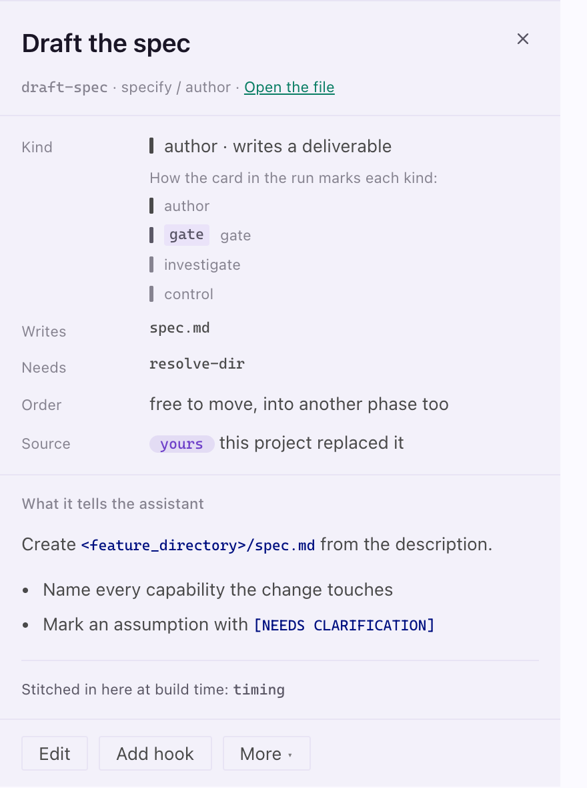

To go back, open **More** and pick **Use the shipped node**. Your copy goes to the trash, and the status line at the foot of the panel holds an **Undo** that puts it back.

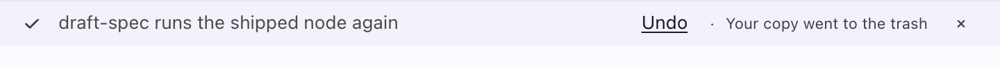

**Move up** and **Move down** sit on the **Order** row, which is the row that says a node can move. **More** holds what costs something: **Remove from the run**, which keeps the file so the node stays on offer under **Add node**, and **Use the shipped node**.

---

## Replace or add a node

Some nodes have alternatives: same place in the run, different instructions. They show a **Replace** menu.

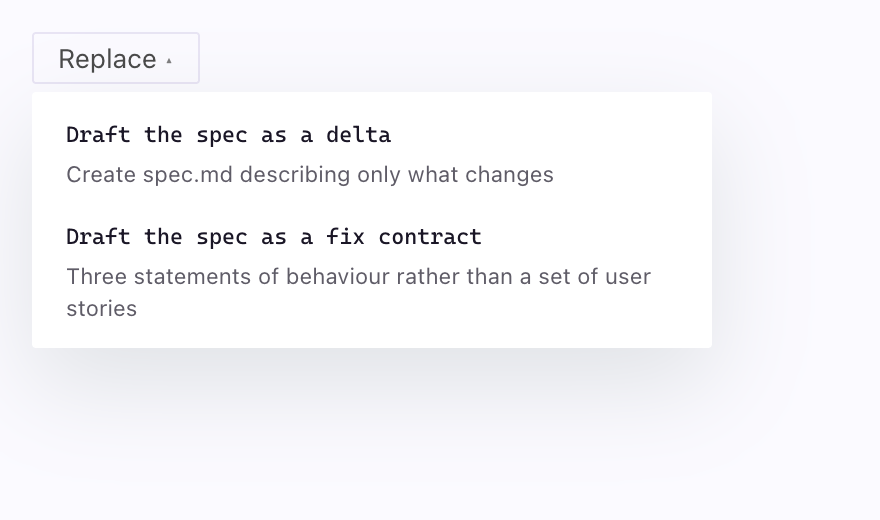

Picking one is the same write a drag makes. The node stays editable, and one click from the shipped one. Anything you attached to the node you replaced comes with it.

Some nodes ship with a step and are not part of the default run. **Add node** in a phase's `+` menu offers them, alongside anything the project dropped, each with a line saying which it is.

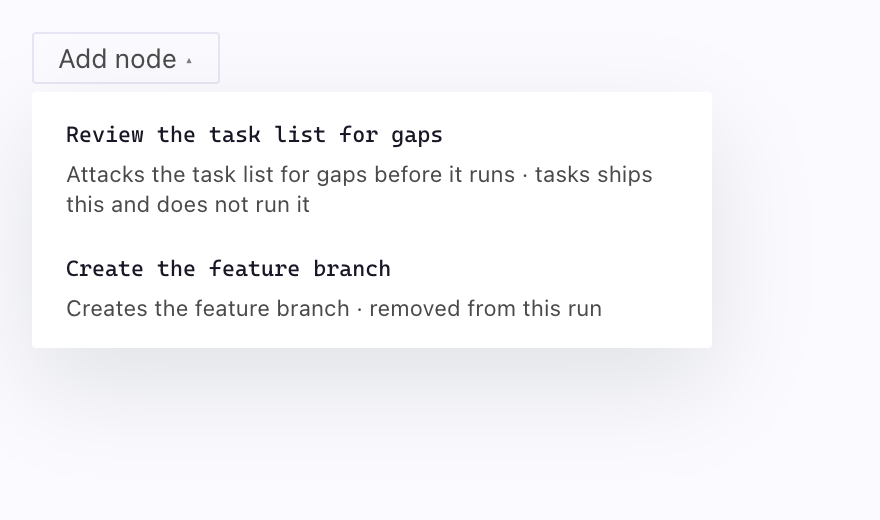

The alternatives and add-ons that ship today are listed in [`docs/template-profiles.md`](./template-profiles.md#picking-a-different-node-or-shape), which is also where you would go to write one of your own.

---

## Change what a step writes

A node says what the assistant does. The **template** chip on a step says what the document it produces looks like.

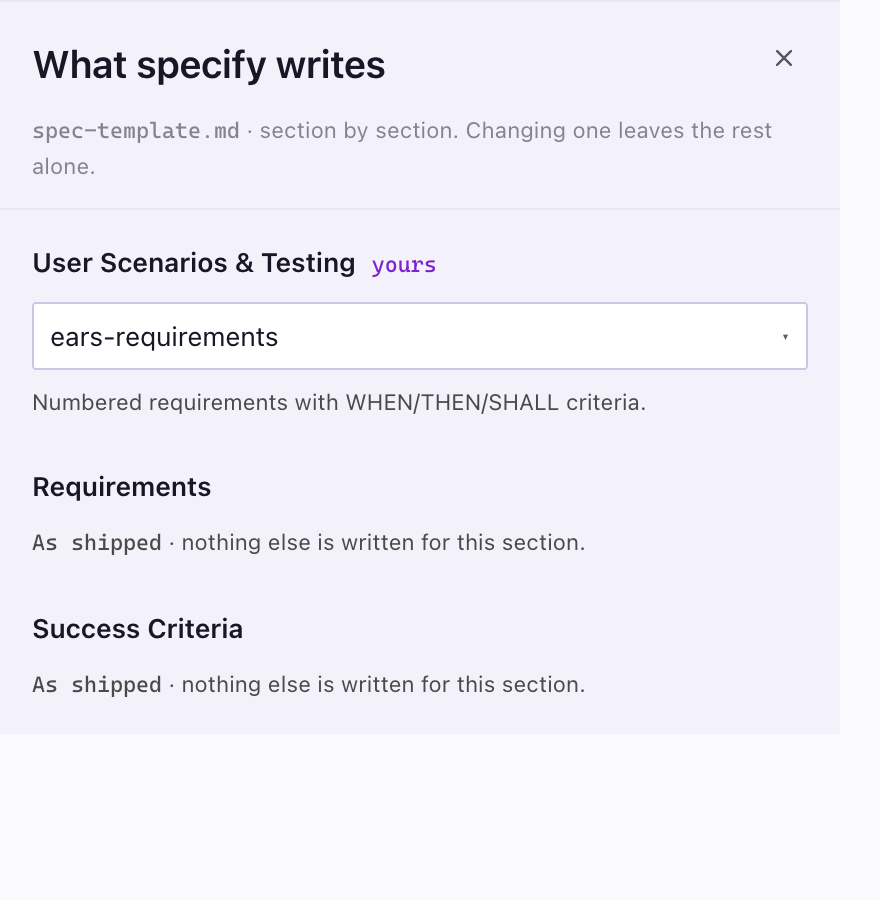

One row per `##` section the template has. A section with alternatives offers the fragments written for it, plus **As shipped**, with the chosen one's summary underneath. A section with none draws no field at all, since a control that cannot be operated invites a click that answers nothing; it says `As shipped` and that nothing else is written for it. Restoring a section removes the entry rather than writing "shipped", because an absent entry already means the template's own words.

A reshaped document is one the command tells the assistant to follow. A step you left alone is byte-identical to the shipped one. The fragments that ship today are listed in [`docs/template-profiles.md`](./template-profiles.md#picking-a-different-node-or-shape).

---

## Add a step

The set of steps used to be fixed, so *"review the change before it counts as done"* had to hide inside implement or not exist. **Add step** in the header gives the run a turn it did not have, and appends it. To put one *between* two steps, click the `+` in the gap between their lanes: the form opens with **Runs after** already naming the step you clicked beside. The same card still sits at the end of the board.

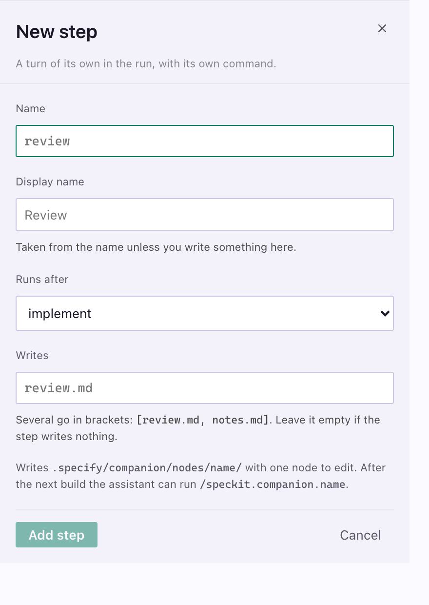

Name it, say where it runs and what it produces. The panel writes `.specify/companion/nodes/<name>/` seeded runnable, with a frame, an order file and one node to edit, and opens that node.

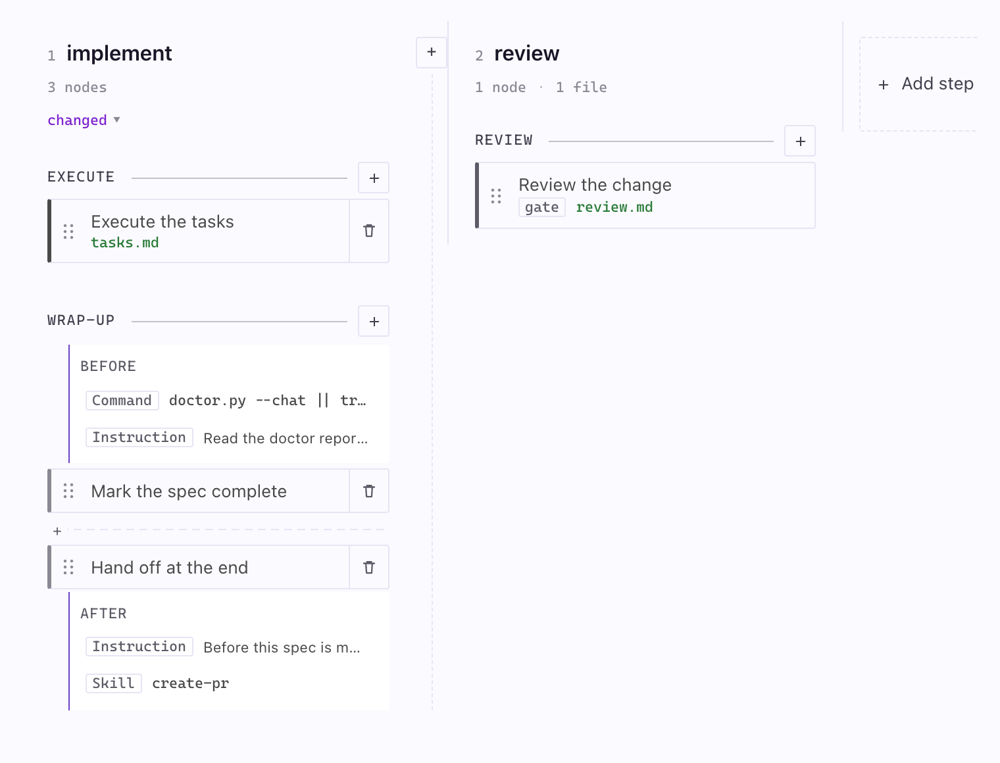

Where it runs is one key in its own order file:

```yaml
# Omit this line for a step you launch when you want it.
after: implement
```

With `after:`, it takes its turn in the run and is drawn between the two steps it sits between. Without one, it is drawn under **Outside the run**: available, not part of the sequence.

Everything else works like a shipped step. Add and replace nodes, name its phases, attach hooks, edit its frame. The build gives it a real agent command, so your assistant can dispatch `/speckit.companion.<name>` after the next build.

---

## Workflows and presets

A **workflow** is a whole named configuration. Switching between them swaps everything at once, including node order, hooks, templates and routing, so a one-line fix and a client deliverable can run different pipelines out of one repository. Your nodes and fragments are shared across all of them. The switcher is the **Workflow** dropdown in the header.

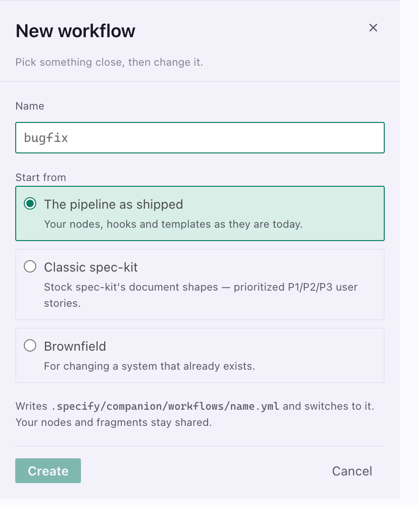

A new workflow starts from what you run today, or from one of the two configurations Companion ships:

| Preset | For |
|---|---|
| **Classic spec-kit** | Stock spec-kit's document shapes: prioritized P1/P2/P3 user stories, the full Technical Context block. Changes what the documents look like, not what the run does. |
| **Brownfield** | Changing a system that already exists: the spec written as a delta, the folder numbered against every branch, the task list attacked before it runs, and a person opening the thing before it counts as done. |

Whichever you pick is copied in and yours to change from there. A preset is a start, not a fixed thing.

---

## Build

Nothing you change takes effect until you build. Configuration is the source of truth; the commands your assistant reads are derived from it.

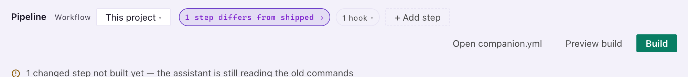

**Preview build** shows what would change and writes nothing. **Build** applies it: it resolves which nodes each step runs, splices in your hooks, resolves any template you reshaped, writes the command bodies with a manifest beside them, and carries them out to the copies your assistant actually loads.

Both answer in the header, where you asked, rather than taking the editor to say so. **Show the log** opens the whole thing, and the SpecKit Companion output channel keeps it either way.

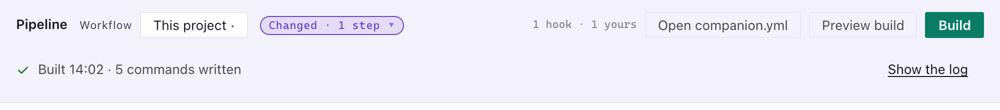

A build that cannot finish says which step and why, and leaves the working pipeline exactly as it was.

---

## When the panel cannot read your pipeline

A configuration outside the readable subset, such as a phase with nothing in it or a node that names something that does not exist, stops the panel drawing.

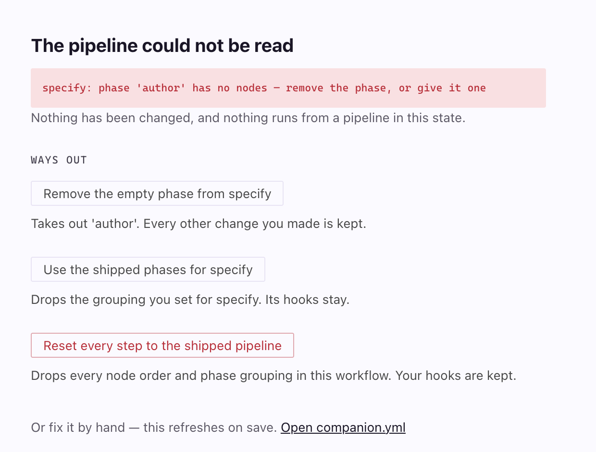

It says so, and offers the ways out as buttons rather than telling you to open a file. The narrowest repair comes first, each saying what it costs, and the broadest one reads as destructive. Your hooks survive every one of them.

**Open companion.yml** is always there, and the panel refreshes when you save it.

---

## Where things live

| Path | What it holds |
|---|---|
| `.specify/companion.yml` | Your configuration, the source of truth |
| `.specify/companion/workflows/<name>.yml` | A whole named configuration you can switch to |
| `.specify/companion/nodes/<step>/<node>.md` | A node you rewrote, or a step you added |
| `.specify/companion/fragments/<name>.md` | A document section you wrote |
| `.specify/extensions/companion/commands/` | What a build produces: derived, not edited |

The reference for the configuration format, and the full list of the alternatives, add-ons, fragments and presets that ship, is [`docs/template-profiles.md`](./template-profiles.md).
