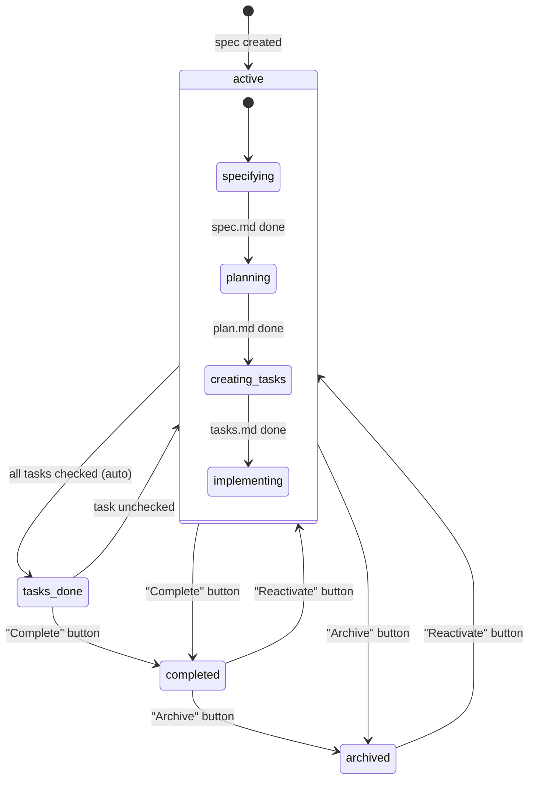
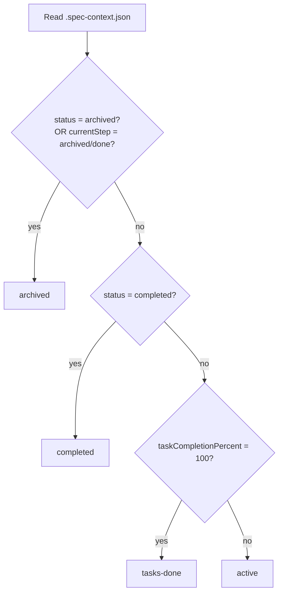
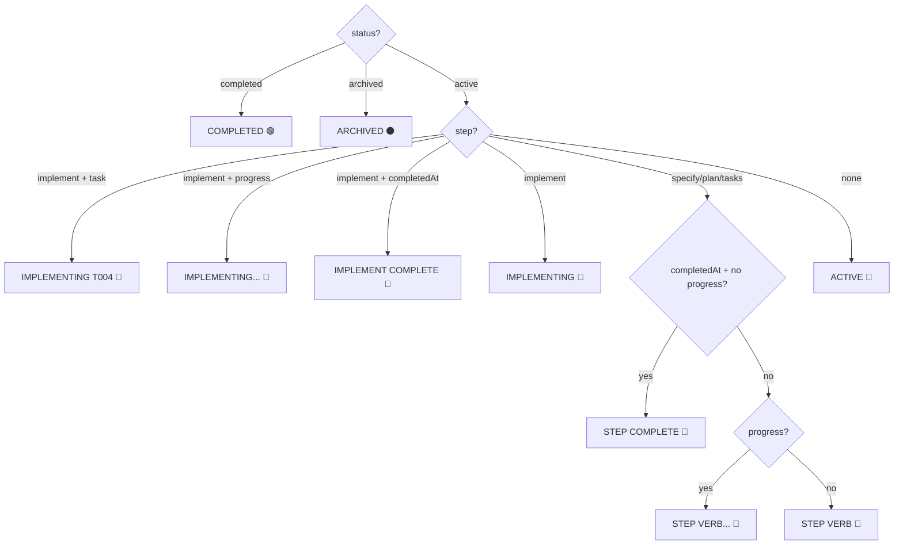
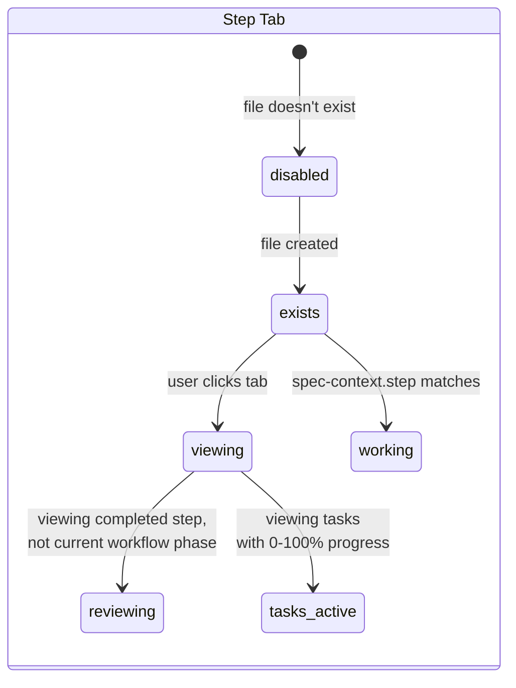
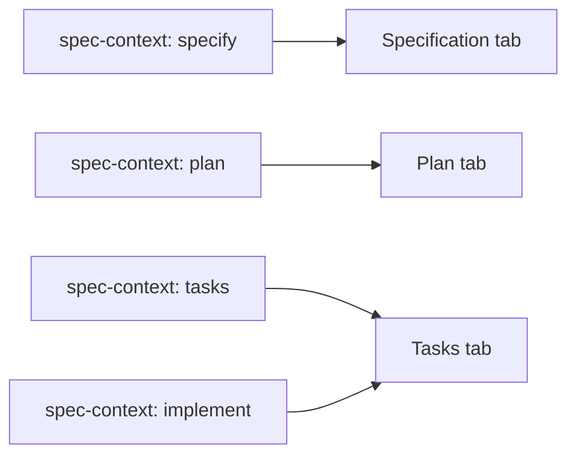
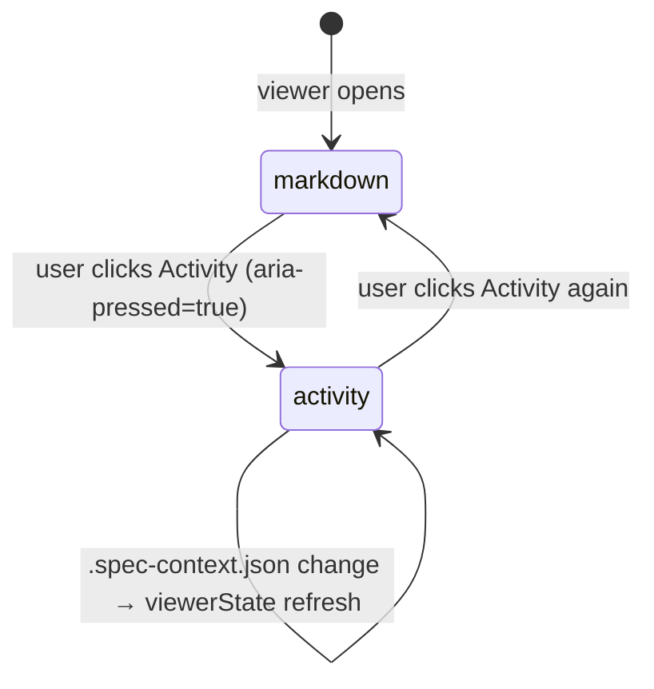
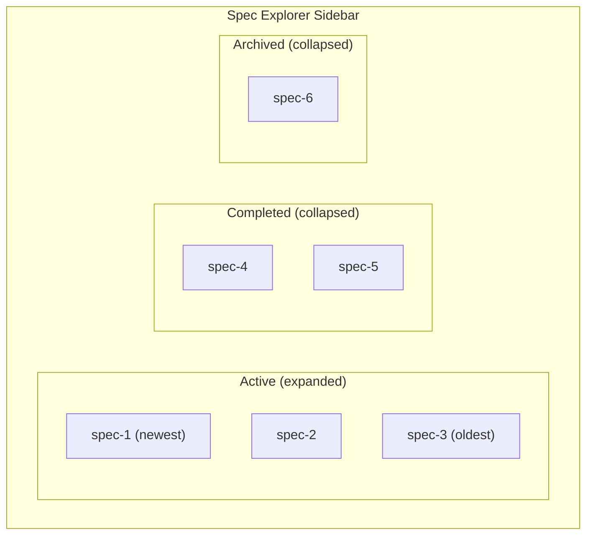

# Spec Viewer — States & Transitions

> **Canonical update (spec 060 — Spec-Context Tracking)**: The viewer now
> derives badge, pulse, highlight, and footer visibility solely from
> `.spec-context.json`. File existence is no longer used to infer step
> completion. See `docs/architecture.md` and
> `src/features/spec-viewer/stateDerivation.ts`.
>
> **Canonical statuses**: `draft` → `specifying` → `specified` → `planning`
> → `planned` → `tasking` → `ready-to-implement` → `implementing` →
> `implemented` → `completed` → `archived`. Legacy `active`/`tasks-done`
> are migrated by `normalizeSpecContext` at read time.
>
> **Final approval gate (`implemented`)**: When the AI finishes the
> `implement` step, `setStepCompleted('implement')` writes
> `status='implemented'` rather than jumping straight to `completed`.
> Terminal `completed` is reached only when the user clicks
> `Mark Completed` (the spec-scope action that calls
> `completeSpec`). This keeps the user in control of when a spec is
> truly closed.
>
> **Visible-label overrides**: The viewer's status badge uses friendlier
> labels for two canonical keys without changing the on-disk values:
> `tasking` renders as `Creating Tasks` and `ready-to-implement` renders
> as `Tasks Created`. Other statuses use the default hyphen-split
> capitalization (`Implemented`, `Implementing`, `Specifying`, …).
>
> **Badge/pulse/highlight rules**:
> - Step badge = `completed` if `stepHistory[step].completedAt` is set
>   **OR** the step precedes `currentStep` in `STEP_NAMES` ordering
>   (inferred completion — handles external tools that advance
>   `currentStep` without populating per-step history); `in-progress`
>   if `startedAt` set and not inferred-completed; else `not-started`.
> - Pulse = the single step whose entry has `startedAt` set and is not
>   inferred-completed. **Null when `status ∈ {completed, archived}`.**
> - Highlight = every step with `completedAt` set or inferred-completed,
>   regardless of active tab.
>
> **Reconciliation**: When the extension reads `.spec-context.json` and
> finds incomplete data (e.g., `currentStep` past steps with no history
> entries, non-canonical status values), it performs a one-time repair
> via `specContextReconciler.ts` — backfilling missing stepHistory
> entries and correcting the status. The file is written back so
> subsequent reads see clean data without re-inferring.
>
> **Viewed step (spec 066)**: Clicking a step tab in the viewer uses the
> same full-HTML regeneration path as sidebar navigation and does NOT
> mutate `.spec-context.json`'s `currentStep`. The header badge and
> footer continue to reflect the spec's true workflow state. The tab
> the user is on gets a solid accent outline; when the viewed step
> isn't the workflow phase (i.e. an earlier completed step), the
> outline is dashed (`.reviewing`). Step tabs only render a green ✓
> when the step's document actually exists on disk, even if
> `viewerState.highlights` lists the step as completed.
>
> **Footer scope tooltips**: Every footer button declares
> `scope: 'spec' | 'step'` and tooltips are auto-suffixed with
> "(Affects whole spec)" / "(Affects this step)".
>
> **Edit Source moved to the sidebar**: The viewer footer no longer has
> an `Edit Source` button. The same affordance lives on each spec/step
> row in the sidebar tree as the inline `Open Source File` action
> (`speckit.openSpecSource`, `$(go-to-file)` icon).
>
> **Auto moved to the Create New Spec form**: `Auto` is no longer
> a viewer footer button. It is the canonical first-time entry point
> for the spec pipeline and lives in the spec-editor webview as the
> `Auto Mode` button next to `Submit`. By the time the spec viewer
> opens, the user has already chosen between Submit and Auto Mode.
>
> **Start removed**: There is no `Start` button. The viewer only opens
> after a step has been initiated (no realistic state where Start
> would apply).
>
> **Closure-eligible gate (`isSpecDone`)**: `Archive` and `Mark
> Completed` are hidden until the spec reaches the final approval
> gate — `status` ∈ {`implemented`, `completed`}. While the AI is
> still creating tasks or building, the footer stays focused on the
> forward action; the sidebar's per-row Archive remains as the
> escape hatch. `Archive` stays visible on `completed`; `Mark
> Completed` does not (the spec is already terminal-completed).
>
> **Footer left/right split**: The renderer routes catalog actions
> into two zones:
> - **Left** (`actions-left`): `Regenerate` only — outlined "redo
>   this step" tool sits alone so the eye finds it without
>   competing with lifecycle controls.
> - **Right** (`actions-right`): `Refine`, `Approve` (forward),
>   `Reactivate`, `Archive`, `Mark Completed`. Closure controls
>   share the right side with the forward button so the user's
>   "what do I do next" decision is in one place.
>
> **Refine scope**: Refine appears only at pause states with a
> markdown doc to comment on (`Specified`, `Planned`,
> `Tasks Created`). It does not surface at `Implemented` — at that
> stage the artifact is the code, not a markdown doc, and the
> right surfaces are `Mark Completed` / `Archive`.
>
> **Dynamic Approve label**: The `Approve` button's visible label is
> derived from the active workflow's step ordering — it shows the next
> step's label (e.g. `Plan`, `Tasks`, `Implement`) so clicking it
> announces what comes next. Falls back to `Approve` when the
> workflow definition is missing.
>
> **Approve advance window**: `Approve` stays visible across the
> "step done, next step not started" pauses (`specified` /
> `planned` / `ready-to-implement`) so the user can dispatch the
> next phase from the viewer footer. It hides once a later step
> actually starts, and on the final step (`implement`) once
> `completedAt` is set — at `implemented` the spec-scope
> `Mark Completed` is the right surface, not `Approve`.
>
> **Generating-during-in-flight (spec 099, restyled in spec 115)**:
> While a step is mid-generation, the footer renders **two
> non-competing affordances**: a non-clickable accent-tinted
> `Generating <step>…` status chip (`<span
> class="footer-generating-chip">` + spinner) on the **right**, and
> the secondary `Mark step complete` override button on the
> **left**. The status chip is not a button — it has
> `pointer-events: none`, `role="status"`, and `aria-live="polite"`,
> so it cannot be clicked or focused and is announced as ambient
> live status rather than an interactive control. The renderer in
> `webview/src/spec-viewer/components/FooterActions.tsx` shows this
> state while the running step (`startedAt` set, no `completedAt`)
> has **not** yet produced its artifact. Completion is content-aware:
> the provider calls `hasNonTrivialArtifact()`
> (`src/features/spec-viewer/stepArtifact.ts`) — `<step>.md` must
> exist with a real heading or ≥40 non-whitespace chars after
> frontmatter is stripped. The result is injected into
> `deriveViewerState`, which carries `runningStepArtifactReady`,
> `runningStepStartedAt`, and `runningStepLabel` on **`viewerState`**
> (the footer's sole input). Both refresh messages — `contentUpdated`
> (tab switch) and `viewerStateUpdated` (`.spec-context.json` change) —
> ship a complete `viewerState`, so the state is consistent however the
> viewer last refreshed. The existing watchers trigger the refresh, so
> no new polling is added (the `implement` step has no single artifact
> and is treated ready at 100% task completion).
>
> Two escape hatches keep the footer from stranding: the left-side
> `Mark step complete` override (posts `markStepComplete`, which
> calls `completeStep` for the running step) and a **10-minute
> recovery timeout** after which the footer reverts to its normal
> enabled buttons. The header status badge and the active step's
> pulse remain the ambient "AI is working" cues; the sidebar's
> per-row Archive remains as an escape hatch.
>
> **Step-tab in-flight pill size**: The active step's
> `.step-status` badge stays at the same 16×16 size as the
> completed checkmark while empty, only widening to a pill when
> there's a `taskCompletionPercent` to show on the implement step.
> Implemented via `:not(:empty)` in
> `webview/styles/spec-viewer/_navigation.css`.
>
> **Footer overflow note (future-proofing)**: After this redesign
> the right-side bar typically holds 1–3 buttons. If more lifecycle
> actions are added later, group secondary entries into an overflow
> `⋯` menu — keep the dynamic next-step button as the primary surface.

## Status Lifecycle



## Status Determination



| Status | How it's reached | Editable? |
|--------|-----------------|-----------|
| `active` | Default / Reactivate button | Yes |
| `tasks-done` | All task checkboxes checked (auto-detected) | Yes |
| `completed` | User clicks "Complete" button | No |
| `archived` | User clicks "Archive" button | No |

---

## Footer Buttons

**Single source of truth.** The footer is a pure function of one `ViewerState`
snapshot derived solely from `.spec-context.json` (`deriveViewerState` →
`getFooterActions`). The webview footer reads **only** `viewerState` for every
decision — status, the button catalog (`viewerState.footer`), the
generating/run-step gate (`runningStepArtifactReady`, `runningStepStartedAt`,
`runningStepLabel`), the recovery-timeout anchor, and button labels. It does
**not** read `navState` for any of these (the lone `navState` read is the
workflow-derived `enhancementButtons`, which can never hide a lifecycle button).
There are exactly two render shapes: the normal `CatalogFooter` and the
`GeneratingFooter` overlay — no legacy fallback branch and no multi-source
status chain. Because every refresh path ships a **complete** `viewerState`
(via one shared payload builder), the same true state always yields the same
button set (determinism by construction).

Zones: **Left** = `regenerate`. **Right** = `refine`, `approve`, `reactivate`,
`archive`, `complete`. The matrix below is the authoritative mapping and matches
`specs/124-fix-footer-button-visibility/contracts/footer-button-matrix.md`.

| Status | Left | Right | Notes |
|--------|------|-------|-------|
| `specifying` / `planning` / `tasking` / `implementing` | Mark step complete | Generating chip | Generating overlay while the running step's artifact is not yet ready (and the recovery window has not elapsed) |
| `specified` | Regenerate | Approve → **Plan** | forward action present |
| `planned` | Regenerate | Approve → **Tasks** | |
| `ready-to-implement` | Regenerate | Approve → **Implement** | |
| `implemented` | Regenerate | **Mark Completed**, **Archive** | Approve hidden; closure controls appear |
| `completed` | — | **Reactivate**, **Archive** | terminal; Regenerate hidden |
| `archived` | — | **Reactivate** | terminal; Archive hidden |

The `Approve` label resolves to the next workflow step (`getApproveLabel`); it is
hidden on the final `implement` step and whenever a past tab is viewed (the
footer always reflects the true workflow stage, not the viewed tab). Once the
running step's artifact lands (or the 10-minute recovery timeout elapses), the
`GeneratingFooter` reverts to the normal `CatalogFooter` buttons — it never
leaves the action bar empty.

The source-tab **Refine** button (`✨ Refine (N)`) still appears dynamically
when pending inline comments are collected. Each comment is persisted to
`.spec-context.json` the moment it is added/removed (message types
`addComment` / `removeComment`, routed through
`specContextWriter`). Clicking Refine sends `runDocRefinement` for the current
doc, which (a) dispatches a direct-edit prompt to the AI built from that
document's pending comments and (b) marks those comments `applied` in
`.spec-context.json` (kept as history — no `<doc>-extra.md` files are written).
On reopen, pending comments are re-rendered inline via best-effort re-anchoring
(stored line → block text → nearest heading).

### Optional command buttons (per tab)

SpecKit's three optional refinement commands surface as built-in enhancement
buttons, each scoped to the tab where it is most useful. They are
workflow-agnostic (no `customWorkflows`/`customCommands` entry required) and
sit alongside any user-defined enhancement buttons for the active tab.

| Active tab | Built-in optional button | Registered command |
|------------|--------------------------|--------------------|
| spec       | **Clarify**              | `speckit.clarify`   |
| plan       | **Checklist**            | `speckit.checklist` |
| tasks      | **Analyze**              | `speckit.analyze`   |

- Each button appears only on its own tab and is hidden on the others.
- Clicking a button dispatches the matching registered VS Code command (via
  `executeCommand`), so behavior is identical to running it from the Command
  Palette — provider formatting and step tracking included.
- A user `customCommands` / workflow command with the same id takes precedence
  and is rendered/dispatched instead (deduped by command id), so overrides win.
- Source: `src/features/spec-viewer/optionalCommands.ts` (table + helpers),
  wired in `resolveEnhancementButtons` (render) and `handleClarify` (dispatch).

### Review comments (Activity panel)

The per-document `*-extra.md` scratchpad files and their read-only "Notes"
sub-tab have been **removed**. Review comments now persist in
`.spec-context.json` (`reviewComments[]`) and surface in two places:

- **Inline** — the always-on primary path: the line-hover `+`, comment card,
  and dialog, restored on reopen.
- **Activity panel → *Review comments* card** — a consolidated cross-document
  list. Each entry shows a `pending` / `applied` status badge, a jump-to-line
  control, and each document offers a **Run refinement** button (dispatches
  `runDocRefinement` for that doc). The card hides itself when there are no
  comments, like every other Activity card.

When the Activity panel is toggled off there is no cross-document list, but
inline comments still work and still persist.

---

## Badge Text



| Priority | Condition | Badge Text | Color |
|----------|-----------|-----------|-------|
| 1 | `status: "completed"` | COMPLETED | green |
| 2 | `status: "archived"` | ARCHIVED | gray |
| 3 | `step: "implement"` + `task` + `progress` | IMPLEMENTING T004... | blue |
| 4 | `step: "implement"` + `task` | IMPLEMENTING T004 | blue |
| 5 | `step: "implement"` + `progress` | IMPLEMENTING... | blue |
| 6 | `step: "implement"` + `completedAt` | IMPLEMENT COMPLETE | blue |
| 7 | `step: "implement"` (idle) | IMPLEMENTING | blue |
| 8 | `step: "specify"` + `completedAt` + no `progress` | SPECIFY COMPLETE | blue |
| 9 | `step: "plan"` + `completedAt` + no `progress` | PLAN COMPLETE | blue |
| 10 | `step: "tasks"` + `completedAt` + no `progress` | TASKS COMPLETE | blue |
| 11 | `step: "specify"` + `progress` | SPECIFYING... | blue |
| 12 | `step: "plan"` + `progress` | PLANNING... | blue |
| 13 | `step: "tasks"` + `progress` | CREATING TASKS... | blue |
| 14 | `step: "specify"` (idle) | SPECIFYING | blue |
| 15 | `step: "plan"` (idle) | PLANNING | blue |
| 16 | `step: "tasks"` (idle) | CREATING TASKS | blue |
| 17 | Fallback | ACTIVE | blue |
| 18 | No `.spec-context.json` | *(hidden)* | — |

**Priority**: status > step-completion > in-progress > idle-step > fallback.

When `progress` is non-null (in-progress work by an AI agent), the badge appends `...` to indicate active work. In-progress always takes precedence over step completion — if `completedAt` is set but `progress` is also non-null, the in-progress badge is shown.

---

## Structured Header

When `.spec-context.json` data is available, a structured header renders above the markdown content:

```
[Badge] [Created Date]
[DocType: specName]
[branch badge]
───────────────────────
```

| Row | Content | Source |
|-----|---------|--------|
| Row 1 | Badge pill + created date | `computeBadgeText()`, `computeCreatedDate()` |
| Row 2 | `{DocType}: {specName}` | `getDocTypeLabel(step)`, `specName` or `deriveSpecName(specDir)` |
| Row 3 | Branch badge with git icon | `branch` field from context |
| Separator | Horizontal rule | Always shown |

- **Badge color**: Uses `--header-title` (same as h1 headings) for primary color
- **H1 hiding**: When header is present (`data-has-context="true"`), the first H1 in markdown is hidden via CSS to avoid duplicate title
- **Metadata stripping**: When context data is available, `preprocessSpecMetadata` strips raw metadata (Status, Feature Branch, etc.) from rendered markdown
- **Fallback**: When `specName` is missing from context, it is derived from the directory slug (e.g., `046-spec-viewer-header-redesign` → `Spec Viewer Header Redesign`)
- **No context**: When no `.spec-context.json` exists, no header renders; markdown displays as before

### Key Files

| File | Role |
|------|------|
| `src/features/spec-viewer/html/generator.ts` | `buildHeaderHtml()` — server-side header generation |
| `webview/src/spec-viewer/navigation.ts` | `updateNavState()` — client-side header updates on tab switch |
| `webview/src/spec-viewer/markdown/preprocessors.ts` | `preprocessSpecMetadata()` — strips metadata when context-driven |
| `webview/styles/spec-viewer/_content.css` | `.spec-header` layout and `.spec-badge` color styles |

---

## Date Display

Dates are derived from `.spec-context.json` — **not** from markdown frontmatter.

### Date Derivation

| Field | Source | Fallback |
|-------|--------|----------|
| **Created** | `stepHistory.specify.startedAt` | Earliest `startedAt` across all steps |
| **Last Updated** | `context.updated` (AI agent activity) | Most recent timestamp across all `stepHistory` entries |

### Omission Rules

| Condition | Created | Last Updated |
|-----------|---------|-------------|
| No `.spec-context.json` | Hidden | Hidden |
| No `stepHistory` | Hidden | Hidden |
| Only one timestamp (same as Created) | Shown | Hidden (avoid redundancy) |
| Unparseable ISO timestamp | Hidden | Hidden |
| Malformed `.spec-context.json` | Hidden | Hidden |

### Format

Dates display as locale-friendly short format: `"Apr 1, 2026"` — computed on the extension side via `toLocaleDateString('en-US', { month: 'short', day: 'numeric', year: 'numeric' })`.

---

## Step Tab States



| Class | Meaning | Visual |
|-------|---------|--------|
| `exists` | File exists on disk | Green checkmark dot + bright label (normal weight) |
| `viewing` | Currently displayed in viewer | Accent-tinted fill + inset accent ring wrapping the whole tab + bold bright label |
| `working` | Step being worked on (from `spec-context.step`, only if not completed) | Pulsing green glow on dot + live elapsed timer (e.g. `3m 22s`) rendered via `.step-tab__elapsed` |
| `tasks-active` | Viewing tasks with 0-100% progress | Percentage badge in dot |
| `in-progress` | Tasks have progress but not viewing | Percentage in dot (subtle) |
| `workflow` | Current workflow phase (not viewing) | Bright label |
| `reviewing` | Viewing completed step, not active workflow | White bold label |
| `disabled` | Step not available (no file, not first) | Dimmed (opacity 0.35) |
| `stale` | Document stale relative to upstream | `!` badge |

### Elapsed Timer and Completion Notifications

- **Elapsed timer** (`.step-tab__elapsed`): rendered as a live `Ns` / `Mm Ss` / `Hh Mm` ticker beneath the running step tab's label. Derived from `stepHistory[step].startedAt`, so it survives webview reloads. Hidden as soon as the step's `completedAt` is written.
- **Completion notification**: when any step's `completedAt` flips from null to a timestamp, the extension fires `vscode.window.showInformationMessage('Spec {N} · {Step} complete', 'Open spec')`. Dedupe is keyed on `{specDir}:{step}:{startedAt}` in-memory — never re-announced across viewer reopens. Gated by `speckit.notifications.stepComplete` (default `true`).

### Working Step Mapping



---

## Activity Panel

An `Activity` button at the right of the navigation bar swaps the markdown
pane for a card-stack overview of everything `.spec-context.json` exposes
through `viewerState`.



**Cards (top to bottom; each hides when its data is empty)**:

| Card | Source fields |
|------|---------------|
| Approach | `approach`, `last_action`, `status`, `prUrl`/`prNumber`, `checkpointStatus.{commit, pr}` |
| Phases | `stepHistory` (step-level `startedAt`/`completedAt`) + `transitions` for substep names; renders an overall started/ended/total header, per-step duration, and per-substep timing. Author (`by`) badge shows once at spec start |
| Tasks | `task_summaries.T###` — `status`, `did`, `files`, per-task `concerns` |
| Decisions | `decisions[]` |
| Concerns | `concerns[]` (`{ task?, note }`) |
| Files touched | `files_modified[]`, clickable |

**Setting gate** — `speckit.viewer.activityPanel`:

| Value | Toggle visibility | Label |
|-------|------------------|-------|
| `"off"` | hidden | — |
| `"beta"` (default) | visible | `Activity` + small `beta` pill |
| `"on"` | visible | `Activity` (no pill) |

**stepHistory is derived, not read from disk.** The extension owns this
field. `deriveStepHistory(transitions, currentStep, status)` in
`src/features/specs/stepHistoryDerivation.ts` rebuilds it on every read by
walking `transitions[]`: each step's `startedAt` is its first transition,
`completedAt` is the first transition of the next step (a real boundary
when `by: "extension"`). Two correctness rules: (1) consecutive identical
`(step, substep, from)` transitions are collapsed before grouping, so a
substep written several times in a row (e.g. an implement loop's
repeated `phase1`) does not distort durations or produce duplicate rows;
(2) when `status ∈ {completed, archived}` the terminal step's `completedAt`
is finalized to its last transition's `at` instead of reading as in-flight
forever. The AI is told (via `promptBuilder.ts`) not to write this field;
whatever it ships on disk gets ignored.

**Phases card timing.** The card surfaces all the timing it derives:
- An **overall header** — spec-wide *started* (first group's `startedAt`),
  *ended* (last group's `completedAt`, or *in progress*), and *total*.
- **Active time per step** in each step heading. Elapsed is computed as the
  sum of gaps between recorded activity timestamps, with any gap longer than
  `IDLE_GAP_CAP_MS` (5 min) capped — so idle pauses (including an overnight gap
  *between* substeps) don't count as work. The overall **Total** is the sum of
  per-step active time.
- **Per-substep timing** on each substep row — for a tracked substep, its
  active duration (gap to the next event, idle-capped); otherwise the offset
  from the step start (`+5s`, `+1m 30s`).
- **The in-flight step pulses** (animated dot + accent-colored time); there is
  no separate "last active" line (staleness is surfaced by the StaleBanner).
- **Per-step start dates** appear only on a multi-day spec — a step shows its
  absolute start date when it began on a different calendar day than the spec
  start; single-day specs show no per-step dates (the whole-spec *Started* is
  always in the header).
- The **author (`by`) badge** appears once, on the spec-start transition —
  not on every per-substep row (it's uniform within a phase, so repeating
  it is noise).

Substep `at` values are still AI-typed when `by ∈ {cli, ai}`, so absolute
substep times are best-effort; the offsets/durations are displayed as a
relative read of those values rather than authoritative wall-clock timing.
For legacy specs with no transition timing, a one-time reconciler backfill
(`specContextReconciler.ts`) fills missing `completedAt` from the spec's
artifact-file mtimes (real, not synthesized) — see
[spec-context-schema.md](./spec-context-schema.md).

**Live updates**: when `.spec-context.json` changes on disk, the existing
watcher invokes `specViewerProvider.refreshContextIfDisplaying`, which
re-derives `viewerState` and posts `viewerStateUpdated`. Cards re-render
from the new state without a reload.

**Toggle mechanics**: clicking `Activity` flips the `activityVisible` signal.
The markdown pane stays mounted (hidden via the `hidden` attribute) so
toggling back is instant. `<ActivityPanel />` mounts lazily on first reveal
so initial spec render is never blocked. While Activity is shown, the
sub-document sub-navigation row in `NavigationBar` is suppressed (Activity
has no sub-documents); switching back to a content tab restores that tab's
sub-nav.

---

## Sidebar Grouping



| Group | Default state | Sort order |
|-------|--------------|------------|
| **Active** | Expanded | Newest first (by creation date) |
| **Completed** | Collapsed | Newest first (by creation date) |
| **Archived** | Collapsed | Newest first (by creation date) |

---

## Data Flow

```mermaid
sequenceDiagram
    participant FS as .spec-context.json
    participant Ext as specViewerProvider
    participant Gen as generator.ts
    participant WV as Webview

    FS->>Ext: getFeatureWorkflow()
    Ext->>Ext: compute specStatus, badgeText, activeStep, dates
    Ext->>Gen: generateHtml(specStatus, activeStep, badgeText, dates)
    Gen->>WV: HTML with data-spec-status, data-spec-badge, date elements
    WV->>WV: CSS renders badge, tab states

    Note over WV: On tab switch
    Ext->>WV: contentUpdated (complete navState + viewerState)
    Note over WV: On .spec-context.json change (post-action / external)
    Ext->>WV: viewerStateUpdated (complete navState + viewerState)
    WV->>WV: footer re-renders from viewerState only; tabs from the refreshed navState
```

Both refresh messages are built by one shared payload builder
(`buildViewerPayload`) so their shapes cannot drift, and neither ever ships a
footer-relevant field as a partial merged onto a stale snapshot.

---

## Key Files

| File | Responsibility |
|------|---------------|
| `src/features/spec-viewer/specViewerProvider.ts` | Status computation, `buildViewerPayload` (shared complete-payload builder), data flow to webview |
| `src/features/spec-viewer/stateDerivation.ts` | `deriveViewerState()` — footer catalog + run-step/generating fields |
| `src/features/spec-viewer/footerActions.ts` | Footer action catalog + visibility rules (the deterministic oracle) |
| `src/features/spec-viewer/html/generator.ts` | Initial HTML shell, badge attribute, initial navState |
| `src/features/spec-viewer/phaseCalculation.ts` | `computeBadgeText()`, `computeCreatedDate()`, `computeLastUpdatedDate()`, `mapStepToTab()`, `getDocTypeLabel()` |
| `src/features/spec-viewer/messageHandlers.ts` | Lifecycle action handlers (complete/archive/reactivate) |
| `src/features/spec-viewer/types.ts` | `SpecStatus` type, message types |
| `webview/src/spec-viewer/components/FooterActions.tsx` | Single-source footer (CatalogFooter vs GeneratingFooter) |
| `webview/src/spec-viewer/components/StepTab.tsx` | Step-tab class derivation |
| `webview/src/spec-viewer/actions.ts` | Checkbox toggle + percentage update |
| `webview/styles/spec-viewer/_navigation.css` | Tab visual states |
| `webview/styles/spec-viewer/_footer.css` | Button styles |
| `webview/styles/spec-viewer/_content.css` | Badge pill styles |
| `webview/styles/spec-viewer/_animations.css` | Working pulse animation |
