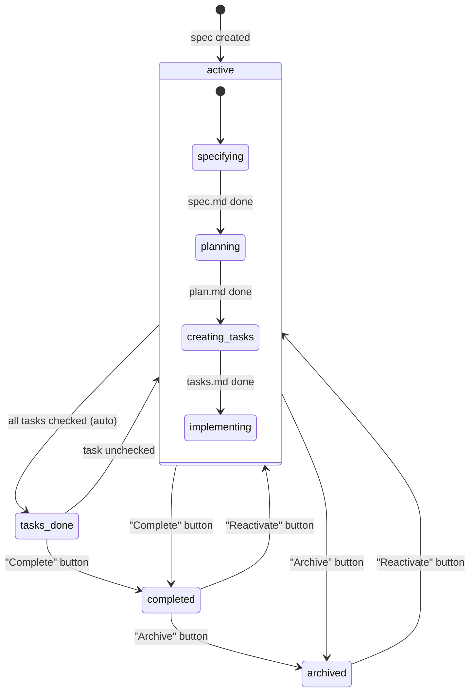
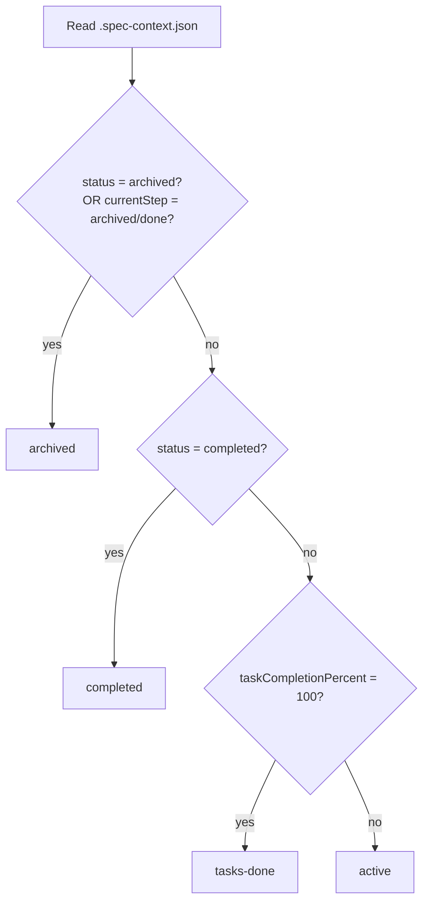
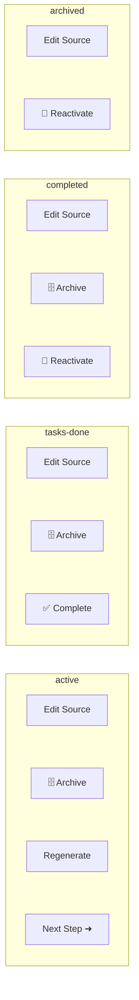
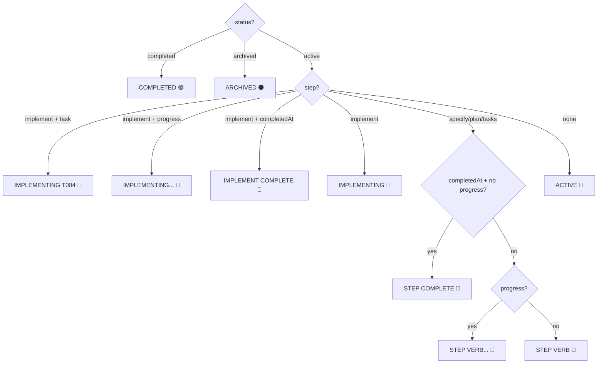
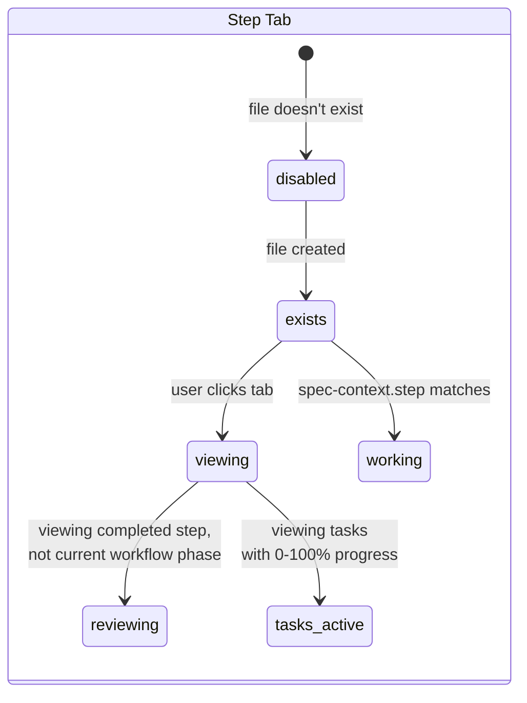
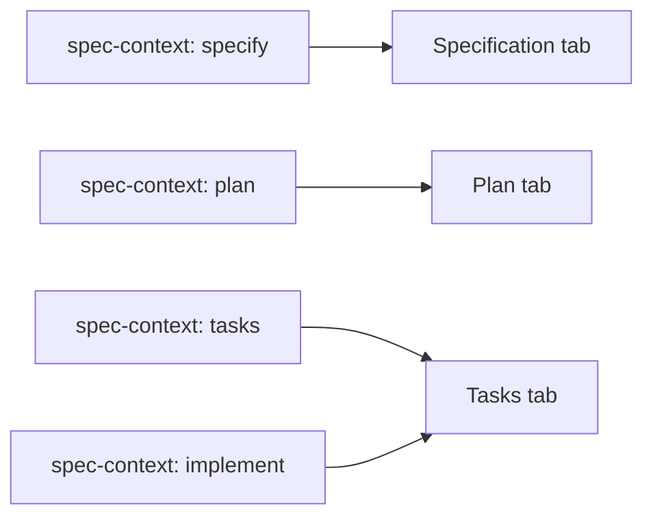
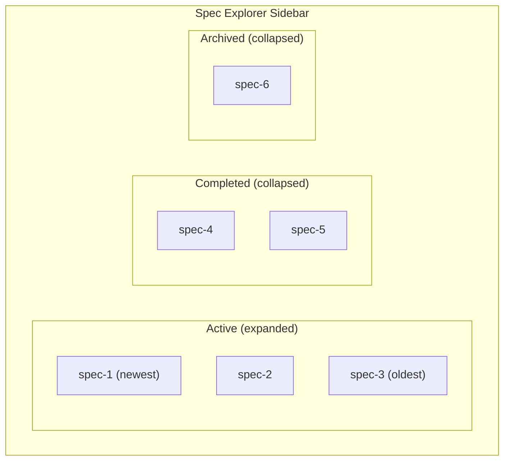
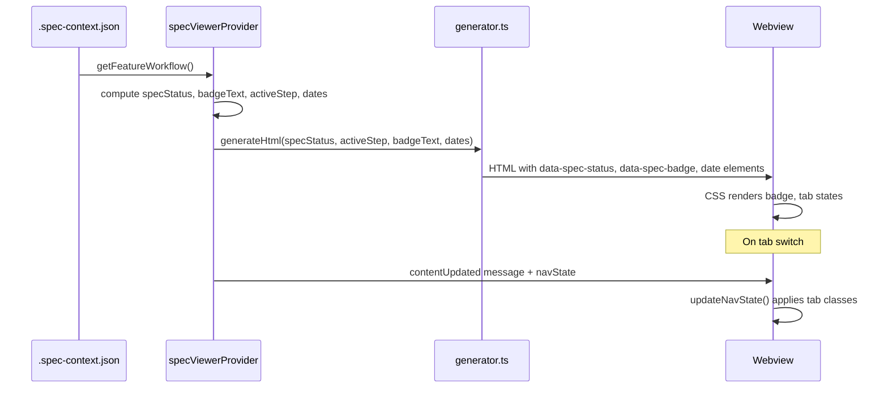

# Spec Viewer — States & Transitions

> **Canonical update (spec 060 — Spec-Context Tracking)**: The viewer now
> derives badge, pulse, highlight, and footer visibility solely from
> `.spec-context.json`. File existence is no longer used to infer step
> completion. See `docs/architecture.md` and
> `src/features/spec-viewer/stateDerivation.ts`.
>
> **Canonical statuses**: `draft` → `specifying` → `specified` → `planning`
> → `planned` → `tasking` → `ready-to-implement` → `implementing` →
> `completed` → `archived`. Legacy `active`/`tasks-done` are migrated by
> `normalizeSpecContext` at read time.
>
> **Badge/pulse/highlight rules**:
> - Step badge = `completed` if `stepHistory[step].completedAt` is set;
>   `in-progress` if `startedAt` set and `completedAt` null; else
>   `not-started`.
> - Pulse = the single step whose entry has `startedAt` set and
>   `completedAt` null. **Null when `status ∈ {completed, archived}`.**
> - Highlight = every step with `completedAt` set, regardless of active tab.
>
> **Footer scope tooltips**: Every footer button declares
> `scope: 'spec' | 'step'` and tooltips are auto-suffixed with
> "(Affects whole spec)" / "(Affects this step)". SDD `Auto` appears only
> on the Specify tab during `draft`/`specifying` for `sdd`/`sdd-fast`
> workflows.

## Status Lifecycle



## Status Determination



| Status | How it's reached | Editable? |
|--------|-----------------|-----------|
| `active` | Default / Reactivate button | Yes |
| `tasks-done` | All task checkboxes checked (auto-detected) | Yes |
| `completed` | User clicks "Complete" button | No |
| `archived` | User clicks "Archive" button | No |

---

## Footer Buttons



| Status | Left side | Right side |
|--------|-----------|------------|
| **active** | Edit Source, Archive | Regenerate, *Next Step* (if applicable) |
| **tasks-done** | Edit Source, Archive | **Complete** (primary) |
| **completed** | Edit Source, Archive | Reactivate |
| **archived** | Edit Source | Reactivate |

The "Next Step" button shows only when:
- Status is `active`
- The next core document doesn't exist yet
- Label shows the next step name: "Plan", "Tasks", or "Implement"

The **Refine** button (`✨ Refine (N)`) appears dynamically when inline comments are pending.

---

## Badge Text



| Priority | Condition | Badge Text | Color |
|----------|-----------|-----------|-------|
| 1 | `status: "completed"` | COMPLETED | green |
| 2 | `status: "archived"` | ARCHIVED | gray |
| 3 | `step: "implement"` + `task` + `progress` | IMPLEMENTING T004... | blue |
| 4 | `step: "implement"` + `task` | IMPLEMENTING T004 | blue |
| 5 | `step: "implement"` + `progress` | IMPLEMENTING... | blue |
| 6 | `step: "implement"` + `completedAt` | IMPLEMENT COMPLETE | blue |
| 7 | `step: "implement"` (idle) | IMPLEMENTING | blue |
| 8 | `step: "specify"` + `completedAt` + no `progress` | SPECIFY COMPLETE | blue |
| 9 | `step: "plan"` + `completedAt` + no `progress` | PLAN COMPLETE | blue |
| 10 | `step: "tasks"` + `completedAt` + no `progress` | TASKS COMPLETE | blue |
| 11 | `step: "specify"` + `progress` | SPECIFYING... | blue |
| 12 | `step: "plan"` + `progress` | PLANNING... | blue |
| 13 | `step: "tasks"` + `progress` | CREATING TASKS... | blue |
| 14 | `step: "specify"` (idle) | SPECIFYING | blue |
| 15 | `step: "plan"` (idle) | PLANNING | blue |
| 16 | `step: "tasks"` (idle) | CREATING TASKS | blue |
| 17 | Fallback | ACTIVE | blue |
| 18 | No `.spec-context.json` | *(hidden)* | — |

**Priority**: status > step-completion > in-progress > idle-step > fallback.

When `progress` is non-null (in-progress work by an AI agent), the badge appends `...` to indicate active work. In-progress always takes precedence over step completion — if `completedAt` is set but `progress` is also non-null, the in-progress badge is shown.

---

## Structured Header

When `.spec-context.json` data is available, a structured header renders above the markdown content:

```
[Badge] [Created Date]
[DocType: specName]
[branch badge]
───────────────────────
```

| Row | Content | Source |
|-----|---------|--------|
| Row 1 | Badge pill + created date | `computeBadgeText()`, `computeCreatedDate()` |
| Row 2 | `{DocType}: {specName}` | `getDocTypeLabel(step)`, `specName` or `deriveSpecName(specDir)` |
| Row 3 | Branch badge with git icon | `branch` field from context |
| Separator | Horizontal rule | Always shown |

- **Badge color**: Uses `--header-title` (same as h1 headings) for primary color
- **H1 hiding**: When header is present (`data-has-context="true"`), the first H1 in markdown is hidden via CSS to avoid duplicate title
- **Metadata stripping**: When context data is available, `preprocessSpecMetadata` strips raw metadata (Status, Feature Branch, etc.) from rendered markdown
- **Fallback**: When `specName` is missing from context, it is derived from the directory slug (e.g., `046-spec-viewer-header-redesign` → `Spec Viewer Header Redesign`)
- **No context**: When no `.spec-context.json` exists, no header renders; markdown displays as before

### Key Files

| File | Role |
|------|------|
| `src/features/spec-viewer/html/generator.ts` | `buildHeaderHtml()` — server-side header generation |
| `webview/src/spec-viewer/navigation.ts` | `updateNavState()` — client-side header updates on tab switch |
| `webview/src/spec-viewer/markdown/preprocessors.ts` | `preprocessSpecMetadata()` — strips metadata when context-driven |
| `webview/styles/spec-viewer/_content.css` | `.spec-header` layout and `.spec-badge` color styles |

---

## Date Display

Dates are derived from `.spec-context.json` — **not** from markdown frontmatter.

### Date Derivation

| Field | Source | Fallback |
|-------|--------|----------|
| **Created** | `stepHistory.specify.startedAt` | Earliest `startedAt` across all steps |
| **Last Updated** | `context.updated` (AI agent activity) | Most recent timestamp across all `stepHistory` entries |

### Omission Rules

| Condition | Created | Last Updated |
|-----------|---------|-------------|
| No `.spec-context.json` | Hidden | Hidden |
| No `stepHistory` | Hidden | Hidden |
| Only one timestamp (same as Created) | Shown | Hidden (avoid redundancy) |
| Unparseable ISO timestamp | Hidden | Hidden |
| Malformed `.spec-context.json` | Hidden | Hidden |

### Format

Dates display as locale-friendly short format: `"Apr 1, 2026"` — computed on the extension side via `toLocaleDateString('en-US', { month: 'short', day: 'numeric', year: 'numeric' })`.

---

## Step Tab States



| Class | Meaning | Visual |
|-------|---------|--------|
| `exists` | File exists on disk | Green checkmark dot |
| `viewing` | Currently displayed in viewer | White bold label |
| `working` | Step being worked on (from `spec-context.step`, only if not completed) | Pulsing green glow on dot |
| `tasks-active` | Viewing tasks with 0-100% progress | Percentage badge in dot |
| `in-progress` | Tasks have progress but not viewing | Percentage in dot (subtle) |
| `workflow` | Current workflow phase (not viewing) | Bright label |
| `reviewing` | Viewing completed step, not active workflow | White bold label |
| `disabled` | Step not available (no file, not first) | Dimmed (opacity 0.35) |
| `stale` | Document stale relative to upstream | `!` badge |

### Working Step Mapping



---

## Sidebar Grouping



| Group | Default state | Sort order |
|-------|--------------|------------|
| **Active** | Expanded | Newest first (by creation date) |
| **Completed** | Collapsed | Newest first (by creation date) |
| **Archived** | Collapsed | Newest first (by creation date) |

---

## Data Flow



---

## Key Files

| File | Responsibility |
|------|---------------|
| `src/features/spec-viewer/specViewerProvider.ts` | Status computation, data flow to webview |
| `src/features/spec-viewer/html/generator.ts` | Footer button HTML, badge attribute |
| `src/features/spec-viewer/phaseCalculation.ts` | `computeBadgeText()`, `computeCreatedDate()`, `computeLastUpdatedDate()`, `mapSddStepToTab()` |
| `src/features/spec-viewer/messageHandlers.ts` | Lifecycle action handlers (complete/archive/reactivate) |
| `src/features/spec-viewer/types.ts` | `SpecStatus` type, message types |
| `webview/src/spec-viewer/navigation.ts` | Tab class application logic |
| `webview/src/spec-viewer/actions.ts` | Checkbox toggle + percentage update |
| `webview/styles/spec-viewer/_navigation.css` | Tab visual states |
| `webview/styles/spec-viewer/_footer.css` | Button styles |
| `webview/styles/spec-viewer/_content.css` | Badge pill styles |
| `webview/styles/spec-viewer/_animations.css` | Working pulse animation |
