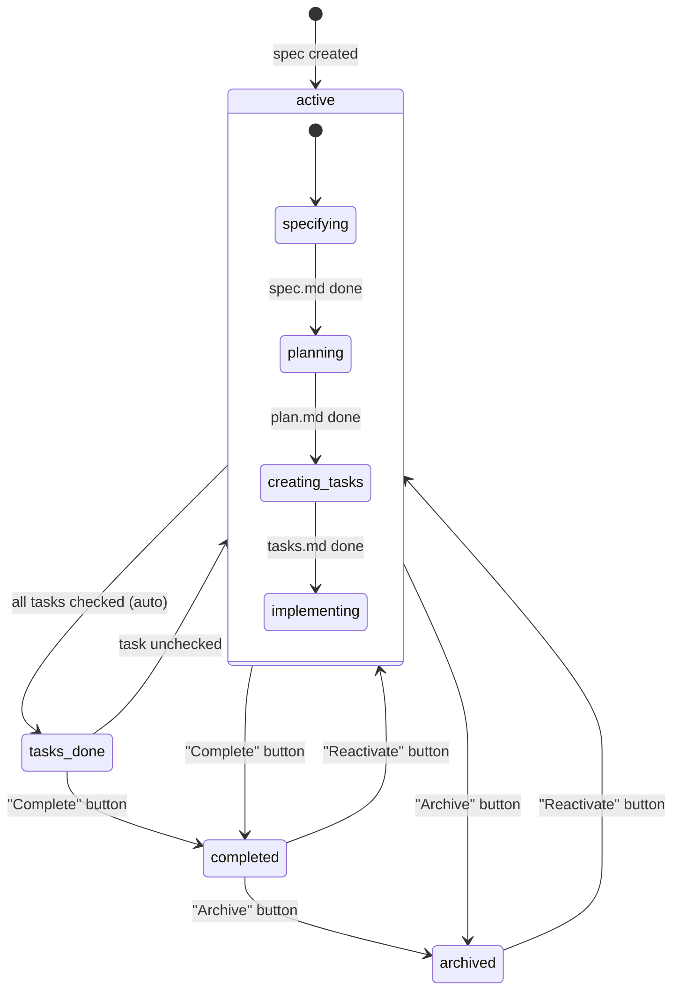
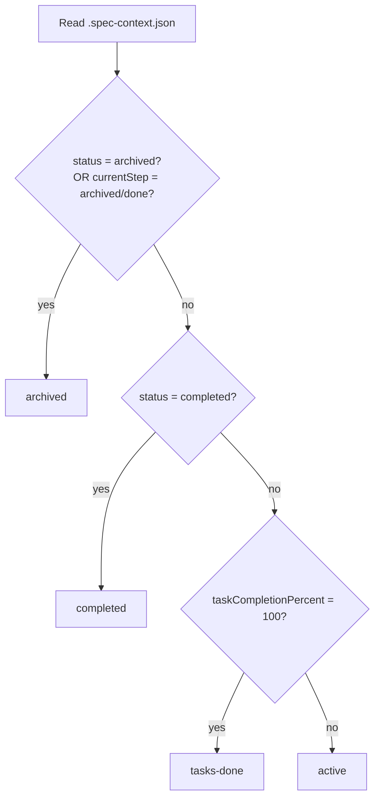
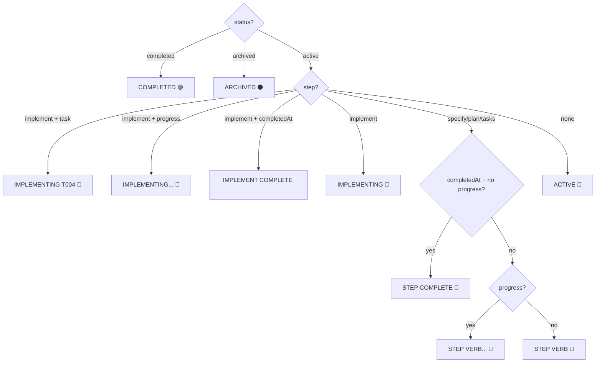
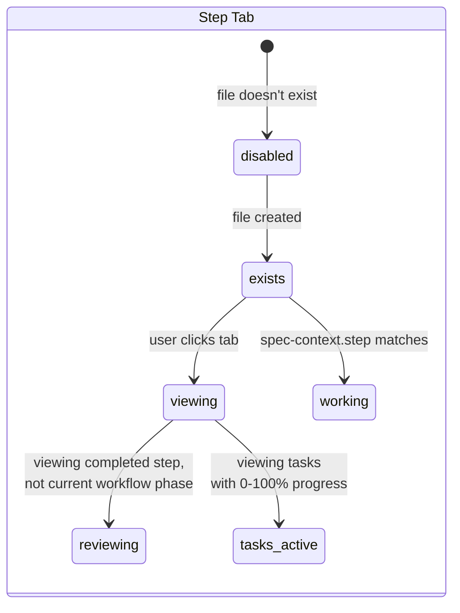
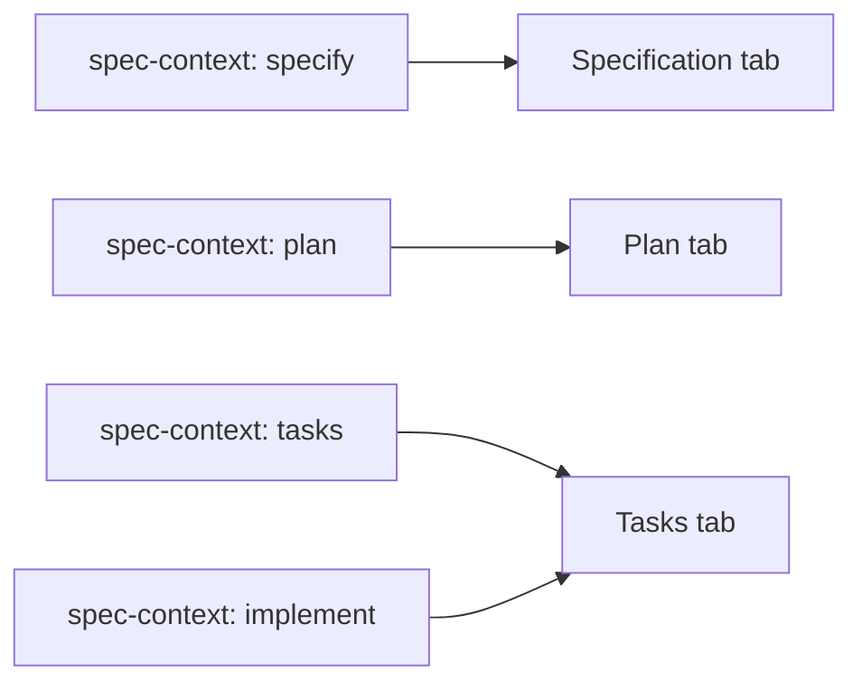
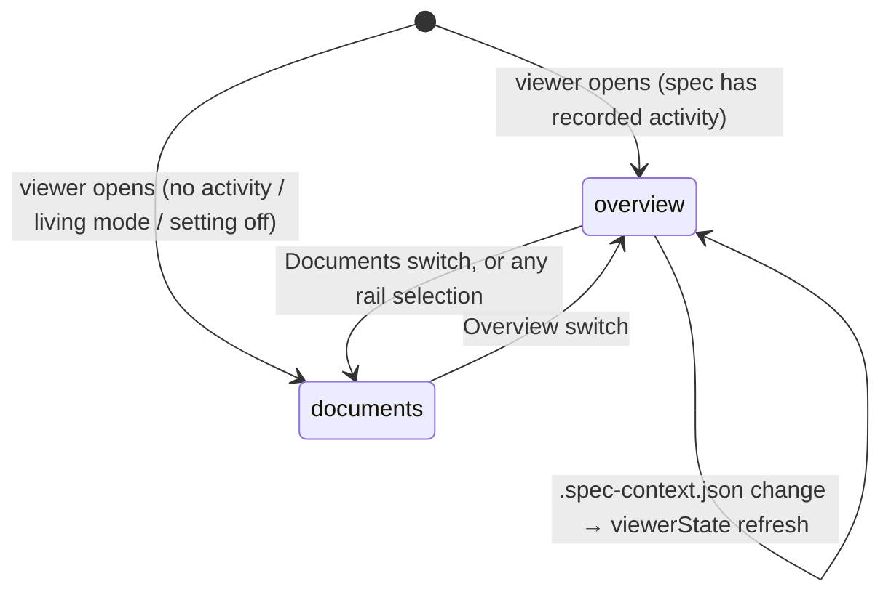
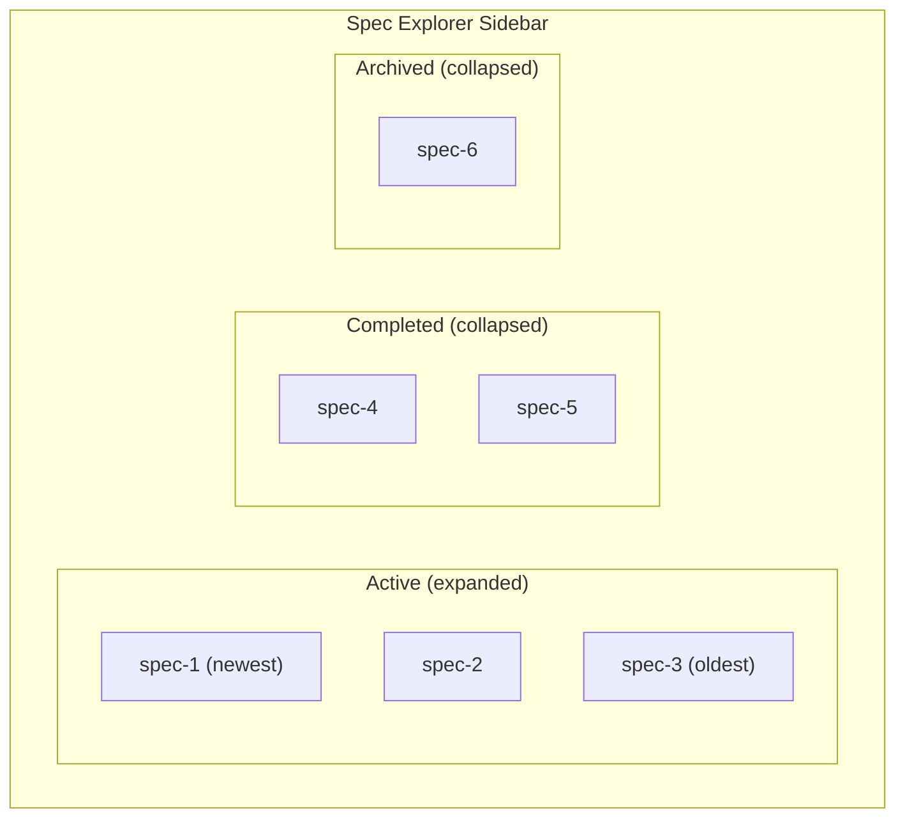

# Spec Viewer — States & Transitions

> **Canonical update (spec 060 — Spec-Context Tracking)**: The viewer now
> derives badge, pulse, highlight, and footer visibility solely from
> `.spec-context.json`. File existence is no longer used to infer step
> completion. See `docs/architecture.md` and
> `src/features/spec-viewer/stateDerivation.ts`.
>
> **Canonical statuses**: `draft` → `specifying` → `specified` → `planning`
> → `planned` → `tasking` → `ready-to-implement` → `implementing` →
> `implemented` → `completed` → `archived`. Legacy `active`/`tasks-done`
> are migrated by `normalizeSpecContext` at read time.
>
> **Final approval gate (`implemented`)**: When the AI finishes the
> `implement` step, `setStepCompleted('implement')` writes
> `status='implemented'` rather than jumping straight to `completed`.
> Terminal `completed` is reached only when the user clicks
> `Mark Completed` (the spec-scope action that calls
> `completeSpec`). This keeps the user in control of when a spec is
> truly closed. Because of this gate, the sidebar keeps `implemented`
> specs in the **Active** group, not **Completed** — only `completed`
> specs surface under Completed, so the "still needs a manual
> Mark Completed" state stays visible (see `docs/sidebar.md`).
>
> **Visible-label overrides**: The viewer's status badge uses friendlier
> labels for two canonical keys without changing the on-disk values:
> `tasking` renders as `Creating Tasks` and `ready-to-implement` renders
> as `Tasks Created`. Other statuses use the default hyphen-split
> capitalization (`Implemented`, `Implementing`, `Specifying`, …).
>
> **Badge/pulse/highlight rules**:
> - Step badge = `completed` if `stepHistory[step].completedAt` is set
>   **OR** the step precedes `currentStep` in `STEP_NAMES` ordering
>   (inferred completion — handles external tools that advance
>   `currentStep` without populating per-step history); `in-progress`
>   if `startedAt` set and not inferred-completed; else `not-started`.
> - Pulse = the single step whose entry has `startedAt` set and is not
>   inferred-completed. **Null when `status ∈ {completed, archived}`.**
> - Highlight = every step with `completedAt` set or inferred-completed,
>   regardless of active tab.
>
> **Reconciliation**: When the extension reads `.spec-context.json` and
> finds incomplete data (e.g., `currentStep` past steps with no history
> entries, non-canonical status values), it performs a one-time repair
> via `specContextReconciler.ts` — backfilling missing stepHistory
> entries and correcting the status. The file is written back so
> subsequent reads see clean data without re-inferring.
>
> **Viewed step (spec 066)**: Clicking a step tab in the viewer uses the
> same full-HTML regeneration path as sidebar navigation and does NOT
> mutate `.spec-context.json`'s `currentStep`. The header badge and
> footer continue to reflect the spec's true workflow state. The tab
> the user is on gets a solid accent outline; when the viewed step
> isn't the workflow phase (i.e. an earlier completed step), the
> outline is dashed (`.reviewing`). Step tabs only render a green ✓
> when the step's document actually exists on disk, even if
> `viewerState.highlights` lists the step as completed.
>
> **Footer scope tooltips**: Every footer button declares
> `scope: 'spec' | 'step'` and tooltips are auto-suffixed with
> "(Affects whole spec)" / "(Affects this step)".
>
> **Edit Source moved to the sidebar**: The viewer footer no longer has
> an `Edit Source` button. The same affordance lives on each spec/step
> row in the sidebar tree as the inline `Open Source File` action
> (`speckit.openSpecSource`, `$(go-to-file)` icon).
>
> **Auto moved to the Create New Spec form**: `Auto` is no longer
> a viewer footer button. It is the canonical first-time entry point
> for the spec pipeline and lives in the spec-editor webview as the
> `Auto Mode` button next to `Submit`. By the time the spec viewer
> opens, the user has already chosen between Submit and Auto Mode.
>
> **Start removed**: There is no `Start` button. The viewer only opens
> after a step has been initiated (no realistic state where Start
> would apply).
>
> **Closure-eligible gate (`isSpecDone`)**: `Archive` and `Mark
> Completed` are hidden until the spec reaches the final approval
> gate — `status` ∈ {`implemented`, `completed`}. While the AI is
> still creating tasks or building, the footer stays focused on the
> forward action; the sidebar's per-row Archive remains as the
> escape hatch. `Archive` stays visible on `completed`; `Mark
> Completed` does not (the spec is already terminal-completed).
>
> **Footer left/right split**: The renderer routes catalog actions
> into two zones:
> - **Left** (`actions-left`): `Regenerate` only — outlined "redo
>   this step" tool sits alone so the eye finds it without
>   competing with lifecycle controls.
> - **Right** (`actions-right`): `Refine`, `Approve` (forward),
>   `Reactivate`, `Archive`, `Mark Completed`. Closure controls
>   share the right side with the forward button so the user's
>   "what do I do next" decision is in one place.
>
> **Refine scope**: Refine appears only at pause states with a
> markdown doc to comment on (`Specified`, `Planned`,
> `Tasks Created`). It does not surface at `Implemented` — at that
> stage the artifact is the code, not a markdown doc, and the
> right surfaces are `Mark Completed` / `Archive`.
>
> **Dynamic Approve label**: The `Approve` button's visible label is
> derived from the active workflow's step ordering — it shows the next
> step's label (e.g. `Plan`, `Tasks`, `Implement`) so clicking it
> announces what comes next. Falls back to `Approve` when the
> workflow definition is missing.
>
> **Approve advance window**: `Approve` stays visible across the
> "step done, next step not started" pauses (`specified` /
> `planned` / `ready-to-implement`) so the user can dispatch the
> next phase from the viewer footer. It hides once a later step
> actually starts, and on the final step (`implement`) once
> `completedAt` is set — at `implemented` the spec-scope
> `Mark Completed` is the right surface, not `Approve`.
>
> **Rollback recovery (#414)**: "a later step started" is judged by
> `history[]` *order*, not by "ever started". When an interrupted run
> leaves a dangling step start (e.g. implement dispatched, AI died) and
> the user forces an earlier status via the sidebar gear, the forced
> boundary becomes the newest step-level entry — the stale start now
> precedes it, so it no longer suppresses `Approve` and the forward
> button (e.g. **Implement**) comes back. Derivation follows the same
> rule: a rolled-back attempt that never completed is dropped from
> `stepHistory` (its tab reads not-started, no phantom pulse, no
> back-filled end time), while a step that genuinely completed before
> the rollback keeps its own completion. The interrupted attempt stays
> in the append-only `history[]` for the activity feed; recovery never
> requires deleting `.spec-context.json`.
>
> **In-flight indicator consolidated onto the step tab (#277 Child 4)**:
> There is no longer a "Generating…" footer pill. The single source of
> in-flight motion is the **spinning step tab**. While the current step
> is in flight (status `specifying` / `planning` / `tasking` /
> `implementing`), the footer simply **suppresses its forward-motion
> button** (`approve` / the next step's `start`) — the step hasn't
> settled, so advancing it makes no sense — while keeping `Regenerate`
> and any closure/refine actions. `FooterActions.tsx` reads `status`
> from `viewerState` and passes a `stepInFlight` flag to `CatalogFooter`,
> which drops the forward-motion ids. The old `GeneratingFooter`
> component (and its left-side `Mark step complete` override + the
> 10-minute recovery-timeout net) were removed: the extension now
> reliably settles implement on its own from the always-on `tasks.md`
> watcher (#244), so the manual override is no longer needed, and the
> step tab stops the moment `status` settles (#255), so the strand-guard
> is obsolete.
>
> **No one-click force-complete for specify / plan / tasks (accepted gap, #281)**:
> With the override removed, an in-flight specify / plan / tasks step has
> no manual "mark complete" button — only `Regenerate`. In practice each
> of these steps settles on its own: the AI writes each step's completion
> per the dispatch preamble. `plan`/`tasks`/`clarify`/`analyze` always do;
> `specify` was the exception — it deferred to "the specify command," which
> only closes it in companion mode. #332 made that **mode-aware**: in **stock**
> the preamble now tells the AI to self-close `specify` too, so it advances to
> `specified` on its own and the next-step button appears (no hand-edit). If a
> transition is still ever missed, the recovery path remains **Regenerate**, which re-runs
> the step and lets capture settle it. The gap is accepted rather than
> re-homed to a force-complete surface, which would reintroduce exactly the
> redundant in-flight control #277 removed. The orphaned `markStepComplete`
> message chain and the dead `runningStep*` `ViewerState` fields it relied
> on were deleted with that decision (#281).
>
> **Step-tab in-flight indicator (spec 147, #229; extended in #277)**:
> While **any** step is running — specify / plan / tasks **and**
> implement — its tab renders a spinning `sync` codicon (looping
> arrows) — a `<span class="codicon codicon-sync step-status__sync">`
> colored with the `--purple` theme var and spun via the shared `spin`
> keyframe. The glyph is rendered whenever `canonicalState ===
> 'in-flight'`, so it **disappears the instant the step completes** (a
> `completedAt` is recorded or `status` settles — no manual refresh).
> During the implement step the glyph renders **inside
> `.step-tab__percent`, next to the live `taskCompletionPercent`**, so
> the implement tab has motion instead of a static "Tasks 0%". For the
> earlier steps it renders in the (otherwise empty) `.step-status` badge.
> Reduced-motion users get a static glyph (the global
> `prefers-reduced-motion` rule in `tokens.css` neutralizes the spin).
> Implemented in `StepTab.tsx` + `webview/styles/spec-viewer/_navigation.css`.
>
> **Viewer refresh on completion (#277 Child 3 / #270)**: The open
> viewer re-derives its state on every `.spec-context.json` write,
> driven by a watcher over each configured spec directory
> (`**/<pattern>/**/.spec-context.json` from `getFileWatcherPatterns`,
> wired in `src/core/fileWatchers.ts`). The legacy `.claude` watcher is
> kept for back-compat. This is why completing a step now stops the
> spinner and surfaces the next action within a debounce window without
> switching tabs, and why a newly-created spec (including under
> `.specify/specs/`) clears the welcome screen and appears in the
> sidebar without a window reload.
>
> **Footer overflow note (future-proofing)**: After this redesign
> the right-side bar typically holds 1–3 buttons. If more lifecycle
> actions are added later, group secondary entries into an overflow
> `⋯` menu — keep the dynamic next-step button as the primary surface.

## Status Lifecycle



## Status Determination



| Status | How it's reached | Editable? |
|--------|-----------------|-----------|
| `active` | Default / Reactivate button | Yes |
| `tasks-done` | All task checkboxes checked (auto-detected) | Yes |
| `completed` | User clicks "Complete" button | No |
| `archived` | User clicks "Archive" button | No |

---

## Footer Buttons

**Single source of truth.** The footer is a pure function of one `ViewerState`
snapshot derived solely from `.spec-context.json` (`deriveViewerState` →
`getFooterActions`). The webview footer reads **only** `viewerState` for every
decision — status, the button catalog (`viewerState.footer`), the
in-flight gate (the `status` discriminator), and button labels. It does
**not** read `navState` for any of these (the lone `navState` read is the
workflow-derived `enhancementButtons`, which can never hide a lifecycle button).
There is exactly one render shape — the `CatalogFooter`, which suppresses its
forward-motion button while the step is in flight — no legacy fallback branch and
no multi-source status chain. Because every refresh path ships a **complete**
`viewerState`
(via one shared payload builder), the same true state always yields the same
button set (determinism by construction).

Zones: **Left** = `regenerate`. **Right** = `refine`, `approve`, `reactivate`,
`archive`, `complete`. The matrix below is the authoritative mapping and matches
`specs/124-fix-footer-button-visibility/contracts/footer-button-matrix.md`.

| Status | Left | Right | Notes |
|--------|------|-------|-------|
| `specifying` / `planning` / `tasking` / `implementing` | Regenerate | _(forward-motion button suppressed)_ | In-flight: the spinning step tab carries the only motion; the footer hides the forward button until the step settles. No one-click force-complete — Regenerate is the recovery path (#281). |
| `specified` | Regenerate | Approve → **Plan** | forward action present |
| `planned` | Regenerate | Approve → **Tasks** | |
| `ready-to-implement` | Regenerate | Approve → **Implement** | |
| `implemented` | Regenerate | **Mark Completed**, **Archive** | Approve hidden; closure controls appear. A done spec (`status` ∈ {`implemented`, `completed`}) offers **only** its finish actions regardless of the recorded `currentStep` — see the done-state guard below. |
| `completed` | — | **Reactivate**, **Archive** | terminal; Regenerate hidden |
| `archived` | — | **Reactivate** | terminal; Archive hidden |

The `Approve` label resolves to the next workflow step (`getApproveLabel`); it is hidden on the final `implement` step and whenever a past tab is viewed (the footer always reflects the true workflow stage, not the viewed tab). While a step is in flight the `CatalogFooter` suppresses its forward-motion button and keeps `Regenerate` (plus any closure/refine actions); the moment the step settles — its `status` settles **or** its completion is recorded in history (`FooterActions` reads the resilient `isStepInFlight`, not the status string alone, so a lagging status can't keep it locked, #491) — the forward button reappears; it never leaves the action bar empty.

A status recovered via the sidebar gear maps to the **same row** as its normal pause stage: forcing `ready-to-implement` after an interrupted implement run restores Approve → **Implement**, and forcing `planned` restores Approve → **Tasks** — the stale start left by the interrupted run does not suppress the forward button (#414, "Rollback recovery" above). The oracle rows in `footerMatrix.fixtures.ts` pin these recovered states alongside the normal ones.

**Done-state guard**: once a spec is done building (`status` ∈ {`implemented`, `completed`}), the footer offers **only** its finish actions (**Mark Completed** / **Archive**) — the forward **Approve** never appears, regardless of what `currentStep` records. During a fast-path finish, `status` can flip to `implemented` before the pipeline stamps the final step's boundary, so `currentStep` transiently trails (e.g. still `tasks`). Without the guard that skew would light **Approve → Implement** next to **Mark Completed** — advance-and-finish side by side. `shouldShowApprove` returns early on `isSpecDone(ctx)` so the footer stays correct through the skew; the oracle's `implemented (fast-path skew: currentStep still at tasks)` row pins it.

The source-tab **Refine** button (`✨ Refine (N)`) still appears dynamically
when pending inline comments are collected. Each comment is persisted to
`.spec-context.json` the moment it is added/removed (message types
`addComment` / `removeComment`, routed through
`specContextWriter`). Clicking Refine sends `runDocRefinement` for the current
doc, which (a) dispatches a direct-edit prompt to the AI built from that
document's pending comments and (b) marks those comments `applied` in
`.spec-context.json` (kept as history — no `<doc>-extra.md` files are written).
On reopen, pending comments are re-rendered inline via best-effort re-anchoring
(stored line → block text → nearest heading).

### Optional command buttons (per tab)

SpecKit's three optional refinement commands surface as built-in enhancement
buttons, each scoped to the tab where it is most useful. They are
workflow-agnostic (no `customWorkflows`/`customCommands` entry required) and
sit alongside any user-defined enhancement buttons for the active tab.

| Active tab | Built-in optional button | Registered command |
|------------|--------------------------|--------------------|
| spec       | **Clarify**              | `speckit.clarify`   |
| plan       | **Checklist**            | `speckit.checklist` |
| tasks      | **Analyze**              | `speckit.analyze`   |

- Each button appears only on its own tab and is hidden on the others.
- Clicking a button dispatches the matching registered VS Code command (via
  `executeCommand`), so behavior is identical to running it from the Command
  Palette — provider formatting and step tracking included.
- A user `customCommands` / workflow command with the same id takes precedence
  and is rendered/dispatched instead (deduped by command id), so overrides win.
- Source: `src/features/spec-viewer/optionalCommands.ts` (table + helpers),
  wired in `resolveEnhancementButtons` (render) and `handleClarify` (dispatch).

### Review comments (Activity panel)

The per-document `*-extra.md` scratchpad files and their read-only "Notes"
sub-tab have been **removed**. Review comments now persist in
`.spec-context.json` (`reviewComments[]`) and surface in two places:

- **Inline** — the always-on primary path: the line-hover `+`, comment card,
  and dialog, restored on reopen.
- **Activity panel → *Review comments* card** — a consolidated cross-document
  list. Each entry shows a `pending` / `applied` status badge, a jump-to-line
  control, and each document offers a **Run refinement** button (dispatches
  `runDocRefinement` for that doc). The card hides itself when there are no
  comments, like every other Activity card.

When the Activity panel is toggled off there is no cross-document list, but
inline comments still work and still persist.

### Living specs (Activity panel)

When a feature touches **living specs** (durable capability specs), the spec-kit side records which capabilities were loaded into context at specify time (`livingSpecs.loaded`) and which were folded back at completion (`livingSpecs.synced`). The viewer surfaces this read-only in the Activity panel's *Living specs* card as a compact row of capability chips — one per capability — with the synced ones marked *folded back*. A capability that appears in `synced` but not `loaded` is still shown. Each chip that resolves to a capability spec in the workspace is clickable and opens that capability in the Living Specs viewer; the full capability content lives there, so the run log never reprints its requirements. The card hides itself when there is no `livingSpecs` data, like every other Activity card, so existing specs see no new UI. The viewer never writes `livingSpecs` — it only displays what LS·2/LS·3 wrote.

---

## Badge Text



| Priority | Condition | Badge Text | Color |
|----------|-----------|-----------|-------|
| 1 | `status: "completed"` | COMPLETED | green |
| 2 | `status: "archived"` | ARCHIVED | gray |
| 3 | `step: "implement"` + `task` + `progress` | IMPLEMENTING T004... | blue |
| 4 | `step: "implement"` + `task` | IMPLEMENTING T004 | blue |
| 5 | `step: "implement"` + `progress` | IMPLEMENTING... | blue |
| 6 | `step: "implement"` + `completedAt` | IMPLEMENT COMPLETE | blue |
| 7 | `step: "implement"` (idle) | IMPLEMENTING | blue |
| 8 | `step: "specify"` + `completedAt` + no `progress` | SPECIFY COMPLETE | blue |
| 9 | `step: "plan"` + `completedAt` + no `progress` | PLAN COMPLETE | blue |
| 10 | `step: "tasks"` + `completedAt` + no `progress` | TASKS COMPLETE | blue |
| 11 | `step: "specify"` + `progress` | SPECIFYING... | blue |
| 12 | `step: "plan"` + `progress` | PLANNING... | blue |
| 13 | `step: "tasks"` + `progress` | CREATING TASKS... | blue |
| 14 | `step: "specify"` (idle) | SPECIFYING | blue |
| 15 | `step: "plan"` (idle) | PLANNING | blue |
| 16 | `step: "tasks"` (idle) | CREATING TASKS | blue |
| 17 | Fallback | ACTIVE | blue |
| 18 | No `.spec-context.json` | *(hidden)* | — |

**Priority**: status > step-completion > in-progress > idle-step > fallback.

When `progress` is non-null (in-progress work by an AI agent), the badge appends `...` to indicate active work. In-progress always takes precedence over step completion — if `completedAt` is set but `progress` is also non-null, the in-progress badge is shown.

---

## Structured Header

When `.spec-context.json` data is available, a structured header renders above the markdown content:

```
[Badge] [Created Date]
[DocType: specName]
[branch badge]
───────────────────────
```

| Row | Content | Source |
|-----|---------|--------|
| Row 1 | Badge pill + created date | `computeBadgeText()`, `computeCreatedDate()` |
| Row 2 | `{DocType}: {specName}` | `getDocTypeLabel(step)`, `specName` or `deriveSpecName(specDir)` |
| Row 3 | Branch badge with git icon | `branch` field from context |
| Separator | Horizontal rule | Always shown |

- **Badge color**: Uses `--header-title` (same as h1 headings) for primary color
- **H1 hiding**: When header is present (`data-has-context="true"`), the first H1 in markdown is hidden via CSS to avoid duplicate title
- **Metadata stripping**: When context data is available, `preprocessSpecMetadata` strips raw metadata (Status, Feature Branch, etc.) from rendered markdown
- **Fallback**: When `specName` is missing from context, it is derived from the directory slug (e.g., `046-spec-viewer-header-redesign` → `Spec Viewer Header Redesign`)
- **No context**: When no `.spec-context.json` exists, no header renders; markdown displays as before

### Badge hover text

The badge sets a `title` **only when it would add something the badge doesn't already say** — that is, only when a created date exists, giving `{badge} · {date}`. A living spec passes no created date, so its badge carries no hover text at all; before this rule the tooltip repeated the badge verbatim (`DRAFT` hovering over `DRAFT`) and covered the title while showing. The in-body `[DRAFT]` banner is unaffected and must stay — `isLivingDraft()` keys on it to decide the badge in the first place.

### Living-spec header

A living spec has no branch, created date, phases or task completion, so the header carries capability facts instead. All of them are best-effort: a fact that cannot be determined is **omitted**, never rendered as a zero.

| Element | Content | Source |
|---------|---------|--------|
| Title | The spec document's own H1, with a trailing `— Living Spec` stripped | `livingSpecHeading()` in `livingDocs.ts`; falls back to `livingCapabilityName()` |
| Facts row | `N requirements`, `N scenarios`, `N/M covered`, `drift` | `countLivingFacts()`; coverage/drift from `readCapabilityHealth()` |
| Covers row | `Covers` + up to 3 claimed globs + `+N more` (rest on hover) | `match` from the capability's `.specify/companion.yml` entry |
| Location | Repo-relative spec path, with the central/colocated explanation on hover | `location` + `spec` from the resolved capability |

Notes:

- **The title is authored, so it is not re-cased.** `.spec-header-title` carries `text-transform: capitalize` for feature specs, whose names really are directory slugs. A heading-derived title adds `.spec-header-title--authored`, which turns that off — without it, `SpecKit` renders as `Speckit` and the fix looks like it never landed.
- **The title belongs to the capability, not the tier on screen.** It is read from the spec tier's document whichever of Spec / Architecture / Coverage is selected.
- **Coverage and drift are the sidebar's own numbers.** They come from `readCapabilityHealth()` in `src/features/specs/livingSpecsModel.ts` — the exact call the Living Specs tree makes — so the two surfaces cannot disagree. See [`docs/sidebar.md`](./sidebar.md).
- **The requirement count and the coverage denominator are one derivation.** Both call `requirementIds()` in `src/features/specs/livingSpecsModel.ts`, which ignores fenced code blocks, so `N requirements` and the `M` in `N/M covered` are counted off the same identifiers and cannot drift apart.
- **Health is discarded if the panel moved on.** Colocated capabilities share a panel key, so a health result is dropped unless the panel's current spec tier is still the one the call was made for — otherwise a slow git check on one capability could land on another.
- **Health arrives after first paint.** Drift runs git, so the header renders from the synchronous facts and the extension pushes `livingHealthResolved` once the health call returns. A repository without git, a spec never committed, or a timed-out check simply leaves both fields absent.

### Key Files

| File | Role |
|------|------|
| `src/features/spec-viewer/livingDocs.ts` | `livingSpecHeading()` / `livingSpecTitle()` — the authored title |
| `src/features/spec-viewer/livingHeaderMeta.ts` | `countLivingFacts()`, `buildLivingHeaderMeta()`, `resolveLivingHealth()` |
| `src/features/spec-viewer/html/generator.ts` | `buildHeaderHtml()` — server-side header generation |
| `webview/src/spec-viewer/navigation.ts` | `updateNavState()` — client-side header updates on tab switch |
| `webview/src/spec-viewer/markdown/preprocessors.ts` | `preprocessSpecMetadata()` — strips metadata when context-driven |
| `webview/styles/spec-viewer/_content.css` | `.spec-header` layout and `.spec-badge` color styles |

---

## Date Display

Dates are derived from `.spec-context.json` — **not** from markdown frontmatter.

### Date Derivation

| Field | Source | Fallback |
|-------|--------|----------|
| **Created** | `stepHistory.specify.startedAt` | Earliest `startedAt` across all steps |
| **Last Updated** | `context.updated` (AI agent activity) | Most recent timestamp across all `stepHistory` entries |

### Omission Rules

| Condition | Created | Last Updated |
|-----------|---------|-------------|
| No `.spec-context.json` | Hidden | Hidden |
| No `stepHistory` | Hidden | Hidden |
| Only one timestamp (same as Created) | Shown | Hidden (avoid redundancy) |
| Unparseable ISO timestamp | Hidden | Hidden |
| Malformed `.spec-context.json` | Hidden | Hidden |

### Format

Dates display as locale-friendly short format: `"Apr 1, 2026"` — computed on the extension side via `toLocaleDateString('en-US', { month: 'short', day: 'numeric', year: 'numeric' })`.

---

## Step Tab States



| Class | Meaning | Visual |
|-------|---------|--------|
| `exists` | File exists on disk | Green checkmark dot + bright label (normal weight) |
| `viewing` | Currently displayed in viewer | Accent-tinted fill + inset accent ring wrapping the whole tab + bold bright label |
| `working` | Step being worked on (from `spec-context.step`, only if not completed) | Spinning `sync` codicon (looping arrows, `.step-status__sync`) + live elapsed timer (e.g. `3m 22s`) via `.step-tab__elapsed`; both clear the moment the step completes |
| `tasks-active` | Viewing tasks with 0-100% progress | Percentage badge in dot |
| `in-progress` | Tasks have progress but not viewing | Percentage in dot (subtle) |
| `workflow` | Current workflow phase (not viewing) | Bright label |
| `reviewing` | Viewing completed step, not active workflow | White bold label |
| `disabled` | Step not available (no file, not first) | Dimmed (opacity 0.35) |
| `stale` | Document stale relative to upstream | `!` badge |

### In-flight derivation (one fact, one path)

Whether a step is running is decided in exactly one place per bundle. In the webview it is `isStepInFlight(step, run)` (`webview/src/spec-viewer/stepInFlight.ts`), and every viewer surface reads that one answer: the step tab's spinning glyph, the live implement percent, and the footer's forward-motion gate (`FooterActions` asks the same module which step a status names). There is no second "the implement percent is below 100, so it must still be running" path — that one could not be stopped by a settled status, which is how a completed spec kept a step spinning at 95% forever. On the extension side the same fact comes from `STATUS_OWNING_STEP` / `isInFlightStatus()` (`src/core/types/specContext.ts`), which `forceStatus` and the quiet-run recovery strip both read; the webview keeps its own copy only because it is a separate bundle that cannot import `src/`.

The derivation, in order:

1. **A recorded completion settles the step, whatever the status says.** If the step's badge is `completed` or its history entry carries a `completedAt`, the step is done — even when the top-level `status` still names it running. The status can lag its own history: a journal-only `--finish` self-close records the completion without flipping `status`, and if no lifecycle hook fires (an IDE-chat host, the workflow engine, an interrupted run) `status` sits at `tasking` while history already shows tasks complete. Trusting `status` over history there kept the panel locked on "Step running — actions unlock when it settles" with no way forward but hand-editing the file (#491). The reconciler heals the on-disk `status` on load too (`specContextReconciler`, forward-only, never implement→completed), but the derivation must not depend on that write having happened.
2. **Otherwise the spec-level `status` wins when it names a step.** `specifying` / `planning` / `tasking` / `implementing` run exactly the step they name — and only that step — as long as no completion for that step is recorded (rule 1).
3. **A settled status runs nothing.** `specified`, `planned`, `ready-to-implement`, `implemented`, `completed`, `archived` — no step spins.
4. **Otherwise fall back to local signals** (a status that gives no guidance, e.g. `draft`): an `activeStep` match runs the step; and `implement`, which writes no document of its own, is read as running while the workflow sits at it and `tasks.md` still has unchecked boxes.

The implement percent is a *label*, not a run signal: the tab that hosts it shows it only while implement is in flight by the rule above. The host is the last document tab (Tasks in the stock workflows) — the rail renders entries only for steps that produce a readable document, so action-only steps (Implement, Mark Complete, any custom `actionOnly` step) never get a rail entry and their lifecycle actions live in the footer. A running hidden step also locks no tabs: the running-step lock index is computed against the rendered document list, and a step with no entry yields no index. (Only a workflow that defines `implement` as a document-producing step gets an implement entry, which then hosts the percent itself.)

**What counts as a task.** The percent comes from `countTaskCheckboxes()` (`src/core/utils/taskCheckboxes.ts`), which counts only line-leading `- [ ]` / `- [x]` list items — indented sub-tasks included — and ignores anything inside a fenced code block or an inline code span, so a `tasks.md` legend line like ``Line format: `- [ ] **T###** …` `` is documentation, not an unfinished task. A task whose *description* contains inline code (`` - [x] **T001** fix `foo.ts` ``) still counts: only the line-leading marker decides. That module is the single reader of task checkboxes — the viewer percent, the workflow panel's task stats, and the phase-completion notifications all go through it.

### Elapsed Timer and Completion Notifications

- **Elapsed timer** (`.step-tab__elapsed`): rendered as a live `Ns` / `Mm Ss` / `Hh Mm` ticker beneath the running step tab's label. Derived from `stepHistory[step].startedAt`, so it survives webview reloads. Hidden as soon as the step's `completedAt` is written.
- **Completion notification**: when any step's `completedAt` flips from null to a timestamp, the extension fires `vscode.window.showInformationMessage('Spec {N} · {Step} complete', 'Open spec')`. Dedupe is keyed on `{specDir}:{step}:{startedAt}` in-memory — never re-announced across viewer reopens. Gated by `speckit.notifications.stepComplete` (default `true`).

### Working Step Mapping



---

## Overview (the Activity view)

Since the Codex redesign (spec 394) and its Context-First revision, the
Activity data is the **Overview** — a destination on the document rail,
not a mode toggle. The rail's first entry is `Overview`, present only when
the spec has a recorded run (`hasAnyData(viewerState)`); selecting it is
the same kind of act as selecting a document, so there is exactly one
selection axis and navigation can never get stuck. A spec whose context
carries durable material (`hasDurableContext` — intent / approach /
context / expectations / verified / decisions / coverage / concerns)
**lands on the Overview**; a spec with only a work log, no context at all,
living specs, or the panel setting off lands on its document view. A
one-line **run strip** above the content carries the frequently scanned
facts (phase, tasks, traced requirements, checks, concerns, trusted active
time, PR link) — the status is not repeated there, the header badge owns
it.



**Opening a spec from the sidebar** (clicking its name, which runs `speckit.openSpec`) is a spec-level open: it asks for no particular document, so `resolveDisplayDocument` picks the first one that exists, and the landing rule above then decides Overview-versus-document. The tree makes neither call. Because an extension-driven open regenerates the panel HTML (each render carries a fresh CSP nonce, so the assignment is never a no-op), the webview reloads, `viewerMode` resets to unset, and the rule re-applies — which is why the same click returns an already-open panel to the Overview.

**Dossier sections (top to bottom; each hides when its data is empty)**:

| Section | Source fields |
|---------|---------------|
| Intent | `intent` as the typographic statement; `approach`, the `area:` entry of `context[]`, and `classification` in the meta grid |
| Expectations | `constraint:` entries of `context[]` (must stay true) paired with `expectations[]` (deliberately out of scope) |
| Verified | `verified[]` — a ledger row per check: `what`, `result`, evidence `command`, `warnings[]` (amber) |
| Decisions | `decisions[]` — numbered, top 3 visible, the rest behind a disclosure |
| Coverage | `coverage[]` — requirement → tasks → tests traceability rows, untraced first, full list behind a disclosure |
| Concerns | `concerns[]` (`{ task?, note }`) |
| Run log (collapsed `<details>`) | `last_action`, latest `history[]` finishes, `stepHistory` phase timeline, `task_summaries.T###`, `files_modified[]`, review comments, living specs |

**Setting gate** — `speckit.viewer.activityPanel` is a **boolean** (default
`true`). `true`: specs with recorded activity land on the Overview and the
rail shows the Overview/Documents switch. `false`: every spec lands on its
documents and the switch never renders. (The legacy `"off" | "beta" | "on"`
strings migrate to booleans on activation; there is no beta pill.)

**stepHistory is derived, not read from disk.** The extension owns this
field. `deriveStepHistory(transitions, currentStep, status)` in
`src/features/specs/stepHistoryDerivation.ts` rebuilds it on every read by
walking `transitions[]`: each step's `startedAt` is its first transition,
`completedAt` is the first transition of the next step (a real boundary
when `by: "extension"`). Two correctness rules: (1) consecutive identical
`(step, substep, from)` transitions are collapsed before grouping, so a
substep written several times in a row (e.g. an implement loop's
repeated `phase1`) does not distort durations or produce duplicate rows;
(2) when `status ∈ {completed, archived}` the terminal step's `completedAt`
is finalized to its last transition's `at` instead of reading as in-flight
forever. The AI is told (via `promptBuilder.ts`) not to write this field;
whatever it ships on disk gets ignored.

**Folded phases (fast-path).** A fast-path (`simple`-verdict) run folds plan and tasks into the specify run: the extension stamps their start/complete pairs back-to-back inside the specify hook, so their spans are real but meaningless (tens of ms). `deriveStepHistory` marks such an entry `folded: true` when its own extension-stamped pair spans under 1 second *and* its start lands within 1 second of the previous step's extension-stamped close — the deterministic fold signature, anchored on the stamped pair rather than the derived close (which can be a much-later next-step start). The Overview strip renders a folded phase as *folded into Specify* (the nearest earlier non-folded phase) with a hollow dot instead of a `<1s` duration. `folded` is independent of `durationTrusted` (a same-instant fold is folded but untrusted), and folded phases still count as measured coverage, so a completed fast-path run keeps reading 4 of 4 with an unchanged elapsed total.

**Phases card timing.** The compact run-timing *summary* — the "N of M phases" coverage line and the per-phase strip with durations — lives in exactly one place, the always-visible Overview (`OverviewTiming` in `OverviewDossier.tsx`). The collapsed Phases card no longer repeats it; it keeps only the detail the strip can't hold:
- An **overall header** — spec-wide *Started*, *Elapsed*, and *Ended* — shown only when timing coverage is complete.
- The **per-phase recorded event timeline**, grouped by step: each recorded event renders with its offset from the step start (`+5s`, `+1m 30s`), idle-capped by `IDLE_GAP_CAP_MS` (5 min) so idle pauses don't count as work.
- The **author (`by`) badge**, once, on the spec-start entry — not on every event row (it's uniform within a phase, so repeating it is noise).
- **Nothing when there is nothing unique.** With the redundant strip gone, a card that has neither completed timing totals nor recorded events renders `null` rather than an empty shell (staleness is surfaced by the StaleBanner).
- **Timing coverage denominator.** The Overview's "N of M phases" line (and whether the Phases card's *Started / Elapsed / Ended* block shows at all — it appears only when coverage is complete) counts `M` as the workflow's steps that can actually be *measured*. A step flagged `untimed` in the workflow config is excluded: `mark-complete` only flips `status: completed` and never writes a start/complete boundary, so counting it would leave every finished Companion spec stuck one short of complete and the elapsed block would never render. `untimed` is the discriminator, not `actionOnly` — `implement` is action-only yet timed. So a completed Companion run reads **4 of 4** (specify/plan/tasks/implement) and shows the elapsed block; the stock 4-step workflow is unchanged.

Substep `at` values are still AI-typed when `by ∈ {cli, ai}`, so absolute
substep times are best-effort; the offsets/durations are displayed as a
relative read of those values rather than authoritative wall-clock timing.
For legacy specs with no transition timing, a one-time reconciler backfill
(`specContextReconciler.ts`) fills missing `completedAt` from the spec's
artifact-file mtimes (real, not synthesized) — see
[spec-context-schema.md](./spec-context-schema.md).

**Live updates**: when `.spec-context.json` changes on disk, the existing
watcher invokes `specViewerProvider.refreshContextIfDisplaying`, which
re-derives `viewerState` and posts `viewerStateUpdated`. Cards re-render
from the new state without a reload.

**Staleness is document-local.** The notice renders inside `.main-column`,
above the reading column — it describes ONE document (`plan.md` trails
`spec.md`) and its Regenerate action is scoped to that document, so it must
not span the navigation rail. The matching mark on the rail item answers the
same question from the navigation side; the two are complementary.

**Staleness is suppressed once the spec settles.** `computeStaleness` is
skipped entirely for `completed` / `archived` specs (`isStalenessRelevant`
in `staleness.ts`), so the map arrives empty and BOTH surfaces that read it
— the "consider regenerating" banner and the per-step stale mark — go quiet.
"Regenerate the plan, the spec moved on" is advice about work still to do,
and a finished spec has none.

**Selection mechanics**: the rail's `Overview` entry and its document
buttons both set the `viewerMode` signal (`'overview' | 'document'`; `null`
until first interaction, letting the data pick the landing view). The
markdown pane stays mounted (hidden via the `hidden` attribute) so
switching back is instant, and the Overview mounts lazily on first reveal
so initial spec render is never blocked.

**Pipeline clicks are message-based, not a regeneration.** `stepperClick`
routes through `sendContentUpdateMessage`, exactly like the artifact chips.
It used to call `updateContent`, which rebuilds the panel's whole HTML —
that reloads the webview and wipes its in-memory shell state, so picking a
pipeline document while the Overview was showing bounced straight back to
the Overview. Any new navigation path must keep this property: the webview
is a single page, and only its content is swapped.

---

## Sidebar Grouping



| Group | Default state | Sort order |
|-------|--------------|------------|
| **Active** | Expanded | Newest first (by creation date) |
| **Completed** | Collapsed | Newest first (by creation date) |
| **Archived** | Collapsed | Newest first (by creation date) |

---

## Data Flow

```mermaid
sequenceDiagram
    participant FS as .spec-context.json
    participant Ext as specViewerProvider
    participant Gen as generator.ts
    participant WV as Webview

    FS->>Ext: getFeatureWorkflow()
    Ext->>Ext: compute specStatus, badgeText, activeStep, dates
    Ext->>Gen: generateHtml(specStatus, activeStep, badgeText, dates)
    Gen->>WV: HTML with data-spec-status, data-spec-badge, date elements
    WV->>WV: CSS renders badge, tab states

    Note over WV: On tab switch
    Ext->>WV: contentUpdated (complete navState + viewerState)
    Note over WV: On .spec-context.json change (post-action / external)
    Ext->>WV: viewerStateUpdated (complete navState + viewerState)
    WV->>WV: footer re-renders from viewerState only; tabs from the refreshed navState
```

Both refresh messages are built by one shared payload builder
(`buildViewerPayload`) so their shapes cannot drift, and neither ever ships a
footer-relevant field as a partial merged onto a stale snapshot.

---

## Key Files

| File | Responsibility |
|------|---------------|
| `src/features/spec-viewer/specViewerProvider.ts` | Status computation, `buildViewerPayload` (shared complete-payload builder), data flow to webview |
| `src/features/spec-viewer/stateDerivation.ts` | `deriveViewerState()` — footer catalog + run-step/generating fields |
| `src/features/spec-viewer/footerActions.ts` | Footer action catalog + visibility rules (the deterministic oracle) |
| `src/features/spec-viewer/html/generator.ts` | Initial HTML shell, badge attribute, initial navState |
| `src/features/spec-viewer/phaseCalculation.ts` | `computeBadgeText()`, `computeCreatedDate()`, `computeLastUpdatedDate()`, `mapStepToTab()`, `getDocTypeLabel()` |
| `src/features/spec-viewer/messageHandlers.ts` | Lifecycle action handlers (complete/archive/reactivate) |
| `src/features/spec-viewer/types.ts` | `SpecStatus` type, message types |
| `webview/src/spec-viewer/components/FooterActions.tsx` | Single-source footer (CatalogFooter; forward button suppressed while in flight) |
| `webview/src/spec-viewer/components/StepTab.tsx` | Step-tab class derivation |
| `webview/src/spec-viewer/actions.ts` | Checkbox toggle + percentage update |
| `webview/styles/spec-viewer/_navigation.css` | Tab visual states |
| `webview/styles/spec-viewer/_footer.css` | Button styles |
| `webview/styles/spec-viewer/_content.css` | Badge pill styles |
| `webview/styles/spec-viewer/_animations.css` | Working pulse animation |
