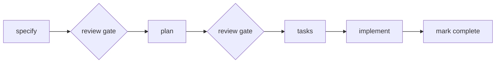
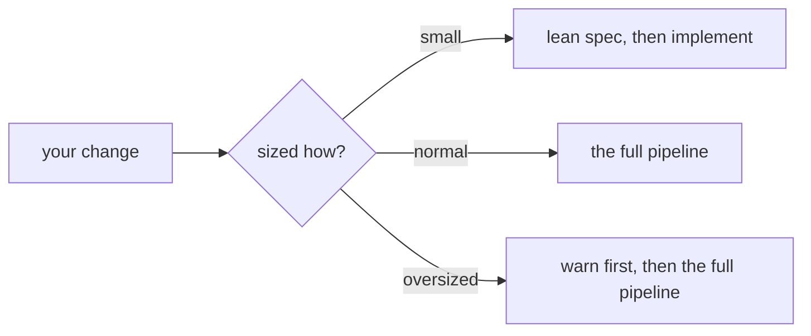
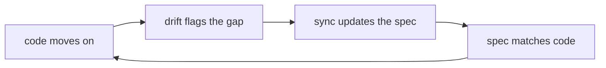

<!-- IMAGE PATHS: every image in THIS file uses an ABSOLUTE
     https://raw.githubusercontent.com/alfredoperez/speckit-companion/main/... URL. The Spec
     Kit community catalog renders this file from main and cannot resolve relative paths, so
     a relative path means a broken image there (the hero included). The root README keeps
     relative paths (GitHub and vsce both resolve those); only this file needs absolutes.
     Cost: an image edited on a branch shows main's version until the branch merges, and a
     brand-new image 404s until its file is pushed to main. -->

<p align="center">
  
</p>

<h1 align="center">SpecKit Companion: the Spec Kit Extension</h1>

<p align="center">
  <strong>Everything your AI does in a spec run, recorded as it happens.</strong> This is the Spec Kit side of <a href="https://marketplace.visualstudio.com/items?itemName=alfredoperez.speckit-companion">SpecKit Companion</a>: it runs inside <a href="https://github.com/github/spec-kit">Spec Kit</a> and writes every step of your spec-driven runs into <code>.spec-context.json</code>, the plain file that powers live progress, a full run history, and one-command resume.
</p>

<p align="center">
  
  <!-- Both badges read speckit-extension/extension.yml on main, so a release
       (or a floor bump) updates them without touching this file. -->
  
  
  
</p>

```bash
# Install and update (same command: the URL always serves the newest build)
specify extension add companion --from https://github.com/alfredoperez/speckit-companion/releases/download/companion-latest/companion.zip --force
```

> Tags: `#spec-driven-development` `#tracking` `#companion` · Independently maintained.

---

## The engine half: pair it with the free visual workspace

SpecKit Companion is two halves. This extension is the engine: it rides your Spec Kit runs and records everything that happens. The other half is a **free VS Code extension** that turns everything the engine records into a visual workspace: a sidebar that shows where every feature stands, specs rendered as readable documents with pull-request-style review comments, a live view of the run while it happens, and an Overview that keeps the record of what the AI actually did and why.

<!-- This screenshot lives in the ROOT repo at docs/screenshots/generated/ and is
     regenerated by scripts/capture-docs-images.mjs. The pair's second beat (the
     Overview record) now rides the cross-promo banner down in the Traceability
     section, so only the viewer shows here. -->


The two halves install independently and meet in one file. This extension **writes** the canonical `.spec-context.json`; the VS Code extension **reads** it. The JSON is useful to any tool on its own, but it is built to feed that GUI:

```bash
code --install-extension alfredoperez.speckit-companion   # the GUI (VS Code Marketplace / OpenVSX)
specify extension add companion --from <release-url>      # this extension (Spec Kit side)
```

It works wherever Spec Kit runs (Claude Code, Copilot, Cursor, Gemini, and more), and it is careful by design: writes are atomic, preserve unknown fields, never regress a shipped spec, and never fail your Spec Kit command. Stdlib-only Python; capture degrades gracefully when `python3` is absent.

## What you get

<!-- The benefits strip: one panel per benefit below, every panel a fixture-fed product
     surface (C4 in ReadmeCapture.stories.tsx, captured by scripts/capture-docs-images.mjs). -->


1. **[Traceability: every run leaves an enhanced Overview](#traceability-every-run-leaves-an-enhanced-overview)**: install it, change nothing, and every run your existing `/speckit.*` commands make lights up the GUI and leaves a full record of what happened and why.
2. **[Customization: more hooks, a smaller footprint of specs](#customization-more-hooks-a-smaller-footprint-of-specs)**: attach your own steps to any command without forking it, and get specs that skip what a typical change never needs.
3. **[Fast path: a small change skips the ceremony](#fast-path-a-small-change-skips-the-ceremony)**: changes are sized after specify, and a small one takes a shorter road.
4. **[Living specs: in one folder, or colocated with your features](#living-specs-in-one-folder-or-colocated-with-your-features-opt-in)**: durable per-capability docs that stay current as the code evolves, with drift detection and one-pass sync.

## Traceability: every run leaves an enhanced Overview

Install it and change nothing else. The extension rides your *existing* Spec Kit commands through lifecycle hooks, the small scripts Spec Kit runs after each command finishes. Each step (specify, plan, tasks, implement) is recorded as it happens, implement journals every task as it completes, and each step also records *why*: the goal and out-of-scope fence at specify, decisions with rejected alternatives at plan, requirement-to-task coverage at tasks, and what was verified at implement.

It also **never lies about state**. When a hook didn't fire (a skipped command, an out-of-band run, a project that never had the extension), `derive-from-files.py` reconstructs the state from the artifacts on disk, so the GUI reflects reality, not a half-truth.

Because the state lives in a committed file, not in a chat scrollback, status and resume come in one breath: `/speckit.companion.status` prints where the active spec stands, and `/speckit.companion.resume` continues from exactly that point with the recorded decisions in scope, restarting inside implement at the next unchecked task. Close the laptop mid-run, or hand the branch to a teammate; either way the next session starts where the last one stopped. And you don't need the GUI to see any of it. Ask a mid-run feature where it stands and `/speckit.companion.status` prints exactly this (real output of `scripts/status-context.py`, on a sample feature):

```text
Spec: Profile photo upload   (source: state)
Step: implement   Status: implementing
Decisions:
  - Resize on the server, not in the browser.
  - Reject oversized uploads before reading the body.
  - Swap avatar_url first, delete the old object second.
Next: Continue implementation at T004  →  dispatching /speckit.companion.implement
```

The payoff is the Overview. Every run, watched, resumed, or hands-off, leaves the same enhanced record in the GUI: the intent the run started from, honest per-phase timing, the expectations fence, the checks that were verified with the commands that prove them, the decisions made with their rejected alternatives, and the requirement-to-task-to-test coverage table. That page is what a future session, a reviewer, or a teammate reads instead of re-asking you.

<!-- Engine-angled cut of the Overview loop. Source composition:
     media/feature-clips/overview-engine/ (see its STORYBOARD.md); regenerate the GIF by
     rendering that composition. Absolute URL on purpose: this README is also served
     outside the repo tree (extension catalog), where relative paths do not resolve. -->


<!-- TODO(alfredo): the per-task history / traceability presentation is awaiting Alfredo's design pass. Do not redesign how it is presented (here or in the docs) until that lands; this table row keeps only the benefit-led naming treatment. -->

| What you get | Stock Spec Kit | + SpecKit Companion |
|---|:---:|:---:|
| The spec-driven pipeline itself (`specify` → `plan` → `tasks` → `implement`) | ✅ | ✅ |
| Works with the AI assistants you already use (Claude, Copilot, Cursor, Gemini, …) | ✅ | ✅ |
| Live progress in the VS Code sidebar while a run happens | ❌ | ✅ |
| A history of every task the AI completed, kept per task | ❌ | ✅ |
| Pick up where you left off (`status` shows the run, `resume` continues it) | ❌ | ✅ |
| Leaner specs that skip sections a typical change never needs | ❌ | ✅ |
| Ceremony sized to the change: small ones take a shorter path | ❌ | ✅ |
| An accurate picture even when a step ran outside the hooks | ❌ | ✅ |

### Hands-off runs

The extension also ships its own pipeline family, `/speckit.companion.specify · plan · tasks · implement`. The stock `/speckit.*` commands stay installed unchanged; the two families coexist, and installing one never deletes the other. A Companion run finishes itself: capture records each step and task as it lands, and a terminal **mark-complete** step moves a finished run into Completed on its own.

`/speckit.companion.auto "what you want built"` runs the entire pipeline with no approval pauses: specify, plan, tasks, implement, completion. It sets an `unattended` signal that project checkpoint hooks can read (record the checkpoint and keep going instead of waiting for a human). On a plain one-shot terminal it gracefully falls back: the first step runs, then you trigger the rest as usual.

Prefer gates? The pipeline also ships as a Spec Kit **workflow definition**: a file that tells the Spec Kit engine which step follows which, and where to stop for you. Run it and the engine drives the whole spec end to end, pausing at two review gates (one before plan, one before tasks) so you approve the direction before the detail:



```bash
specify workflow add speckit-extension/workflows/speckit-companion.workflow.yml
specify workflow run speckit-companion
specify workflow resume <run_id>   # paused at a gate? pick up from the exact node
```

On an agentic CLI each Companion command also continues into the next step on its own, honoring the same gates, so you get the hands-off flow without `workflow run`. Full reference: [template-profiles.md](../docs/template-profiles.md). Either way, hands-off or gated, the run leaves the same Overview record as a run you watched.

<!-- Cross-promo banner (C6 in ReadmeCapture.stories.tsx, captured by
     scripts/capture-docs-images.mjs). Committed src, per this file's
     absolute-URL rule:
     https://raw.githubusercontent.com/alfredoperez/speckit-companion/main/docs/screenshots/generated/banner-install-vscode.png -->
[](https://marketplace.visualstudio.com/items?itemName=alfredoperez.speckit-companion)

## Customization: more hooks, a smaller footprint of specs

The Companion commands are assembled from composable **nodes**: small named sections inside a command. An optional, project-local `.specify/companion.yml` lets you attach your own work before or after any node (run a shell command, add an instruction, or call a reusable node file) without forking the command itself. If the file is absent, every command runs exactly as it ships. A hook marked `owns: validation` after `implement-exec` takes over the pipeline's final validation task, so your consolidated test run happens once, not twice. This is separate from stock Spec Kit's own `.specify/extensions.yml` hooks: a Companion run honors those too. A worked example (a review, PR, merge, reinstall ship tail) is in [examples/ship-ticket/](./examples/ship-ticket/); full reference in [docs/node-model.md](./docs/node-model.md).

The specs themselves get smaller, too. Same four steps, smaller output: the specs the Companion pipeline writes skip sections a typical change never needs (formal user stories among them), order tasks by the files they touch and what depends on what, and leave no throwaway side files.

## Fast path: a small change skips the ceremony

Not every change deserves four documents. After specify, the change is sized `small`, `normal`, or `oversized` against a fixed bar (about five files or ten tasks). A small change takes a folded path: one lean specify pass that carries the plan inline, then straight to implement. An oversized one gets a visible warning and then the full pipeline. Nothing is ever skipped silently, and an ambiguous size always runs every phase.



## Living specs: in one folder, or colocated with your features (opt-in)

Most specs describe one change and then go quiet. **Living specs** are the opposite: one durable spec per *capability* (checkout, auth, billing) that stays current as the code evolves. You register capabilities in a `living-specs.yml` at the project root, mapping file globs to spec files, and Companion does the rest.

The specs live wherever you want them: all together in a central `capabilities/` folder, or colocated, each spec sitting right next to the feature's own source so it travels with the code it describes. `/speckit.companion.living-move` moves a spec (with its tier siblings and registry entry) between the two, reversibly. Either way the sidebar shows per-capability test coverage and flags drift, and the viewer renders the capability as a real document:

<!-- This composition (Storybook story C3 in ReadmeCapture.stories.tsx, captured by
     scripts/capture-docs-images.mjs) is also the storyboard seed for the future Living
     Specs GIF: sidebar row → click → viewer opens → drift → Update. -->


- **Auto-loading**: starting a feature loads the living specs of the capabilities it touches into the assistant's context before it drafts, so you stop re-explaining the codebase.
- **Folding**: completing a feature folds its delta sections back into each affected capability's spec. The feature spec was the proposal; the living spec becomes the record, reviewed in the same PR as the code.
- **Adoption**: `/speckit.companion.living-adopt` drafts first-pass specs for an existing code area, surface-first and honestly marked (`[DRAFT]`, `inferred` tags, an `Uncovered` list).
- **Drift and sync**: `/speckit.companion.living-drift` reports which files changed since a spec was last committed; `/speckit.companion.living-sync` updates every affected spec from your current changes in one pass, uncommitted work included, update-not-regenerate.
- **Coverage**: `/speckit.companion.living-coverage` reports which requirements have a mapped test.

The loop that keeps a spec honest:



The whole family is **opt-in** (no `living-specs.yml`, no behavior change), its writes are **append-only** and preserve what you wrote, and it **never fails** your run: drift and coverage are read-only reports, and sync leaves its edits uncommitted so they ship with the code that caused them.

Full reference, including the registry format, the resolver, delta sections, and the architecture/coverage tiers: [living-specs.md](./docs/living-specs.md).

## Commands

Four families. Most commands are yours to run; the hook commands run themselves and should never be typed by hand.

### Pipeline

The spec-driven run itself, in the order you'd use them.

| Command | What it does |
|---------|--------------|
| `/speckit.companion.specify` | Write `spec.md` (requirements, acceptance scenarios, success criteria) and classify the change's size |
| `/speckit.companion.plan` | Write `plan.md` and its design artifacts, right-sized to that classification |
| `/speckit.companion.tasks` | Write `tasks.md`: a dependency-ordered task list |
| `/speckit.companion.implement` | Execute `tasks.md`, journaling each task as it finishes |
| `/speckit.companion.auto` | Run the whole pipeline hands-off, no approval pauses. The Run button in Create Spec triggers the same flow |
| `speckit.companion.classify` | Emit a `small \| normal \| oversized` size signal so the workflow can right-size the pipeline. Dispatched by the workflow's routing step |
| `speckit.companion.mark-complete` | Write `status: completed`, the workflow's terminal step. The command writes it; the AI never hand-writes `completed`. Dispatched by the workflow |

### Pick up where you left off

| Command | What it does |
|---------|--------------|
| `/speckit.companion.status` | Print where the active spec stands: current step, status, recorded decisions, and the next action |
| `/speckit.companion.resume` | Continue from the recorded step, carrying decisions into scope, and dispatch the next command in the family the spec has been running (at the next unchecked task inside implement) |

### Diagnostics

| Command | What it does |
|---------|--------------|
| `/speckit.companion.doctor` | Report on a spec's run health — unfinished steps, unjournaled tasks, batched journaling, step bleed, drift you can actually judge, and why completion did not land. Read-only, never halts, and works on specs created before it existed. `--chat` adds a session-transcript audit; `--json` for tooling |

### Living specs

With no `living-specs.yml` in your project these report nothing and change nothing.

| Command | What it does |
|---------|--------------|
| `/speckit.companion.living-adopt` | Brownfield adoption wizard: draft living specs for the code areas you name, surface-first, and register the capabilities (incremental) |
| `/speckit.companion.living-drift` | Per-capability report of source files changed since the living spec was last committed, classified `tracked` vs `unspeced` (read-only; `--working` also counts uncommitted changes) |
| `/speckit.companion.living-sync` | Group working-tree changes (uncommitted included) by capability and update every affected spec in one pass, update-not-regenerate |
| `/speckit.companion.living-coverage` | Per-capability requirement-to-test report: which requirements have a test mapped in the capability's `.coverage.md` tier (read-only) |
| `/speckit.companion.living-move` | Move a living spec between central and colocated storage: the file, its tier siblings, and the registry entry together (reversible) |

### Hooks (never invoke these)

These run automatically when their lifecycle event fires. They keep `.spec-context.json` current; they are listed here so you recognize them, not so you call them.

| Command | Fired by | What it records |
|---------|----------|-----------------|
| `speckit.companion.after-specify` | `after_specify` | Specify completion (`specified`) |
| `speckit.companion.after-plan` | `after_plan` | Plan completion (`planned`) |
| `speckit.companion.after-tasks` | `after_tasks` | Tasks completion (`ready-to-implement`) |
| `speckit.companion.after-implement` | `after_implement` | Per-task journaling on implement (`implemented` when every task is checked) |

Full reference: [docs/commands.md](./docs/commands.md). This table is checked against the extension's own command list on every build, so a command can't be added without appearing here.

## Installation

Requires a **github-source** Spec Kit; the stock PyPI `specify-cli` has no `extension` subsystem:

```bash
uv tool install specify-cli --from git+https://github.com/github/spec-kit.git --force

# From the release archive (recommended); re-run the SAME line to update later
specify extension add companion --from https://github.com/alfredoperez/speckit-companion/releases/download/companion-latest/companion.zip --force

# Or from a local checkout while developing
specify extension add ./speckit-extension --dev
```

Verify with `specify extension list` (`companion` present), then run a real `/speckit.specify` and confirm `specs/<NNN>/.spec-context.json` is written. `python3` is optional: capture skips gracefully without it and never fails the host command. Full prerequisites and a CLI-less fallback: [docs/install.md](./docs/install.md). The release archive is a runtime-only allow-list generated and CI-checked from `scripts/package-manifest.py`; see [docs/publishing.md](./docs/publishing.md).

## How it works

```
/speckit.specify  →  after_specify hook  →  speckit.companion.after-specify
                                              →  write-context.py
                                              →  .spec-context.json  (append-only history[])  →  GUI lights up
```

Each lifecycle hook appends one entry to the canonical `history[]` and advances `currentStep` / `status`. Inside implement, each completed task is journaled as a substep, so the viewer never mistakes a single task for the whole step finishing. When no hook fired, `derive-from-files.py` rebuilds the same shape from the artifacts on disk, tagged `by: "derive"`. Full chain, the writer's guarantees, and the canonical schema: [docs/how-it-works.md](./docs/how-it-works.md).

## Docs & links

- [**SpecKit Companion (VS Code)**](https://marketplace.visualstudio.com/items?itemName=alfredoperez.speckit-companion): the GUI this feeds.
- [docs/install.md](./docs/install.md): install (release / dev / fallback) + verification.
- [docs/commands.md](./docs/commands.md): the commands and the hooks they run.
- [docs/living-specs.md](./docs/living-specs.md): the living specs reference.
- [docs/how-it-works.md](./docs/how-it-works.md): the hook → script → `.spec-context.json` chain and canonical schema.
- [docs/node-model.md](./docs/node-model.md): how Companion commands are composed from nodes and the `.specify/companion.yml` hook model.
- [docs/publishing.md](./docs/publishing.md): how this extension is released (separate from the VS Code extension).
- [ROADMAP.md](./ROADMAP.md): the migration plan and per-step status.
- [CHANGELOG.md](./CHANGELOG.md): version history (independent of the VS Code extension).

## License

[MIT](./LICENSE) © alfredoperez. Independently maintained; not affiliated with the Spec Kit core team.
