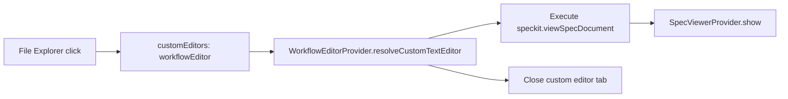

# Plan: Fix File Explorer Spec Rendering

**Spec**: [spec.md](./spec.md) | **Date**: 2026-03-26

## Approach

Replace the `WorkflowEditorProvider` custom text editor with a redirect: when VS Code opens a spec markdown file via the custom editor hook, instead of rendering its own webview, it delegates to `speckit.viewSpecDocument` (the SpecViewerProvider). This ensures identical rendering regardless of how the file is opened. The `WorkflowEditorProvider` becomes a thin shim that intercepts the open and hands off to the spec viewer.

## Technical Context

**Stack**: TypeScript, VS Code Extension API
**Key Dependencies**: `vscode.CustomTextEditorProvider`, `vscode.WebviewPanel`
**Constraints**: VS Code custom editors _must_ set `webviewPanel.webview.html` — they cannot simply close themselves. The shim must set minimal HTML, then immediately fire the `speckit.viewSpecDocument` command and close the custom editor tab.

## Flow

## Files

### Modify

| File | Change |
|------|--------|
| `src/features/workflow-editor/workflowEditorProvider.ts` | Gut `resolveCustomTextEditor` to a redirect shim: set placeholder HTML, fire `speckit.viewSpecDocument` with the document path, then close the custom editor tab via `webviewPanel.dispose()`. |
| `package.json` | Change `customEditors[0].priority` from `"default"` to `"option"` so VS Code doesn't force the workflow editor as the only opener — users can still right-click → "Open With" for the default text editor. |

## Risks

- **Tab flicker**: The custom editor tab will briefly appear before being disposed. Mitigation: set `retainContextWhenHidden: false` and dispose immediately after command execution; the flash should be imperceptible.
- **Infinite loop**: If `speckit.viewSpecDocument` somehow re-triggers the custom editor. Mitigation: `SpecViewerProvider.show()` creates a `WebviewPanel` (not a file open), so it won't re-trigger the custom editor selector.
