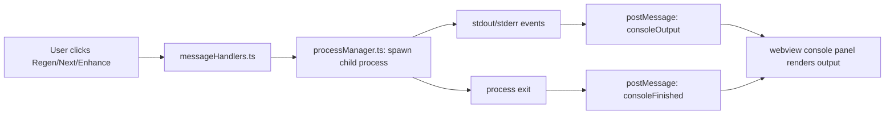

# Plan: Console Panel

**Spec**: [spec.md](./spec.md) | **Date**: 2026-03-26

## Approach

Replace the current `executeInTerminal` flow with a `child_process.spawn` approach that streams output via `postMessage` to a console panel embedded in the spec viewer webview. The extension side manages process lifecycle (spawn, stream, kill) per panel instance, while the webview side renders a collapsible console UI between the content area and footer. This keeps users in a single view instead of bouncing between webview and terminal.

## Technical Context

**Stack**: TypeScript, VS Code Extension API, child_process.spawn
**Key Dependencies**: `child_process` (Node built-in), existing `IAIProvider` interface
**Constraints**: No stdin support in v1; `retainContextWhenHidden: false` means console output lost on hide (accepted)

## Flow

## Files

### Create

| File | Purpose |
|------|---------|
| `src/features/spec-viewer/processManager.ts` | Manages child process lifecycle per panel: spawn, stream output via postMessage, kill on dispose, enforce single-process-per-panel with confirmation dialog |
| `webview/src/spec-viewer/console.ts` | Webview-side console panel logic: render output, toggle visibility, auto-scroll with scroll-position detection, ANSI stripping, line buffer cap |
| `webview/styles/spec-viewer/_console.css` | Console panel styles: collapsible container, header with status badges, monospace output area, pulse animation for running state |

### Modify

| File | Change |
|------|--------|
| `src/features/spec-viewer/types.ts` | Add `consoleStarted`, `consoleOutput`, `consoleFinished` to `ExtensionToViewerMessage` union; add `toggleConsole` to `ViewerToExtensionMessage` union; add `ConsoleState` type |
| `src/features/spec-viewer/messageHandlers.ts` | Replace `executeStepInTerminal` calls with `processManager.execute()` that spawns child process and streams to webview; handle `toggleConsole` message |
| `src/features/spec-viewer/specViewerProvider.ts` | Add `ProcessManager` to `PanelInstance`; kill process on panel dispose; pass `postMessage` callback to processManager |
| `src/features/spec-viewer/html/generator.ts` | Add console panel HTML skeleton (hidden by default) between `<main>` and `<footer>`; add ">_ Console" toggle button to footer actions-left |
| `webview/src/spec-viewer/index.ts` | Import and initialize console module; wire `consoleStarted`, `consoleOutput`, `consoleFinished` message handlers |
| `webview/styles/spec-viewer/index.css` | Import `_console.css` partial |
| `src/ai-providers/aiProvider.ts` | Add `buildCommand(prompt: string): { command: string; args: string[] }` to `IAIProvider` interface so processManager can spawn the CLI directly instead of going through terminal |
| `src/ai-providers/claudeCodeProvider.ts` | Implement `buildCommand()` returning `{ command: 'claude', args: ['--permission-mode', 'bypassPermissions', prompt] }` |

## Data Model

| Entity/Type | Fields / Shape | Notes |
|-------------|---------------|-------|
| `ConsoleState` | `status: 'hidden' \| 'running' \| 'done' \| 'error'`, `exitCode?: number`, `command?: string` | New type in types.ts, tracked per panel instance |
| `consoleStarted` msg | `{ type: 'consoleStarted', command: string }` | Extension → webview |
| `consoleOutput` msg | `{ type: 'consoleOutput', data: string, stream: 'stdout' \| 'stderr' }` | Extension → webview, sent per chunk |
| `consoleFinished` msg | `{ type: 'consoleFinished', exitCode: number }` | Extension → webview |

## Risks

- **Large output volume**: Rapid postMessage calls with large chunks could lag the webview. Mitigation: batch output into ~100ms intervals before posting; enforce 10K line cap.
- **Process orphaning**: If VS Code crashes, spawned child processes may survive. Mitigation: use `detached: false` (default) and tree-kill on dispose; accept edge case for v1.
- **Provider abstraction**: Adding `buildCommand` to `IAIProvider` means all 5 providers need implementation. Mitigation: provide a default that throws "console not supported" — only Claude needs it initially.
