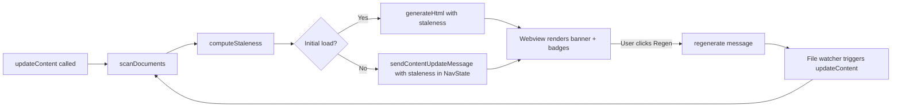

# Plan: Stale Warning Banner

**Spec**: [spec.md](./spec.md) | **Date**: 2026-03-26

## Approach

Add a staleness detection layer that computes file mtimes for all core workflow documents during `updateContent`, then threads staleness info through to both the initial HTML generation and the message-based content updates. The webview renders a warning banner between nav and content, and `!` badges on stale tabs. This follows the existing pattern where the extension computes state and the webview renders it — no new message types needed beyond extending `NavState` with staleness data.

## Technical Context

**Stack**: TypeScript, VS Code Extension API, Webview (browser-side TS)
**Key Dependencies**: `vscode.workspace.fs.stat()` for mtime reads
**Constraints**: Must work with custom N-step workflows, not just the default 3-step (spec/plan/tasks)

## Flow

## Files

### Create

| File | Purpose |
|------|---------|
| `src/features/spec-viewer/staleness.ts` | `computeStaleness()` — reads mtimes via `fs.stat()`, returns a `StalenessMap` keyed by document type |
| `src/features/spec-viewer/__tests__/staleness.test.ts` | Unit tests for staleness computation logic |

### Modify

| File | Change |
|------|--------|
| `src/features/spec-viewer/types.ts` | Add `StalenessInfo` interface (isStale, staleReason, newerUpstream) and `stalenessMap` to `NavState` |
| `src/features/spec-viewer/specViewerProvider.ts` | Call `computeStaleness()` in `updateContent` and `sendContentUpdateMessage`, pass results to `generateHtml` and `NavState` |
| `src/features/spec-viewer/html/generator.ts` | Accept staleness data, pass to `generateCompactNav`, render banner HTML between nav and content area |
| `src/features/spec-viewer/html/navigation.ts` | Accept staleness map, render `!` badge on stale tab buttons |
| `webview/src/spec-viewer/types.ts` | Mirror `StalenessInfo` type and extend `NavState` with `stalenessMap` |
| `webview/src/spec-viewer/navigation.ts` | Update `updateNavState` to toggle `!` badges and show/hide banner based on staleness |
| `webview/styles/spec-viewer/index.css` | Import new staleness partial |
| `webview/styles/spec-viewer/_staleness.css` | Warning banner styles (yellow/orange theme-aware) and `!` badge styles |

## Data Model

| Entity/Type | Fields / Shape | Notes |
|-------------|---------------|-------|
| `StalenessInfo` | `isStale: boolean, staleReason: string, newerUpstream: string` | Per-document staleness state |
| `StalenessMap` | `Record<DocumentType, StalenessInfo>` | Keyed by step name, computed fresh on each update |
| `NavState` (extended) | `+ stalenessMap?: StalenessMap` | Threaded through existing message protocol |

## Risks

- **mtime granularity on some filesystems**: Some FS have 1-second mtime resolution, so rapid spec→plan regeneration within the same second might not detect staleness. Mitigation: acceptable edge case — user can manually refresh.
- **Performance with many workflow steps**: Each step requires an `fs.stat()` call. Mitigation: these are local filesystem ops and will be sub-millisecond; the existing `scanDocuments` already does `fs.stat()` per file.
