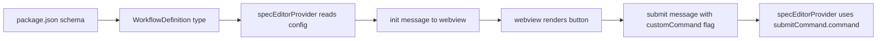

# Plan: Custom Spec Command Button

**Spec**: [spec.md](./spec.md) | **Date**: 2026-03-29

## Approach

Add a `submitCommand` object (`{ label, command }`) to the custom workflow configuration schema. Thread it through the `WorkflowDefinition` type to the webview, where the spec editor dynamically renders a secondary button next to Submit when the selected workflow provides one. The button reuses the existing submit flow but substitutes the command string.

## Flow

## Files

### Modify

| File | Change |
|------|--------|
| `package.json` | Add `submitCommand` object schema (`label`, `command`) to `speckit.customWorkflows` items |
| `src/features/workflows/types.ts` | Add optional `submitCommand` to `WorkflowConfig` |
| `src/features/spec-editor/types.ts` | Add optional `submitCommand` to `WorkflowDefinition`; add `submitCustom` message type |
| `src/features/spec-editor/specEditorProvider.ts` | Read `submitCommand` from workflow config, pass to webview, handle `submitCustom` message |
| `webview/src/spec-editor/types.ts` | Add `submitCommand` to webview `WorkflowDefinition`; add `submitCustom` message type |
| `webview/src/spec-editor/index.ts` | Render/hide custom command button on workflow change, wire click handler |
| `webview/styles/spec-editor.css` | Add `.btn-secondary` style for custom command button |

## Data Model

| Entity/Type | Fields / Shape | Notes |
|-------------|---------------|-------|
| `WorkflowConfig.submitCommand` | `{ label: string; command: string }` | New optional field on custom workflow settings |
| `WorkflowDefinition.submitCommand` | `{ label: string; command: string }` | Passed through init message to webview |
