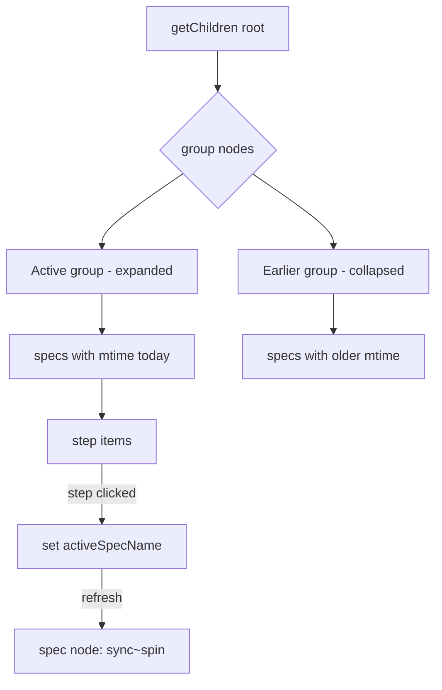

# Plan: Active Spec Grouping & Step Indicator

**Spec**: [spec.md](./spec.md) | **Date**: 2026-03-31

## Approach

Add "Active" and "Earlier" group nodes to the spec explorer tree by checking the most recent mtime of files in each spec directory. Specs modified today go into Active (expanded, newest-first), everything else into Earlier (collapsed). Remove the static circle indicators from step descriptions. Track a single `activeSpecName` in memory — set it when any step command is executed, show `sync~spin` on that spec's parent node.

## Technical Context

**Stack**: TypeScript, VS Code Extension API
**Key Dependencies**: `fs.statSync` for mtime checks
**Constraints**: Grouping must be tool-agnostic (no state.json dependency); spinning state is in-memory only

## Architecture

## Files

### Create

_(none)_

### Modify

- `src/features/specs/specExplorerProvider.ts` — Add group nodes (Active/Earlier), mtime-based classification, newest-first sorting within Active, `activeSpecName` tracking for spinning icon, remove STATUS_INDICATORS from descriptions
- `src/features/specs/specCommands.ts` — After executing a step command, set `activeSpecName` on the explorer provider and trigger refresh

## Risks

- File mtime can be affected by git operations (checkout, rebase) causing specs to shift groups unexpectedly — low risk since specs live in `.claude/` which is typically gitignored
