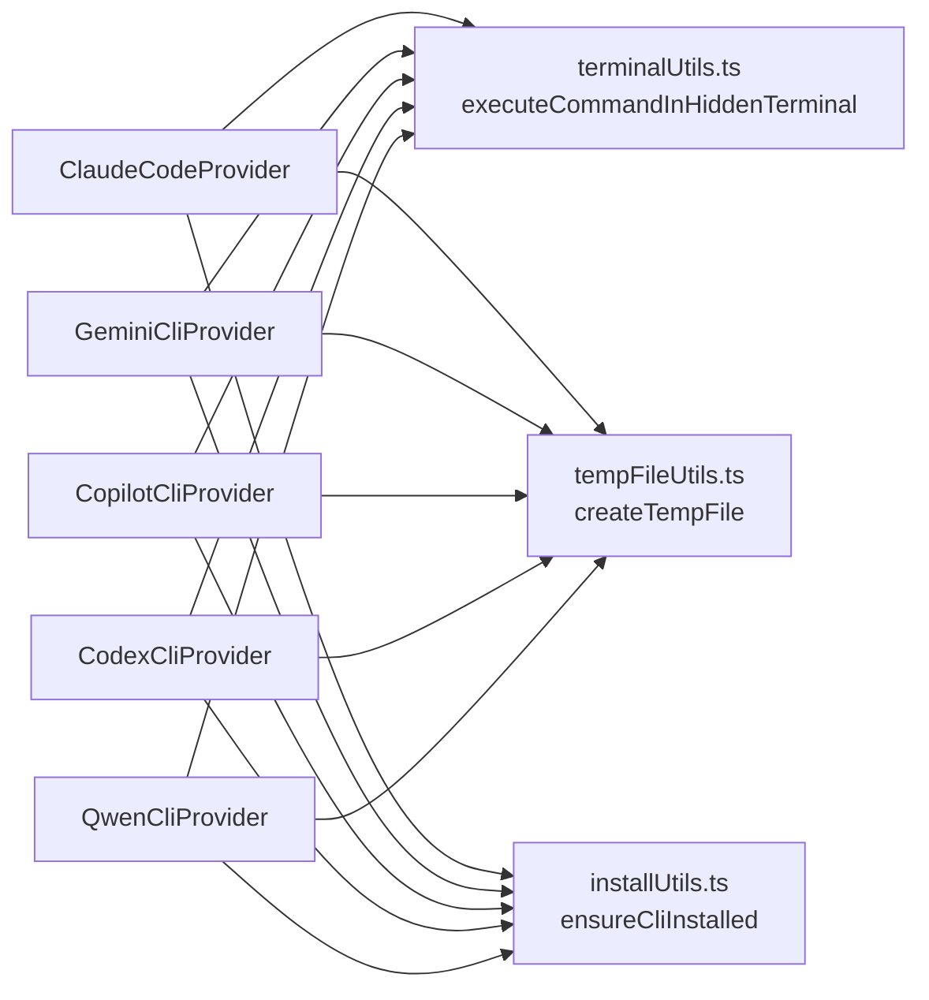

# Plan: Provider Refactoring — Reduce Duplication

**Spec**: [spec.md](./spec.md) | **Date**: 2026-04-01

## Approach

Extract the three major duplicated patterns (`executeHeadless` shell integration, `createTempFile`, `ensureInstalled`) into shared utility functions in `core/utils/`, then refactor all 5 providers to call these utilities. Use composition (standalone functions) rather than inheritance, keeping each provider as a thin wrapper with only provider-specific logic (CLI command construction, flags, log prefix). Defer `executeInTerminal` extraction to a follow-up since Gemini's interactive mode diverges significantly.

## Technical Context

**Stack**: TypeScript, VS Code Extension API
**Key Dependencies**: `vscode.Terminal`, `shellIntegration` API, `fs.promises`
**Constraints**: Must preserve exact runtime behavior — shell integration path, fallback path, exit codes, temp file cleanup timing

## Architecture

## Files

### Create

- `src/core/utils/tempFileUtils.ts` — shared `createTempFile(context, content, prefix, convertWSL?)` function
- `src/core/utils/installUtils.ts` — shared `ensureCliInstalled(cliName, installCommand, checkCommand)` function

### Modify

- `src/core/utils/terminalUtils.ts` — add `executeCommandInHiddenTerminal(options)` alongside existing `waitForShellReady`
- `src/ai-providers/claudeCodeProvider.ts` — replace `createTempFile`, `executeHeadless` body with shared utilities
- `src/ai-providers/geminiCliProvider.ts` — replace `createTempFile`, `ensureInstalled`, `executeHeadless` body with shared utilities
- `src/ai-providers/copilotCliProvider.ts` — replace `createTempFile`, `ensureInstalled`, `executeHeadless` body with shared utilities
- `src/ai-providers/codexCliProvider.ts` — replace `createTempFile`, `ensureInstalled`, `executeHeadless` body with shared utilities; pass conditional cleanup for temp file
- `src/ai-providers/qwenCliProvider.ts` — replace `createTempFile`, `ensureInstalled`, `executeHeadless` body with shared utilities
- `src/core/utils/__tests__/terminalUtils.test.ts` — add tests for `executeCommandInHiddenTerminal`

## Data Model

`executeCommandInHiddenTerminal` options interface:

- `ExecuteInHiddenTerminalOptions` — fields: `commandLine, cwd, terminalName, outputChannel, logPrefix, cleanupFn?, tempFilePath?` — new interface passed to the shared utility

## Testing Strategy

- **Unit**: Test `createTempFile` creates files and optionally converts WSL paths. Test `ensureCliInstalled` shows error + copies install command on failure.
- **Integration**: Existing `terminalUtils.test.ts` extended for `executeCommandInHiddenTerminal` — mock `shellIntegration` and `onDidEndTerminalShellExecution` to verify both paths.
- **Edge cases**: Codex conditional temp file cleanup (no temp file when using sed+pipe), Gemini's unique `executeInTerminal` remains untouched.

## Risks

- **Shell integration mocking complexity**: The `executeCommandInHiddenTerminal` function interacts with VS Code terminal APIs that are hard to mock. Mitigation: focus unit tests on the branching logic, verify integration via manual testing.
- **Subtle behavior differences across providers**: Some providers log command on failure (Claude, Codex, Qwen) while others don't (Copilot, Gemini). Mitigation: make error logging of the command optional via the options interface.
