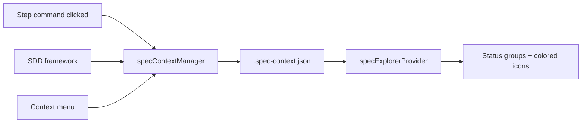

# Plan: Sidebar Spec Status Indicators

**Spec**: [spec.md](./spec.md) | **Date**: 2026-04-01

## Approach

Rename `.speckit.json` to `.spec-context.json`, extend `FeatureWorkflowContext` with `status`, `stepHistory`, and SDD fields, then update the sidebar tree provider to group by status instead of mtime and apply colored ThemeIcons based on step progress. A new `specContextManager.ts` module centralizes all reads/writes to `.spec-context.json` with read-then-merge semantics.

## Technical Context

**Stack**: TypeScript, VS Code Extension API
**Key Dependencies**: `vscode.ThemeIcon` + `vscode.ThemeColor` for colored icons
**Constraints**: Must remain backwards compatible — specs without `.spec-context.json` appear in Active with default icons

## Architecture

## Files

### Create

- `src/features/specs/specContextManager.ts` — read/write `.spec-context.json` with merge semantics, exposes `readSpecContext()`, `updateSpecContext()`, `updateStepProgress()`, `setSpecStatus()`

### Modify

- `src/features/workflows/types.ts` — rename `FEATURE_CONTEXT_FILE` to `.spec-context.json`, extend `FeatureWorkflowContext` interface with `status`, `stepHistory` fields, add `StepHistoryEntry` and `SpecStatus` types
- `src/features/workflows/workflowManager.ts` — update `getFeatureWorkflow()` and `saveFeatureWorkflow()` to use new filename; also check for legacy `.speckit.json` as fallback for migration
- `src/features/workflows/checkpointHandler.ts` — update import, uses `FEATURE_CONTEXT_FILE` constant (auto-follows rename)
- `src/features/specs/specExplorerProvider.ts` — replace mtime-based `Active`/`Earlier` grouping with status-based `Active`/`Completed`/`Archived` groups; read `.spec-context.json` for each spec to determine group and icon colors; add `ThemeColor` to `ThemeIcon` for green/blue indicators on spec and step items
- `src/features/specs/specCommands.ts` — call `updateStepProgress()` when user clicks a step command (after existing `setActiveSpec()` call); register new `speckit.markCompleted` and `speckit.archive` commands
- `src/features/spec-viewer/specViewerProvider.ts` — update `.speckit.json` references to `.spec-context.json`
- `src/features/workflow-editor/workflow/specInfoParser.ts` — update hardcoded `.speckit.json` string to use `FEATURE_CONTEXT_FILE` constant
- `package.json` — register `speckit.markCompleted` and `speckit.archive` commands; add context menu entries for spec items
- `src/features/specs/__tests__/specExplorerProvider.test.ts` — update tests for status-based grouping, colored icons, and remove mtime tests

## Data Model

- `SpecStatus` — type: `"active" | "completed" | "archived"`
- `StepHistoryEntry` — fields: `startedAt: string`, `completedAt: string | null`
- `FeatureWorkflowContext` (extended) — adds: `status?: SpecStatus`, `stepHistory?: Record<string, StepHistoryEntry>`; plus optional SDD fields: `step?, substep?, task?, next?, updated?, approach?, last_action?, task_summaries?, step_summaries?, files_modified?`

## Testing Strategy

- **Unit**: Test `specContextManager` read/write/merge logic; test `specExplorerProvider` grouping by status and icon color assignments
- **Edge cases**: No `.spec-context.json` (defaults to Active), legacy `.speckit.json` fallback, skipped steps in `stepHistory`, SDD-enriched fields ignored gracefully

## Risks

- Legacy `.speckit.json` files in existing projects: mitigate with fallback read (try `.spec-context.json` first, then `.speckit.json`)
- SDD and extension writing concurrently: mitigate with read-then-merge (both sides already do this pattern)
