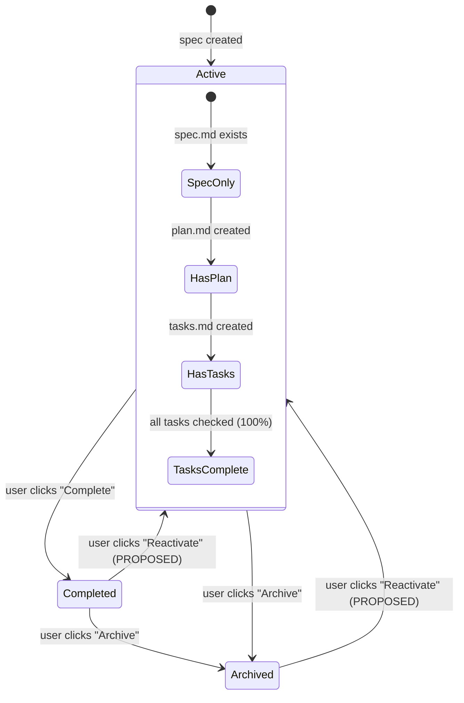
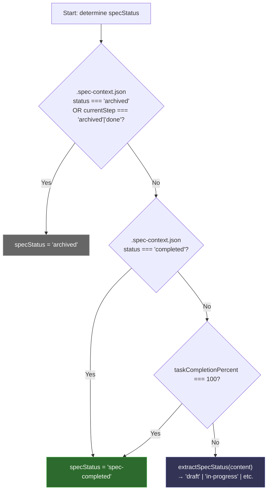
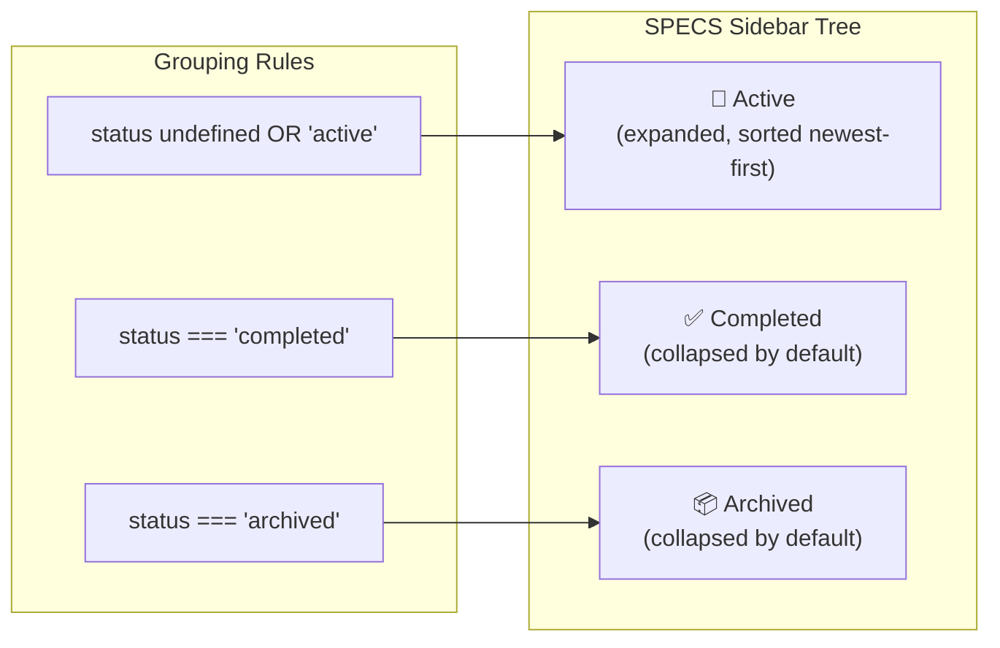
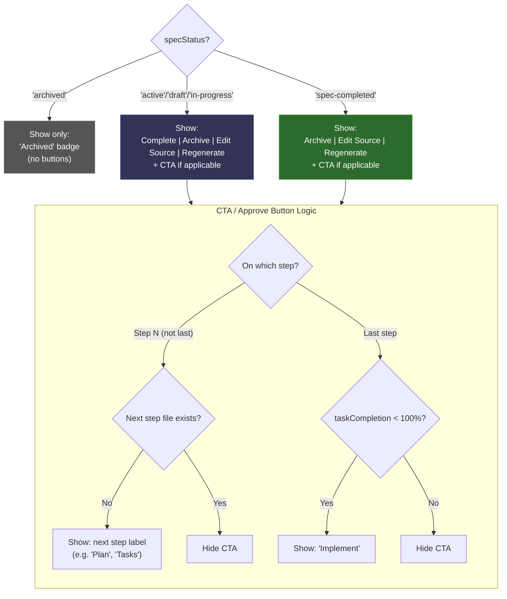
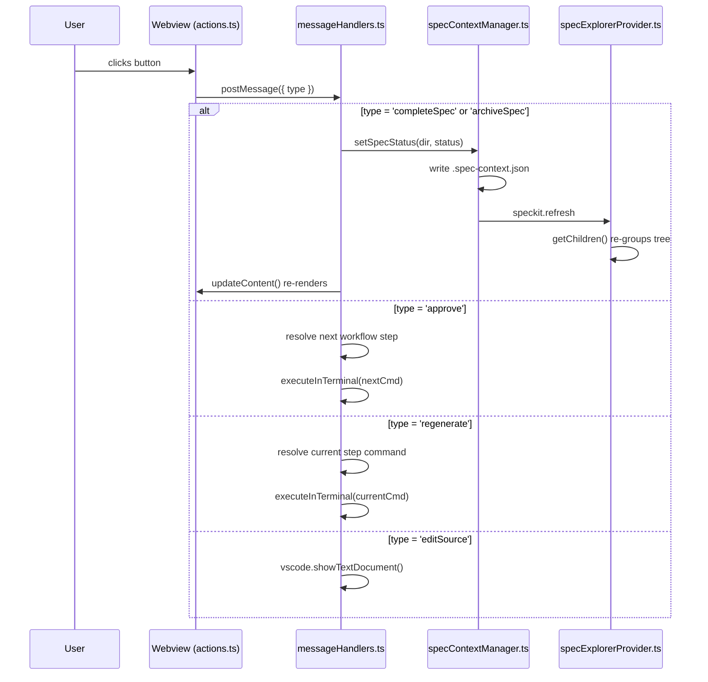
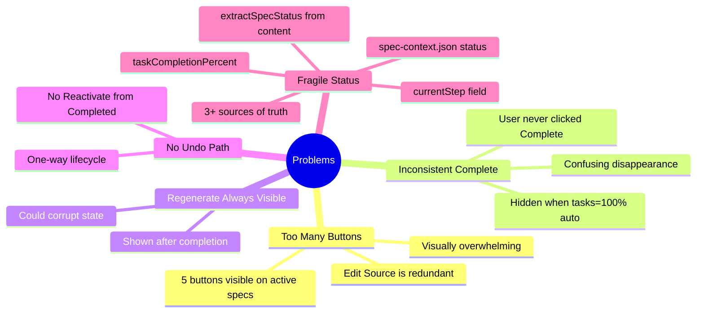
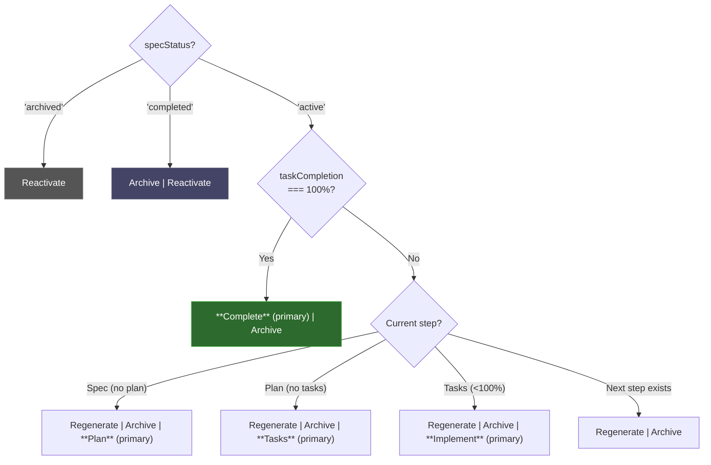

# Spec Viewer: Button & Status System Analysis

## 1. Spec Lifecycle State Machine



## 2. Status Determination Priority Chain



**Source:** `specViewerProvider.ts:462-475`

## 3. Sidebar Grouping



**Source:** `specExplorerProvider.ts:97-112`

## 4. Top Bar: Completion Badge (REMOVE)

The `🌱 SPEC COMPLETED` badge is **redundant** — the Tasks step already shows completion percentage (e.g., "Tasks 100%"). Removing it:
- Reduces visual clutter in the top bar
- The percentage on the Tasks tab is the signal
- The **Complete** button appearing as primary CTA is the call to action

**Source to clean up:** `html/navigation.ts:20-74`

## 5. Current Footer Button Visibility



**Source:** `html/generator.ts:59-89, 148-167`

## 6. Current Button Visibility Matrix

| specStatus | Complete | Archive | Edit Source | Regenerate | CTA (Approve) |
|---|---|---|---|---|---|
| active/draft | ✅ | ✅ | ✅ | ✅ | conditional* |
| in-progress | ✅ | ✅ | ✅ | ✅ | conditional* |
| spec-completed | ❌ | ✅ | ✅ | ✅ | conditional* |
| archived | ❌ | ❌ | ❌ | ❌ | ❌ (badge only) |

\*See CTA Logic diagram above

## 7. Message Flow



## 8. Problems Identified



## 9. Proposed: New Button Visibility



### Proposed Visibility Matrix

| State | Primary CTA | Secondary | Removed |
|---|---|---|---|
| Active (spec, no plan) | Plan | Regenerate, Archive | Complete, Edit Source |
| Active (plan, no tasks) | Tasks | Regenerate, Archive | Complete, Edit Source |
| Active (tasks, <100%) | Implement | Regenerate, Archive | Complete, Edit Source |
| Active (tasks, 100%) | **Complete** | Archive | Regen, Edit Source |
| Completed | — | Archive, Reactivate | Regen, Edit Source |
| Archived | — | Reactivate | Everything else |

**Key changes:** Remove Edit Source, hide Regenerate after 100%, Complete only appears as primary when tasks done, add Reactivate for undo.

## 10. Full Lifecycle E2E Scenario

```mermaid
flowchart LR
    subgraph Step1["1. New Spec"]
        S1_Side["Sidebar: Active"]
        S1_Foot["Footer: Archive | Regen | **Plan**"]
    end

    subgraph Step2["2. Plan Created"]
        S2_Side["Sidebar: Active"]
        S2_Foot["Footer: Archive | Regen | **Tasks**"]
    end

    subgraph Step3["3. Tasks Created"]
        S3_Side["Sidebar: Active"]
        S3_Foot["Footer: Archive | Regen | **Implement**"]
    end

    subgraph Step4["4. Tasks 100%"]
        S4_Side["Sidebar: Active"]
        S4_Foot["Footer: Archive | **Complete**"]
        S4_Tasks["Tasks tab: 100%"]
    end

    subgraph Step5["5. Completed"]
        S5_Side["Sidebar: Completed"]
        S5_Foot["Footer: Archive | Reactivate"]
    end

    subgraph Step6["6. Archived"]
        S6_Side["Sidebar: Archived"]
        S6_Foot["Footer: Reactivate"]
    end

    Step1 -->|"click Plan"| Step2
    Step2 -->|"click Tasks"| Step3
    Step3 -->|"click Implement"| Step4
    Step4 -->|"click Complete"| Step5
    Step5 -->|"click Archive"| Step6
```



## 11. Test Coverage Plan

### Unit Tests: Button Visibility (`generator.ts`)

```
describe('footer button visibility')
  it('shows Complete, Archive, Edit, Regen for active specs')
  it('hides Complete when specStatus is spec-completed')
  it('shows only Archived badge when specStatus is archived')
  it('shows next step label when next doc does not exist')
  it('hides CTA when next doc already exists')
  it('shows Implement on last step when tasks < 100%')
  it('hides CTA on last step when tasks = 100%')
  it('resolves parent step for related docs')
  it('disables Edit Source when current doc does not exist')
```

### Unit Tests: Status Determination (`specViewerProvider.ts`)

```
describe('specStatus determination')
  it('returns archived when .spec-context.json status is archived')
  it('returns archived when currentStep is done')
  it('returns spec-completed when status is completed')
  it('returns spec-completed when taskCompletionPercent is 100')
  it('falls back to extractSpecStatus from content')
  it('spec-context.json archived overrides task completion')
```

### Unit Tests: Message Handlers

```
describe('lifecycle handlers')
  it('completeSpec sets status to completed and refreshes')
  it('archiveSpec sets status to archived and refreshes')
  it('shows notification on status change')

describe('action handlers')
  it('regenerate executes current step command')
  it('approve executes next step command')
  it('editSource opens document in text editor')
```

### Integration Tests: Sidebar Grouping

```
describe('spec explorer grouping')
  it('groups active specs under Active')
  it('groups completed specs under Completed')
  it('groups archived specs under Archived')
  it('treats undefined status as active')
  it('sorts active specs by creation date descending')
```

## 12. Key Files

| File | What to Change |
|---|---|
| `src/features/spec-viewer/html/generator.ts` | Button visibility logic (L59-89, L148-167) |
| `src/features/spec-viewer/specViewerProvider.ts` | Status determination (L462-475) |
| `src/features/spec-viewer/messageHandlers.ts` | Add reactivate handler |
| `src/features/spec-viewer/types.ts` | Add 'reactivateSpec' message type |
| `src/features/specs/specExplorerProvider.ts` | Sidebar grouping consistency |
| `webview/src/spec-viewer/actions.ts` | Wire up new button events |
| `src/features/spec-viewer/__tests__/` | Comprehensive tests |
