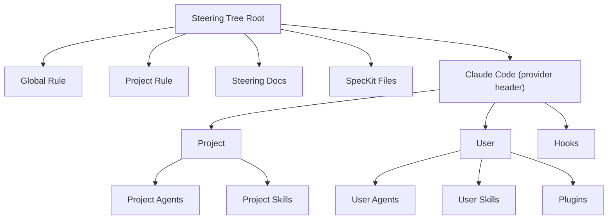

# Plan: AI Provider Config Tree

**Spec**: [spec.md](./spec.md) | **Date**: 2026-04-03

## Approach

Restructure the `SteeringExplorerProvider.getChildren()` root-level layout to replace the separate Workflow, Agents, Skills, and Hooks sections with a single collapsible provider-named section (e.g., "Claude Code"). Under this section, items are grouped into "Project" and "User" sub-groups containing agents, skills, and commands. Hooks and plugins appear as additional sub-groups. The Workflow section and its supporting methods (`getWorkflowStepRefs`, `resolveWorkflowStepRefs`, `getWorkflowCommandChildren`) are removed entirely. Existing child-rendering methods for agents, skills, and hooks are reused — only the tree hierarchy changes.

## Technical Context

**Stack**: TypeScript, VS Code Extension API
**Key Dependencies**: `SteeringExplorerProvider` (~1170 lines), `aiProvider.ts` (provider type/paths config)

## Architecture

## Files

### Create

(none)

### Modify

- `src/features/steering/steeringExplorerProvider.ts` — Remove Workflow section from root `getChildren()` (R001). Add provider-named header with Collapsed state (R002, R005). Replace separate agents/skills/hooks headers with nested provider → Project/User → items hierarchy (R003). Move plugin agents rendering under User sub-group (R004). Remove `getWorkflowStepRefs()`, `resolveWorkflowStepRefs()`, `getWorkflowCommandChildren()` methods. Remove `workflow-commands-header` and `workflow-command` context values from `SteeringItem` constructor icon mapping. Add new context values: `provider-header`, `provider-project-group`, `provider-user-group`.
- `src/ai-providers/aiProvider.ts` — Add `displayName` field to `ProviderPaths` interface and populate for each provider (e.g., "Claude Code", "Gemini CLI", "GitHub Copilot", "Codex CLI", "Qwen CLI") so the tree header can show a human-readable name.
- `package.json` — Remove any `workflow-commands-header` or `workflow-command` context references from `contributes.menus` if present. (Verify first — may not need changes.)

## Testing Strategy

- **Unit**: Add tests for the new tree structure in `steeringExplorerProvider` — verify provider header appears, Project/User groups contain correct children, workflow section is absent.
- **Edge cases**: Provider with no agents/skills/hooks → provider section still shows but with empty groups or is hidden (R008). Non-Claude providers → no plugins sub-group shown.

## Risks

- Workflow section removal may break custom workflow configurations that some users rely on — mitigate by ensuring the workflow editor webview still functions independently (out of scope for this spec, but verify it's not coupled).
