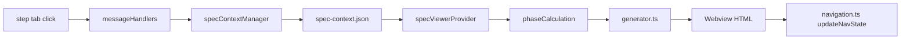

# Plan: Spec Viewer Header Redesign

**Spec**: [spec.md](./spec.md) | **Date**: 2026-04-05

## Approach

Replace the current inline badge-bar + dates-bar with a structured header block rendered from spec-context.json data before markdown content loads. The header shows badge (primary color), created date, titled document line (`{DocType}: {specName}`), file link, and optional branch badge. Step tab clicks will persist to spec-context.json via `updateStepProgress`, and the `preprocessSpecMetadata` preprocessor will strip raw metadata from rendered markdown to avoid duplication.

## Technical Context

**Stack**: TypeScript 5.3+, VS Code Extension API, Webpack 5
**Key Dependencies**: spec-context.json (file-based state), webview message passing
**Constraints**: Header must render before markdown content (no flash of raw metadata)

## Architecture

## Files

### Create

_(none — all changes modify existing files)_

### Modify

- `src/features/workflows/types.ts` — Add `specName` and `branch` fields to `FeatureWorkflowContext` interface
- `src/features/specs/specContextManager.ts` — Populate `specName` (from slug) and `branch` (from git) on context creation/update; clarify or remove `selectedAt`
- `src/features/spec-viewer/phaseCalculation.ts` — Update `computeBadgeText()` to handle in-progress animated suffix; add helper to map step to display doc type label
- `src/features/spec-viewer/html/generator.ts` — Replace badge-bar + dates-bar with structured header block: badge, date, title (`{DocType}: {specName}`), file link, branch badge, separator
- `src/features/spec-viewer/specViewerProvider.ts` — Pass `specName`, `branch`, and file path to `generateHtml()`; pass same to `sendContentUpdateMessage()`
- `src/features/spec-viewer/messageHandlers.ts` — Add `updateStepProgress()` call in `handleStepperClick` to persist step change to spec-context.json
- `webview/src/spec-viewer/navigation.ts` — Update `updateNavState()` to refresh structured header (title, file link, branch) on tab switch
- `webview/src/spec-viewer/markdown/preprocessors.ts` — Modify `preprocessSpecMetadata()` to strip metadata block entirely (instead of rendering compact HTML) when header is context-driven
- `webview/styles/spec-viewer/_content.css` — Restyle badge to use primary/h1 color; add styles for structured header layout, file link, branch badge, separator

## Data Model

- `FeatureWorkflowContext` — add fields: `specName: string` (human-readable name from slug), `branch: string` (git branch name)
- `selectedAt` — investigate usage; if only used at workflow assignment time and `stepHistory.specify.startedAt` covers the same purpose, remove it

## Testing Strategy

- **Unit**: Test `computeBadgeText()` with in-progress substep returns text with `...` suffix; test `preprocessSpecMetadata()` strips metadata when context-driven flag is present
- **Integration**: Test `handleStepperClick` calls `updateStepProgress` and persists to spec-context.json
- **Edge cases**: Spec without spec-context.json falls back gracefully; missing `specName` falls back to H1; missing `branch` hides branch badge

## Risks

- Stripping metadata from markdown could break specs that don't have spec-context.json — mitigate by only stripping when context data is available (feature-flag the strip via a parameter)
- Changing `handleStepperClick` to write spec-context.json introduces async I/O on every tab click — mitigate by fire-and-forget write (don't block UI transition)
