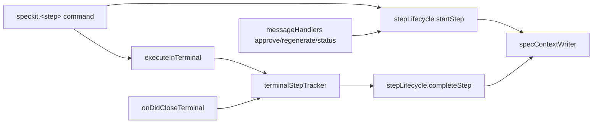

# Plan: Extension-Side Lifecycle Writes for .spec-context.json

**Spec**: [spec.md](./spec.md) | **Date**: 2026-04-13

## Approach

Hook the existing `specContextWriter` (`setStepStarted` / `setStepCompleted` / `setSubstepStarted` / `setSubstepCompleted`) into the two extension-owned dispatch surfaces: the `speckit.<step>` command handlers in `specCommands.ts`, and the viewer message handlers (`approve`, `regenerate`, `completeSpec`, `archiveSpec`, `reactivateSpec`). A small `terminalStepTracker` map remembers which step a spawned terminal was launched for, so `vscode.window.onDidCloseTerminal` can fire `setStepCompleted` even when the AI never writes the file. All status writes route through `updateSpecContext` using the canonical vocabulary, retiring the legacy `setSpecStatus` writer.

## Technical Context

**Stack**: TypeScript 5.3+, VS Code Extension API (`@types/vscode ^1.84.0`)
**Key Dependencies**: existing `specContextWriter` (atomic rename + append-only transitions), `transitionLogger`, `CANONICAL_SUBSTEPS` from `core/types/specContext.ts`
**Constraints**: write failures must log-and-continue (R002); no edits under `.claude/**` or `.specify/**` (R010); writes must be append-safe against concurrent AI writes (R007).

## Architecture

## Files

### Create

- `src/features/specs/stepLifecycle.ts` — thin wrapper exposing `startStep(specDir, step, by)` / `completeStep(specDir, step, by)` / `startSubstep` / `completeSubstep` that swallow + log errors per R002, so callers stay one-liners.
- `src/features/specs/terminalStepTracker.ts` — `Map<vscode.Terminal, { specDir, step }>` plus `track(terminal, specDir, step)` and `onDidCloseTerminal` listener that resolves to `completeStep`. Registered once in `extension.ts` activate.
- `src/features/specs/__tests__/stepLifecycle.test.ts` — BDD specs for write-then-dispatch ordering and log-and-continue on writer failure.
- `src/features/specs/__tests__/terminalStepTracker.test.ts` — verifies close event triggers `setStepCompleted` for the tracked step.

### Modify

- `src/features/specs/specCommands.ts` — before each `executeInTerminal` for `specify|plan|tasks|implement|clarify|analyze`, call `stepLifecycle.startStep(specDir, step, 'extension')` and pass the returned terminal (from a refactored `executeInTerminal` that returns `vscode.Terminal`) to `terminalStepTracker.track`. Replace `setSpecStatus(...COMPLETED|ARCHIVED)` calls with `updateSpecContext` writes using canonical status.
- `src/ai-providers/*` (the providers backing `executeInTerminal`) — return the spawned `vscode.Terminal` so the tracker can register it. Minimal signature change; no behavioral change for existing callers that ignore the return value.
- `src/features/spec-viewer/messageHandlers.ts` — `approve` → `setStepCompleted(step, 'extension')`; `regenerate` → `setStepStarted(step, 'extension')`; `completeSpec` / `archiveSpec` / `reactivateSpec` → canonical-status writes via `updateSpecContext` (drop `setSpecStatus` import). Wrap multi-phase approve/regenerate flows with `setSubstepStarted` / `setSubstepCompleted` using `CANONICAL_SUBSTEPS`.
- `src/extension.ts` — register the `terminalStepTracker` close listener once during `activate`, push its disposable into `context.subscriptions`.
- `src/features/specs/specContextManager.ts` — keep `setSpecStatus` only if other callers remain; otherwise mark deprecated and remove. Verify no other importers before deleting.

## Data Model

No schema changes. Reuses existing `SpecContext.stepHistory[step] = { startedAt, completedAt }`, the canonical `status` derivation from `currentStep`, and the append-only `transitions` array — all already shipped in spec 060.

## Testing Strategy

- **Unit**: Jest BDD specs for `stepLifecycle` (writer called with correct args; errors logged not thrown) and `terminalStepTracker` (close event → `completeStep`; untracked terminal close is a no-op).
- **Integration**: Extend `specCommands.test.ts` to assert `setStepStarted` is called before `executeInTerminal`, and that the sequence still completes when the writer rejects. Extend `messageHandlers.test.ts` for approve/regenerate/status canonical writes.
- **Edge cases**: terminal reuse across two consecutive step launches (only last close fires completion — covered by approve/regenerate fallback per R009 spirit); concurrent AI write landing in the same second (atomic rename + append-only transitions guarantee no loss).

## Risks

- **Provider signature change**: making `executeInTerminal` return `vscode.Terminal` touches every AI provider. Mitigation: keep return optional (`Promise<vscode.Terminal | void>`) so providers that can't easily expose the terminal still compile; tracker simply skips registration when undefined.
- **Legacy `setSpecStatus` callers outside the touched files**: removing it could break callers we missed. Mitigation: grep before delete; if non-trivial, leave the function as a thin shim that delegates to canonical `updateSpecContext`.
