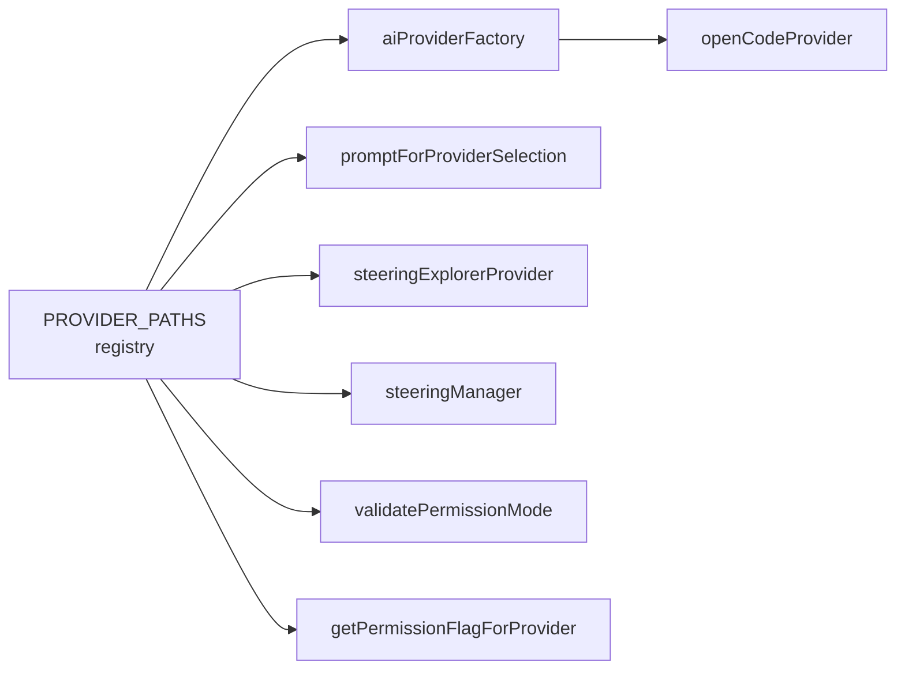

# Plan: Provider Registry

**Spec**: [spec.md](./spec.md) | **Date**: 2026-04-13

## Approach

Extend `PROVIDER_PATHS` in `src/ai-providers/aiProvider.ts` into the single source of truth for all per-provider behavior (UI labels, capability flags, permission flags, steering paths) and refactor the factory, QuickPick, steering sidebar, and permission helpers to derive from it instead of holding parallel hardcoded lists. Add OpenCode as the first provider that exercises the registry end-to-end, fix the Copilot interactive-mode silent-failure with a `validatePermissionMode()` notification, and move the spec-editor's Post-Specification instructions into the temp markdown file so the terminal dispatch line stays clean.

## Technical Context

**Stack**: TypeScript 5.3+ (ES2022, strict), VS Code Extension API, Webpack 5
**Key Dependencies**: none new
**Constraints**: must not change behavior of existing `formatCommandForProvider` tests; activation must remain non-blocking; no edits to `.claude/**` or `.specify/**` (extension isolation).

## Architecture

## Files

### Create

- `src/ai-providers/openCodeProvider.ts` — `IAIProvider` impl modeled on `qwenCliProvider.ts`; `isInstalled()` shells `opencode --version` and returns false on ENOENT; uses `dispatchSlashCommandViaTempFile` for execution.
- `src/ai-providers/permissionValidation.ts` — exports `validatePermissionMode(context)` and `getPermissionFlagForProvider(providerType)`; subscribed to `onDidChangeConfiguration` for `speckit.permissionMode` and `speckit.aiProvider`.

### Modify

- `src/ai-providers/aiProvider.ts` — extend `ProviderPaths` with `globalSteeringFile`, `configDir`, `quickPickIcon`, `quickPickDescription`, `supportsInteractivePermissions`, `autoApproveFlag`; populate for all six providers; rewrite `promptForProviderSelection()` to iterate `PROVIDER_PATHS`.
- `src/ai-providers/aiProviderFactory.ts` — replace `switch` with `PROVIDER_CONSTRUCTORS: Record<AIProviderType, () => IAIProvider>`; derive `getSupportedProviders()` from `Object.keys(PROVIDER_PATHS)`.
- `src/ai-providers/index.ts` — barrel export for `openCodeProvider` and `permissionValidation`.
- `src/ai-providers/claudeCodeProvider.ts`, `geminiCliProvider.ts`, `copilotCliProvider.ts`, `codexCliProvider.ts`, `qwenCliProvider.ts` — `getPermissionFlag()` delegates to `getPermissionFlagForProvider(this.type)`.
- `src/core/constants.ts` — add `OPENCODE: 'opencode'` to `AIProviders`.
- `src/features/steering/steeringExplorerProvider.ts` — file watchers and section visibility derive from `getProviderPaths()`; remove hardcoded `.claude/` patterns and `providerType === AIProviders.CLAUDE` checks; rename method calls to `createProjectSteeringFile` / `createUserSteeringFile`; remove `getSteeringFilePaths` per-provider switch (resolve via `globalSteeringFile` + `steeringFile`).
- `src/features/steering/steeringManager.ts` — rename `createProjectClaudeMd` → `createProjectSteeringFile`, `createUserClaudeMd` → `createUserSteeringFile`; update internal references.
- `src/features/spec-editor/tempFileManager.ts` — add `appendToMarkdownFile(filePath, content)` method.
- `src/features/spec-editor/specEditorProvider.ts` — append Post-Specification instruction block to the temp `spec.md` via the new method; change dispatched line from `{command} {markdownContent}{specContextInstruction}` to `{command} {tempFilePath}`.
- `src/extension.ts` — call `validatePermissionMode(context)` after activation; subscribe to setting changes.
- `package.json` — add `opencode` to `speckit.aiProvider` enum + `enumDescriptions`; clarify `speckit.permissionMode` description re: which providers honor `interactive`.

## Testing Strategy

- **Unit**: existing `formatCommandForProvider.test.ts` must pass unchanged; add a small test that `getSupportedProviders()` returns all `PROVIDER_PATHS` keys and that `getPermissionFlagForProvider('copilot')` returns the auto-approve flag only when mode is `auto-approve`.
- **Manual (F5)**: walk through each scenario in spec.md — switch providers in settings, verify steering sidebar reloads with correct files/sections; trigger Copilot+interactive warning and confirm "Switch to Auto-Approve" works; trigger spec-editor dispatch and confirm terminal line shows only the temp file path.

## Risks

- **Renamed steering methods break callers**: `createProjectClaudeMd`/`createUserClaudeMd` are wired into command registrations; mitigation — rename and update every caller in the same commit, run `tsc` to catch stragglers.
- **`AGENTS.md` collision between OpenCode and Codex**: same workspace file reused when switching providers; accepted per spec — content is provider-agnostic.
- **Activation-time validation noise**: warning toast on every window open if user already chose Copilot+interactive; mitigation — only show when the *combination* is freshly invalid (debounce per-session via `globalState` flag, or only fire on setting change after activation).
