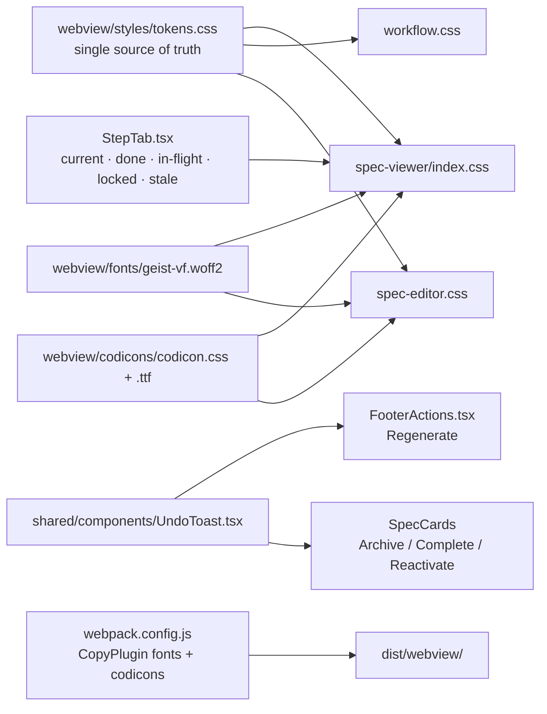

# Plan: Design Tighten & Safety

**Spec**: [spec.md](./spec.md) | **Date**: 2026-04-20

## Approach

Promote `webview/styles/spec-viewer/_variables.css` to a webview-root `webview/styles/tokens.css`, then rewrite `workflow.css`, `spec-editor.css`, and `spec-viewer/index.css` to import it and delete every duplicate/drifted declaration (tokens, button radii, emoji chrome, `rgba(59,130,246,…)` literals, 3-layer halos). In parallel, reduce `StepTab` to four canonical states + an orthogonal `stale` flag so legacy CSS selectors collapse, and merge the 4-layer nav into a 3-layer compact nav. Ship fonts and codicons from bundled webview URIs so the `.vsix` is fully offline, then layer safety (5-second Regenerate undo toast, inline two-click confirm for Archive/Complete/Reactivate, visible focus rings, global `prefers-reduced-motion` override) on top.

## Technical Context

**Stack**: TypeScript 5.3+ (ES2022, strict), VS Code Extension API (`@types/vscode ^1.84.0`), Preact for webviews, Webpack 5, Jest (`ts-jest`).
**Key Dependencies (new)**: `@vscode/codicons` (~60 KB ttf, bundled locally); Geist Variable (woff2, bundled locally — no runtime `cdn.jsdelivr.net` fetch).
**Constraints**:
- Extension isolation: only `src/**`, `webview/**`, `assets/**`, and `webpack.config.js` ship in the `.vsix`. Do not touch `.claude/**` or `.specify/**`.
- Fully offline at runtime: webview CSP `font-src` must be `${webview.cspSource}` only; no CDN fetches for fonts or codicons.
- Must preserve existing run-lock semantics (Regenerate stays disabled during an active run; undo toast must not appear mid-run).
- Bundle A is non-behavioral — only DOM class shapes and CSS change; the regression surface is visual parity across light/dark/high-contrast.

## Architecture

## Files

### Create

- `webview/styles/tokens.css` — single source of truth for design tokens (promoted and expanded from the current `spec-viewer/_variables.css`). Adds the global `@media (prefers-reduced-motion: reduce)` block (R028).
- `webview/fonts/geist-vf.woff2` — bundled Geist Variable font (R018).
- `webview/codicons/codicon.css` — copied from `node_modules/@vscode/codicons/dist/codicon.css` at build time (R019).
- `webview/codicons/codicon.ttf` — copied from `node_modules/@vscode/codicons/dist/codicon.ttf` at build time (R019).
- `webview/src/shared/components/UndoToast.tsx` — shared toast with countdown progress + `[Undo]` button, reusing `.action-toast` styling (R025).
- `webview/src/shared/components/UndoToast.stories.tsx` — Storybook variants (idle, counting, cancelled, elapsed). Optional; include if other shared components already have stories.
- `webview/src/shared/hooks/useInlineConfirm.ts` — hook exposing `{label, onClick}` pair that swaps label to "Confirm?" for 3 s and fires the action on second click (R026).

### Modify

- `webview/styles/spec-viewer/_variables.css` — **delete** (R001). Replaced by `tokens.css`.
- `webview/styles/spec-viewer/index.css` — replace local variables import with `@import '../tokens.css'`.
- `webview/styles/workflow.css` — delete duplicate `:root` + theme-fallback block (lines ~10–141), add `@import './tokens.css'`; keep only `*` and `body` resets. Remove 8 px `radius-md` usages (R004), align step-indicator to 16 px (R003), align button padding 6/14 & 8/24 (R005), replace all `rgba(59,130,246,…)` with `color-mix` on `--accent` (R013), collapse halos to single 2 px accent ring (R014), swap `🌱` / `📄` / `📎` for codicons (R016).
- `webview/styles/spec-editor.css` — add `@import './tokens.css'`; replace direct `var(--vscode-*)` with semantic tokens where equivalents exist (R006); adjust CSP-relevant rules as needed; style bundled codicons (R017).
- `webview/styles/spec-viewer/_navigation.css` — drop `step-tab.reviewing` dashed-outline variant (R009); drop the `.step-tab:focus-visible { outline: none; }` rule (R029); merge related-tabs slot into `.nav-primary` (R010); delete `.related-bar` (R010) and the Overview tab styling (R011).
- `webview/styles/spec-viewer/_animations.css` — delete `.step-tab.pulse` rule + `@keyframes step-tab-pulse`; delete `@keyframes pulse-glow` and the `.empty-state button` infinite animation (R015); ensure remaining animations inherit reduced-motion override via `*` selector in tokens.css.
- `webview/styles/spec-viewer/_content.css` (or wherever `hr` currently renders) — replace `display: none` on `hr` with the thin divider rule (R021).
- `webview/styles/spec-viewer/_base.css` — keep the global 2 px accent `:focus-visible` outline (already present); audit for and remove any stray `outline: none` declarations (R029).
- `webview/styles/spec-viewer/_footer.css` — verify `.action-toast` selector names/tokens the new `UndoToast` will reuse; tighten thumbnail `.remove-btn` rules to render at rest (opacity 0.5), hover/focus opacity 1 (R027).
- `webview/src/spec-viewer/components/StepTab.tsx` — rewrite `classes` to emit at most one of `current | done | in-flight | locked` + optional `stale`; delete legacy classes (`viewing`, `reviewing`, `workflow`, `working`, `in-progress`, `tasks-active`, `pulse`, `completed`, `exists`, `disabled`) (R007, R008).
- `webview/src/spec-viewer/components/StepTab.stories.tsx` — regenerate stories to cover the four canonical states + stale variants.
- `webview/src/spec-viewer/components/NavigationBar.tsx` — render related tabs in a right-aligned slot inside `.nav-primary`; remove Overview related tab (R010, R011).
- `webview/src/spec-viewer/components/RelatedBar.tsx` — **delete** (R010); `RelatedBar.stories.tsx` and any imports removed too.
- `webview/src/spec-viewer/components/SpecHeader.tsx` — collapse to single flex row `[badge] [title] [branch]`; delete internal `
` and `spec-header-row-1` / `spec-header-row-3` wrappers (R012).
- `webview/src/spec-viewer/components/FooterActions.tsx` — wire Regenerate through `UndoToast` (5 s window, Esc/click-Undo cancels, timer-elapse dispatches backend message) (R024, R030).
- `webview/src/spec-viewer/components/SpecHeader.tsx` (Archive/Complete) + any `Reactivate` call-site — use `useInlineConfirm` to implement the two-click "Confirm?" affordance (R026).
- `webview/src/spec-editor/` (Create New Spec page) — rename the "Load Existing Spec" button label to "Load Template" (R023); swap emoji chrome on Load Template / Attach Image buttons for `` (R016, R017).
- `webview/src/workflow.ts` — detect `document.body.classList` theme (`vscode-light` / `vscode-dark` / `vscode-high-contrast`) on init; set up a `MutationObserver` on `body` `class` attribute that re-initializes Mermaid with theme-matched variables (debounced 200 ms) (R022).
- `src/features/spec-viewer/html/generator.ts` — update CSP: `font-src ${webview.cspSource}` only; `style-src ${webview.cspSource} 'unsafe-inline'`; drop `https://cdn.jsdelivr.net` from both. Replace the `@font-face` CDN `src: url(...)` with `webview.asWebviewUri(geist-vf.woff2)` (R018). Add `<link>` for bundled `codicons/codicon.css` via `webview.asWebviewUri(...)` (R019).
- `src/features/spec-editor/specEditorProvider.ts` (and any HTML builder it owns) — add bundled codicons stylesheet via `webview.asWebviewUri(...)`; update CSP to allow `font-src ${webview.cspSource}` for the ttf; ensure no CDN refs remain (R017, R019).
- `src/features/workflow-editor/workflowEditorProvider.ts` — wire the Mermaid theme variables (light / dark / high-contrast) into the initial webview bootstrap so the in-webview observer has correct starting values (R022).
- `webpack.config.js` — add `CopyPlugin` patterns copying `webview/fonts/` → `dist/webview/fonts/` and `node_modules/@vscode/codicons/dist/` → `dist/webview/codicons/` so both ship in the `.vsix` (R020).
- `package.json` — add `@vscode/codicons` to `dependencies` (needed for the copy-plugin source path and packaging).
- `.vscodeignore` — verify `dist/webview/fonts/**` and `dist/webview/codicons/**` are NOT ignored (they must ship in the `.vsix`).
- `README.md` — document the offline asset bundling and the new Regenerate-undo / two-click-confirm safety affordances (user-facing behavior change).

## Testing Strategy

- **Unit (Jest)**: Pure-logic tests for `useInlineConfirm` (first-click swap, timer revert at 3 s, second-click fire, cleanup on unmount) and for the Regenerate queue/cancel state machine inside `UndoToast`. Class-shape assertions on `StepTab` for the four canonical states + stale flag.
- **Integration**: `npm run compile` and `npm test` must pass green after each bundle merges (NFR001, NFR002). `npm run package` must produce a `.vsix` whose `dist/webview/` contains `fonts/geist-vf.woff2` and `codicons/codicon.{css,ttf}` (NFR003).
- **Manual (F5 into extension dev host)**: Open a spec in each of spec-viewer, spec-editor, and workflow-editor; toggle VS Code between Dark+, Light+, and a high-contrast theme and confirm tokens/mermaid re-theme correctly; enable OS Reduce Motion and verify all infinite animations pause (R028); tab through every focusable element across webviews and confirm the 2 px accent outline is visible everywhere (R029); disconnect the network and reopen a spec — no `cdn.jsdelivr.net` requests should appear in the webview Network tab (R018, R019).
- **Heuristic re-score** (`/impeccable:critique`): after Bundle A, score must rise from 19/40 into at least the high-20s, with Consistency, Aesthetic, and Recognition each up ≥ 1 point (NFR004). After Bundle B, User Control & Freedom and Error Recovery each reach 3 (NFR005).

## Risks

- **CSP regression**: dropping `https://cdn.jsdelivr.net` from `style-src` / `font-src` / `script-src` breaks webviews that still reference CDN URLs (e.g., highlight.js, mermaid loaded from `cdn.jsdelivr.net` in `generator.ts`). *Mitigation*: scope the CSP tightening in Bundle A to only the entries being replaced this round (Geist + codicons); track highlight.js/mermaid local bundling as a follow-up, keeping their CDN allowances in CSP until then.
- **`.vsix` size growth**: adding `codicon.ttf` (~60 KB) nudges the package up. *Mitigation*: ship unsubset first; if the size crosses a team-accepted limit (NFR006), subset codicons to the glyphs actually referenced and regenerate the ttf via `npm run package`.
- **StepTab legacy-class sweep breaks callers**: any CSS or automated test still keyed on `.viewing` / `.reviewing` / `.workflow` / `.tasks-active` / `.completed` / `.exists` / `.disabled` / `.in-progress` / `.working` / `.pulse` will silently stop applying styles. *Mitigation*: grep the repo for each removed class name and confirm zero live references before merging Bundle A's StepTab commit; ensure `StepTab.stories.tsx` visually covers all four canonical states.
- **Two-click confirm discoverability**: users who click Archive once and wait may not realize the second click window is 3 s. *Mitigation*: during manual testing, confirm the "Confirm?" label is legible and the revert is perceptible; if feedback lands poorly, extend to a small countdown hint in a follow-up.
- **Mermaid theme re-init flicker**: switching VS Code themes triggers a full Mermaid re-render. *Mitigation*: debounce the `MutationObserver` at 200 ms (R022); if flicker remains objectionable, render into a hidden node and swap on completion.

---

**Problem**: The three webviews each carry their own design-token layer with drifted values, the step-tab state machine has accumulated nine legacy class names, the navigation is stacked four layers deep, Geist and codicons load from a CDN so the extension breaks offline, and destructive actions (Regenerate, Archive, Complete, Reactivate) fire immediately with no undo — together this scores 19/40 on the UX critique.

**Solution**: Ship Bundle A (tighten — one shared `tokens.css`, a four-state StepTab, a 3-layer compact nav, bundled Geist + codicons, theme-aware Mermaid, no emoji chrome) then Bundle B (safety — a 5-second undo toast on Regenerate, inline two-click confirm on Archive/Complete/Reactivate, visible focus rings everywhere, and a global reduced-motion override). Both bundles are additive, reversible, and verified via compile/test/package plus a manual F5 walkthrough across light, dark, and high-contrast themes.
