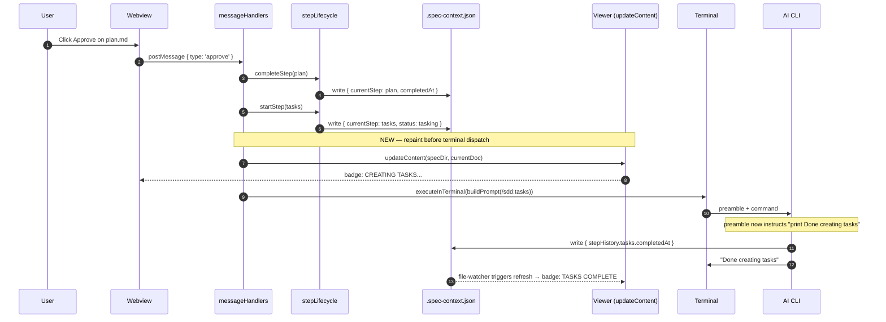
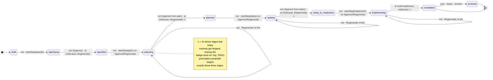
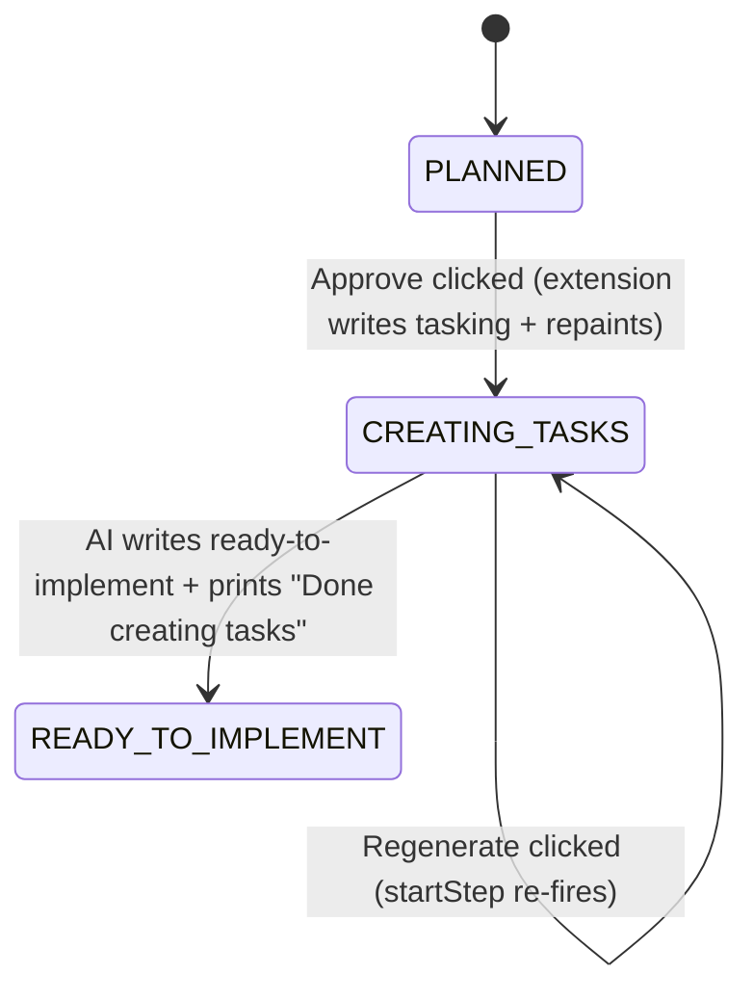

# Plan: Immediate Status Update

**Spec**: [spec.md](./spec.md) | **Date**: 2026-04-22

## Approach

Two problems, one change per file:

1. **Badge doesn't flip on click** — `handleApprove` / `handleRegenerate` already write to `.spec-context.json` via `startStep`/`completeStep` but never call `deps.updateContent`, so the viewer keeps rendering stale state. Fix: mirror the `handleLifecycleAction` pattern and repaint right after the writes, before terminal dispatch.

2. **Badge hangs on in-progress form (`planning`, `tasking`, `implementing`)** — the current `STATUS_LIFECYCLE` preamble *mentions* flipping to the completed form but AIs skip it regularly, so specs sit on `planning` forever. Fix: rewrite the preamble to be prescriptive — three **MUST-DO-BEFORE-ENDING** checklist items: set `completedAt`, flip to completed-form status, print `Done {step}`.

## Status Vocabulary (pin this before reading the diagrams)

The repo does **not** use TS `enum` — states are string union types + `as const` namespaces.

| Vocabulary | Defined in | Values | Used by |
|---|---|---|---|
| `Status` (fine) | `src/core/types/specContext.ts:25` | `draft`, `specifying`, `specified`, `planning`, `planned`, `tasking`, `ready-to-implement`, `implementing`, `completed`, `archived` | `.spec-context.json#status`, preamble, badge label derivation |
| `SpecStatuses` (coarse) | `src/core/constants.ts:234` | `active`, `tasks-done`, `completed`, `archived` | Footer Archive/Complete/Reactivate buttons, tree grouping |

This feature targets the **fine** vocabulary — specifically the `planning → planned`, `tasking → ready-to-implement`, `implementing → completed` transitions that AIs keep skipping. The coarse `SpecStatuses` lifecycle is out of scope; `handleLifecycleAction` already handles it correctly.

Badge display labels (what the user sees) come from `src/features/spec-viewer/phaseCalculation.ts` — e.g., `CREATING TASKS...` (appended `...` when in-progress). The diagrams below use display labels where visible to users and fine-`Status` values elsewhere; both are named explicitly.

## Division of Labor — Extension vs. AI

Critical nuance: `setStepStarted` / `setStepCompleted` in `specContextWriter.ts:100,126` already derive the correct `status` from the step name. So the extension doesn't just mark `completedAt` — it also flips `status` to its completed form. The AI's job only begins when the AI *itself* drives the step forward (Regenerate / `/sdd:auto`), not when the user clicks Approve.

| Trigger | Who writes `.spec-context.json` | `status` transitions written | Visible terminal output |
|---|---|---|---|
| **Approve** (user viewing step N, advances to N+1) | Extension — `completeStep(N)` then `startStep(N+1)` | `planning → planned → tasking` (or `tasking → ready-to-implement → implementing`) — **all three in one click, by the extension** | `Done {N+1}` line at end, from AI (T003) |
| **Regenerate** (user re-runs step N in place) | Extension — `startStep(N)` only | `{prev} → {N-in-progress}` (e.g., `planned → planning`). **No completed-form write is scheduled by the extension.** | AI must flip to completed form + print `Done {N}` at end (T003) |
| `/sdd:auto` pipeline | Extension kicks it off; AI drives step-by-step | All of them — AI writes every `startedAt` / `completedAt` / status flip as it moves through specify → plan → tasks → implement | `Done {step}` at end of each step (T003) |
| Footer **Archive / Complete / Reactivate** | Extension — `handleLifecycleAction` | Coarse `SpecStatuses` only (`active` / `completed` / `archived`) — does **not** touch fine `Status` | none |

### What the extension explicitly handles (synchronous, on click — no AI involvement)

1. Write `stepHistory.{step}.completedAt` for the step being left (Approve only).
2. Write `stepHistory.{step}.startedAt` for the step being entered.
3. Flip `status` to the appropriate derived value (`deriveInProgressStatus` or `deriveCompletedStatus`).
4. Append transition entries with `by: "extension"`.
5. **NEW in this feature**: call `updateContent(...)` to repaint the viewer so the badge reflects the writes above before the terminal dispatch.
6. Call `buildPrompt(...)` and send the command to the terminal.

### What the AI explicitly handles (asynchronous, runs in terminal — driven by prompt preamble)

1. Execute the actual command body (`/sdd:plan` writes `plan.md`, `/sdd:implement` writes code, etc.).
2. Before ending the command — per the rewritten preamble (T003):
   - Set `stepHistory.{step}.completedAt = now` for the step it just executed.
   - Flip `status` from the in-progress form to the completed form using `STATUS_LIFECYCLE`.
   - Append a transition entry with `by: "ai"` / `"sdd"`.
   - Print a single visible `Done {step}` line to the terminal.
3. For `/sdd:auto` — repeat steps 1–2 for every step in the pipeline.

The "stays in planning" bug the user reported happens on **Regenerate on plan** (or inside `/sdd:auto`), where the extension only writes the in-progress `planning` status and relies on the AI to advance out of it. When the AI skips the completion block, the status sticks — which is the exact failure mode T003's prescriptive preamble eliminates.

## State Transitions

### Who writes what, and when (sequence)

### Full canonical status lifecycle

Ten statuses, strictly alternating **in-progress** → **completed-form** per step. The extension drives the `*ing` transitions on button click; the AI is responsible for advancing from each `*ing` to its completed form. Today the AI-side transitions out of `planning`/`tasking`/`implementing` are the ones that fail — which is exactly what the preamble rewrite targets.

Edges are labeled with the driver(s) that can write them. Read `ext` = extension, `ai` = AI-in-terminal.

### Badge behavior on a single click (plan → tasks example — using display labels)

> Display labels shown: `PLANNED`, `CREATING TASKS...`, `READY TO IMPLEMENT` — sourced from `phaseCalculation.ts`. Trailing `...` is appended only while `inProgress` is true, so the label visibly distinguishes active work from an idle landing state.

The key invariant: the in-progress status (fine `tasking` / display `CREATING TASKS...`) is entered **by the extension** the moment the user clicks — independent of the AI. The AI is only responsible for the transition **out of** it, and that's the transition the new preamble wording enforces.

## Files to Change

### Modify

- `src/features/spec-viewer/messageHandlers.ts` — in `handleApprove` (after the completeStep/startStep block, before `executeStepInTerminal`) and in `handleRegenerate` (after `startStep`, before `executeStepInTerminal`), add `await deps.updateContent(specDirectory, instance.state.currentDocument)` so the viewer repaints with the freshly written `.spec-context.json`.
- `src/ai-providers/promptBuilder.ts` — append one bullet to `STATUS_LIFECYCLE` (or add a dedicated line in `renderPreamble`) instructing the AI to print a "Done {step}" completion marker after writing the completed status.
