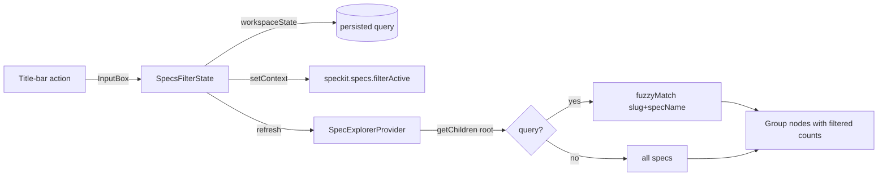

# Plan: Filter/search box above the specs tree

**Spec**: [spec.md](./spec.md) | **Date**: 2026-04-23

## Approach

Add an in-memory filter query to `SpecExplorerProvider` plus a small `SpecsFilterState` helper that reads/writes the query to `workspaceState`. A title-bar action (`speckit.specs.filter`) opens a VS Code `InputBox` prefilled with the current query; accepting the input updates the state and refreshes the tree. A second title-bar action (`speckit.specs.filter.clear`), gated on a `speckit.specs.filterActive` context key, clears the query. Fuzzy matching is a ~30-line in-repo helper (subsequence + alphanumeric normalization) applied to spec slug and `.spec-context.json#specName`, and group counts are computed from the post-filter lists so the already-status-grouped tree (from 071-tree-group-counts) naturally shows filtered totals.

## Technical Context

**Stack**: TypeScript 5.3+ (ES2022, strict), VS Code Extension API `^1.84.0`, Jest + `ts-jest`.
**Key Dependencies**: none added — fuzzy matching is implemented in-repo.
**Constraints**: No embedded input in the TreeView (VS Code API doesn't support it); filter UX is title-bar action + `InputBox`. Filter is workspace-scoped (persisted via `workspaceState`, not `globalState`).

## Architecture

## Files

### Create

- `src/features/specs/specsFilterState.ts` — `SpecsFilterState` class wrapping `workspaceState` reads/writes under key `speckit.specs.filter.query`, exposes `getQuery()`, `setQuery(q)`, `clear()`, and fires a callback so the provider can refresh. Also updates the `speckit.specs.filterActive` context key on every change.
- `src/features/specs/fuzzyMatch.ts` — pure helper: `normalize(s)` (lowercase + strip non-alphanumeric) and `fuzzyMatch(query, ...haystacks)` returning boolean via subsequence check across the concatenated normalized haystacks. ~30 lines.
- `src/features/specs/__tests__/fuzzyMatch.test.ts` — BDD tests covering subsequence match, case-insensitivity, punctuation/whitespace normalization, empty query (matches everything), and no-match.
- `src/features/specs/__tests__/specsFilterState.test.ts` — tests for get/set/clear round-trip via a mocked `workspaceState`, plus the `setContext` side-effect.

### Modify

- `src/features/specs/specExplorerProvider.ts` — inject `SpecsFilterState` via constructor; in `getChildren` root branch, after partitioning specs by status, apply the fuzzy filter to each group using `spec.name` (slug) and `specContext?.specName`; empty groups become hidden; group counts use the filtered lengths. No change to per-spec rendering or to the group children fetch (already reads from `groupSpecs`, which will be the filtered list).
- `src/features/specs/specCommands.ts` — register two commands: `speckit.specs.filter` (opens `vscode.window.showInputBox({ value: currentQuery, prompt: 'Filter specs…' })`, writes result to `SpecsFilterState`) and `speckit.specs.filter.clear` (calls `SpecsFilterState.clear()`).
- `src/extension.ts` — instantiate `SpecsFilterState(context, () => specExplorer.refresh())`, pass it to `SpecExplorerProvider` and `registerSpecKitCommands`, and restore any persisted query on activation (so the tree renders filtered on first paint — NFR around persistence).
- `src/core/constants.ts` — add `Commands.specsFilter`, `Commands.specsFilterClear`, and a `ConfigKeys.workspaceState.specsFilterQuery` constant.
- `package.json` — add two `contributes.commands` entries (icons: `$(filter)` and `$(clear-all)` or `$(close)`), two `view/title` menu entries under `speckit.views.explorer` (group `navigation@0` so filter sits leftmost; clear-filter gated on `speckit.specs.filterActive`), and a `viewsWelcome` entry shown when the filter is active but matches zero specs ("No specs match '{query}'. [Clear filter](command:speckit.specs.filter.clear)").
- `README.md` — document the new filter action in the Specs tree section (screenshot optional, not required).
- `docs/architecture.md` — add `specsFilterState.ts` and `fuzzyMatch.ts` to the specs feature module list.

## Data Model

- `SpecsFilterState` — in-memory fields: `query: string` (empty string means "no filter"). Persisted to `workspaceState` under `speckit.specs.filter.query`.
- No change to `.spec-context.json` — filter reads the existing `specName` field already written by `/sdd:specify`.

## Testing Strategy

- **Unit**: `fuzzyMatch.test.ts` covers the pure matcher exhaustively. `specsFilterState.test.ts` covers persistence round-trip and context-key updates against a mocked `ExtensionContext.workspaceState`.
- **Integration**: Extend `specExplorerProvider.test.ts` with a test that (a) seeds three specs with varying slugs + `specName` via `readSpecContextSync` mock, (b) applies a query via `SpecsFilterState`, (c) asserts the root `getChildren` returns only matching specs and that group counts in labels reflect filtered totals.
- **Edge cases**: empty query → all specs visible; query with no matches → tree returns empty array (the `viewsWelcome` entry renders the no-match message); matching spec with no `specName` field → slug-only match still works; query with whitespace/punctuation → normalized both sides.

## Risks

- **VS Code TreeView selection quirk when items disappear**: hidden specs lose selection, which is intended per spec R008 and matches VS Code's native behavior — documenting it in the test and README avoids confusion.
- **Count desync with 071-tree-group-counts**: the group label format `Active (N)` is generated in one place (`specExplorerProvider.ts` root branch), so using the filtered list length there keeps 071's implementation intact.
- **InputBox without typeahead**: the UX is not "live" — the filter applies after the user accepts the input. This is an explicit trade-off for scope (live typeahead would require a webview). The prompt is re-triggerable from the title bar for incremental edits. Noted in R001.
