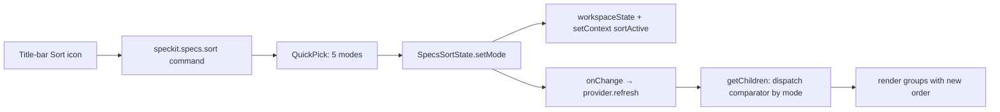

# Plan: Sort Options (name / date / status)

**Spec**: [spec.md](./spec.md) | **Date**: 2026-04-24

## Approach

Mirror the recently-merged `SpecsFilterState` pattern with a parallel `SpecsSortState` class that persists a sort-mode key to workspace state and fires an `onChange` to refresh the tree. Replace the hardcoded numeric-prefix `sortSpecs` comparator inside `specExplorerProvider.getChildren` with a dispatch on the active mode, keeping the current numeric-prefix order as the default so nothing changes visually for users who never open the picker.

## Technical Context

**Stack**: TypeScript 5.3 (strict), VS Code Extension API 1.84+.
**Key Dependencies**: `SpecsFilterState` (template to copy), `readSpecContextSync` + the `specNameByPath` map already built in `getChildren` (reused for name/status sort without extra I/O).
**Constraints**: Sort must apply after the existing fuzzy filter; ordering must be deterministic (tie-break by numeric prefix, then name) so reloads are stable.

## Architecture

## Files

### Create

- `src/features/specs/specsSortState.ts` — workspace-state wrapper for the active sort mode (`getMode` / `setMode` / `clear` / `initialize`); sets `speckit.specs.sortActive` context key when mode is non-default and calls `onChange`.
- `src/features/specs/specsSortMode.ts` — `SortMode` union (`'number' | 'name' | 'dateCreated' | 'dateModified' | 'status'`), default constant, and a `comparators` map keyed by mode (each returns a `(a, b) => number`).
- `src/features/specs/__tests__/specsSortState.test.ts` — mirror of `specsFilterState.test.ts`: persistence, default fallback, `onChange`, context-key sync in `initialize()`.
- `src/features/specs/__tests__/specsSortMode.test.ts` — comparator unit tests for each mode (numeric tie-break, missing signal, stable ordering across groups).

### Modify

- `src/core/constants.ts` — add `Commands.specsSort` (`'speckit.specs.sort'`), `ConfigKeys.workspaceState.specsSortMode` (`'speckit.specs.sort.mode'`).
- `src/features/specs/specExplorerProvider.ts` — accept optional `SpecsSortState` in constructor (parallel to `filterState`); replace the inline `extractNumericPrefix` + `sortSpecs` block with a call into the comparator map keyed by `sortState?.getMode() ?? 'number'`; pass in the already-cached `specNameByPath` and `basePath` so no new disk I/O is added.
- `src/features/specs/specCommands.ts` — register `speckit.specs.sort`: open a `vscode.window.showQuickPick` with labeled `SortMode` options, checkmark the current mode, call `sortState.setMode(chosen)`; accept `SpecsSortState` in the function signature alongside the existing `filterState`.
- `src/extension.ts` — instantiate `SpecsSortState` next to `SpecsFilterState`, pass it to `SpecExplorerProvider` and `registerSpecKitCommands`, call `.initialize()` after construction.
- `package.json` — add `speckit.specs.sort` command with `$(sort-precedence)` icon; add `view/title` menu entry in `group: "navigation@0"` (next to filter, before create/refresh).
- `README.md` — add a sentence or bullet to the specs tree section documenting the new sort picker and available modes.

## Data Model

- `SortMode` — union type: `'number' | 'name' | 'dateCreated' | 'dateModified' | 'status'`. Default `'number'` preserves existing behavior.
- Workspace state key `speckit.specs.sort.mode` — holds the current `SortMode` (string) or `undefined` for default.
- Context key `speckit.specs.sortActive` — `true` when mode is set and non-default (future-proofs a "reset to default" affordance in the menu, per R008).

## Testing Strategy

- **Unit (state)**: persistence, default fallback to `'number'` when nothing stored, `onChange` fires, context key tracks non-default state.
- **Unit (comparators)**: each mode sorts a fixture of specs correctly including tie-breaks (two specs with the same `currentStep` fall back to numeric prefix, spec without `.spec-context.json` sinks to the end under status sort).
- **Integration**: extend `specExplorerProvider.test.ts` with a case asserting that switching sort mode re-orders group children while keeping the group order (Active → Completed → Archived) intact.

## Risks

- Status sort depends on `.spec-context.json.currentStep`; specs that predate the context file would all tie and sort by fallback. Mitigated by the numeric-prefix tie-break so output stays deterministic.
- Date sort uses `fs.statSync` birthtime/mtime, which git operations can rewrite. Documented as a caveat; `number` remains default.
