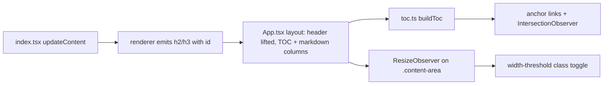

# Plan: Sticky Header & Responsive TOC

**Spec**: [spec.md](./spec.md) | **Date**: 2026-04-25

## Approach

Lift `SpecHeader` out of the scrolling `.content-area` so it becomes a sibling of `.compact-nav` and stays pinned by the existing flex column layout. Inside `.content-area`, restructure to a two-column flex row — a sticky `aside.spec-toc` and the existing `#markdown-content` — and add a small `toc.ts` module that builds anchor links from rendered H2/H3 headings, hides the sidebar via a width-threshold class on the scroller, and tracks the active section with an `IntersectionObserver` rooted on `.content-area`.

## Technical Context

**Stack**: TypeScript 5.3+ (ES2022, strict), Preact (webview), VS Code Webview API.
**Key Dependencies**: none new — uses native `IntersectionObserver` and `ResizeObserver`.
**Constraints**: webview pane width drives the responsive threshold (`ResizeObserver` on `.content-area`, not viewport media query); scroll root is the `.content-area` element, not the document; must rebuild TOC on every doc switch (spec → plan → tasks → related).

## Architecture

## Files

### Create

- `webview/src/spec-viewer/toc.ts` — `buildToc(scrollRoot, markdownRoot, tocRoot)`: scans `#markdown-content h2, h3`, slugifies heading text, writes anchor links into `aside.spec-toc`, attaches a single `IntersectionObserver` (root = `.content-area`) to set `aria-current="location"` on the active link, attaches a `ResizeObserver` to toggle `.spec-toc--hidden` below the threshold, and wires anchor-click smooth-scroll honoring `prefers-reduced-motion`. Re-runnable; tears down prior observers before rebuilding.
- `webview/styles/spec-viewer/_toc.css` — sidebar layout (`aside.spec-toc` flex item, fixed width, sticky `top: 0`, scrollable inner list), active-link styling (`aria-current="location"`), hidden state (`display: none` when `.content-area--narrow`), responsive threshold token (`--toc-min-width`, default `780px`), focus-visible outlines for keyboard nav.

### Modify

- `webview/src/spec-viewer/App.tsx` — lift `<SpecHeader />` to a sibling of `<nav class="compact-nav">` (above `.content-area`); inside `<main class="content-area">`, render `<aside class="spec-toc" id="spec-toc">` followed by `
`. Header is now always pinned by existing flex layout (R001).
- `webview/src/spec-viewer/index.tsx` — after each `updateContent` run, call `buildToc(...)` from `toc.ts` (alongside the existing `applyHighlighting` / `initializeMermaid` rAF block) so the TOC rebuilds on every doc switch (R005, scenario "Switching between core docs"). Also invoke once during `init()` for the initial template content.
- `webview/src/spec-viewer/markdown/renderer.ts` — slugify heading text and emit `id="..."` on `<h1>`–`<h3>` (collision suffix `-2`, `-3` for repeats within a single doc) so anchor links resolve. Keep existing `wrapWithLineActions` behavior for h3+.
- `webview/styles/spec-viewer/_content.css` — drop the assumption that `.spec-header` lives inside `#markdown-content`'s flow; the existing sibling selector `.spec-header[data-has-context="true"] ~ #markdown-content h1:first-of-type` continues to work because both elements remain siblings (just at a higher level now). Adjust `.spec-header` margins/padding so it reads as a viewer-shell element rather than an article header (no `max-width: 72ch` + `margin: 0 auto` once it's outside the column-constrained content area; instead full-width with internal padding).
- `webview/styles/spec-viewer/_base.css` — `.content-area` becomes `display: flex; flex-direction: row; gap: var(--space-6)`. Markdown column keeps `max-width: 72ch` via `#markdown-content`'s existing rule. Add `.content-area--narrow .spec-toc { display: none; }` width-class hook. Keep `overflow-y: auto` on `.content-area` (single scroll context — required for IntersectionObserver root).
- `webview/styles/spec-viewer/index.css` — add `@import '_toc.css';` so the new partial is bundled.
- `docs/architecture.md` — add `webview/src/spec-viewer/toc.ts` to the spec-viewer module list and note the lifted-header layout (header → content-area row → aside + markdown).

## Risks

- **IntersectionObserver root**: must be the `.content-area` element, not the document/viewport. Using the default root will silently fail in webviews because the scroll happens inside an inner element. Mitigation: pass `root: scrollRoot` explicitly in `IntersectionObserver` options and assert in unit test.
- **Heading-slug collisions**: two H2s with identical text (e.g., "Notes") would otherwise share an `id`, breaking anchor navigation. Mitigation: per-render counter that appends `-2`, `-3` on repeats; reset between rerenders.
- **Width source**: VS Code webviews don't re-fire viewport media queries reliably when the editor split is dragged. Mitigation: use `ResizeObserver` on `.content-area` and toggle a CSS class — avoids `@media` width entirely (NFR004 still satisfied via `--toc-min-width` custom prop read in JS).
- **Sticky-header overlap with the first markdown heading**: the existing `~ #markdown-content h1:first-of-type { display: none }` rule depends on DOM siblinghood; lifting the header changes the parent. Mitigation: keep both elements as siblings inside `.viewer-container` so the selector still resolves, or switch to a JS-driven `data-has-context` body attribute that the rule reads instead (R006).
