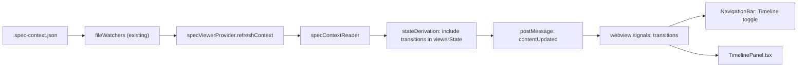

# Plan: Per-Spec Timeline View

**Spec**: [spec.md](./spec.md) | **Date**: 2026-04-28

## Approach

Add a new Preact `TimelinePanel` to the spec-viewer webview that renders the existing `transitions[]` array from `.spec-context.json` as a vertical, oldest-first list grouped by step. A "Timeline" toggle next to the step tabs in `NavigationBar` swaps the main pane between markdown and timeline (no separate webview, no new file format). Live updates piggyback on the existing `.spec-context.json` watcher in `fileWatchers.ts` — when it fires we re-derive `viewerState` and re-post `contentUpdated` to the open webview, so transitions stream in without a reload.

## Technical Context

**Stack**: TypeScript 5.3 (strict, ES2022) extension + Preact 10 + `@preact/signals` webview, Webpack 5.
**Key Dependencies**: existing `specContextReader`, `fileWatchers`, `stateDerivation`, `signals.ts` — no new deps.
**Constraints**: must work on shipped `.vsix` only (no `.claude/**` or `.specify/**` writes); webview can't access fs directly so transitions must be threaded through extension messages.

## Architecture

## Files

### Create

- `webview/src/spec-viewer/components/TimelinePanel.tsx` — Preact component that renders the grouped, oldest-first list of transitions; relative timestamp (`Xs/Xm/Xh/Xd ago`) with absolute ISO in `title`; empty state; per-step grouping; actor badge.
- `webview/src/spec-viewer/components/TimelineEntry.tsx` — single transition row; reused by the grouped renderer.
- `webview/src/spec-viewer/relativeTime.ts` — `formatRelativeTime(iso: string, now?: Date): string` helper (returns `"just now" | "Xm ago" | "Xh ago" | "Xd ago"`); separate from `elapsedFormat.ts` because that one formats live elapsed timers, not historical deltas.
- `webview/styles/spec-viewer/_timeline.css` — vertical-rail layout, step-grouped indentation, actor badge variants, theme-token colors. Imported from `index.css`.
- `src/features/spec-viewer/__tests__/transitionsViewerState.test.ts` — unit tests for the state-derivation slice that copies `transitions` into `viewerState` (empty array, missing field, ordering preservation).
- `webview/src/spec-viewer/__tests__/relativeTime.test.ts` — boundaries for `formatRelativeTime` (just now, minute, hour, day, multi-day).

### Modify

- `src/core/types/specContext.ts` — widen `TransitionBy` from `'extension' | 'user' | 'cli'` to `'extension' | 'user' | 'cli' | 'sdd' | 'ai'` so on-disk values written by `/sdd:*` skills (already present in real `.spec-context.json` files including this spec) type-check; per NFR001 the reader still preserves any unknown value defensively.
- `src/features/spec-viewer/types.ts` — add `transitions: Transition[]` to `ViewerState` (and the `ExtensionToViewerMessage.contentUpdated.viewerState` payload type).
- `src/features/spec-viewer/stateDerivation.ts` — populate `viewerState.transitions` from the read `SpecContext`; default to `[]` when missing.
- `src/features/spec-viewer/specViewerProvider.ts` — add `refreshContextIfDisplaying(specContextPath)` that re-reads context, re-derives `viewerState`, and posts `contentUpdated` (current `refreshIfDisplaying` only fires on markdown changes).
- `src/core/fileWatchers.ts` — in `handleSpecContextChange`, after `specExplorer.refresh()`, also call `specViewerProvider.refreshContextIfDisplaying(uri.fsPath)` so the open viewer sees the new transition (NFR004: piggyback the existing watcher, no new polling).
- `webview/src/spec-viewer/types.ts` — add `transitions: Transition[]` to the webview's `ViewerState` mirror.
- `webview/src/spec-viewer/signals.ts` — add `timelineVisible = signal(false)` and `transitions = signal<Transition[]>([])`.
- `webview/src/spec-viewer/index.tsx` — wire `viewerState.transitions` into the `transitions` signal on every `contentUpdated`.
- `webview/src/spec-viewer/components/NavigationBar.tsx` — add a "Timeline" toggle button at the right end of `.nav-primary`; clicking flips `timelineVisible`. Active state styled with the existing accent ring used by current step tab.
- `webview/src/spec-viewer/App.tsx` — when `timelineVisible.value === true`, render `<TimelinePanel />` in place of the markdown pane (markdown pane stays mounted but hidden via `hidden` attribute so toggling back is instant; satisfies NFR003 by deferring TimelinePanel's first render until the toggle is clicked).
- `webview/styles/spec-viewer/index.css` — `@import './_timeline.css';`.
- `README.md` — add a short subsection under "Reading Specs" describing the Timeline toggle (per CLAUDE.md doc map: new webview UI element).
- `docs/viewer-states.md` — document the new timeline panel state and its toggle interaction (per CLAUDE.md: viewer-states changes go here).

## Data Model

- `Transition` (existing, in `src/core/types/specContext.ts`) — fields: `step, substep, from, by, at`. **No schema change** other than widening `TransitionBy` to include the literals already being written on disk (`'sdd' | 'ai'`).
- `ViewerState` (modified) — gains `transitions: Transition[]`. The webview mirror in `webview/src/spec-viewer/types.ts` adds the same field.

## Testing Strategy

- **Unit (extension-side)**: `transitionsViewerState.test.ts` verifies `deriveViewerState` copies `transitions` straight from `SpecContext`, defaults to `[]` for missing/null, and preserves order.
- **Unit (webview-side)**: `relativeTime.test.ts` covers each bucket boundary (`<1m → "just now"`, `<1h → "Xm ago"`, `<1d → "Xh ago"`, `>=1d → "Xd ago"`).
- **Edge cases from spec to cover**:
  - R006 empty state — `transitions: []` renders the placeholder, not a blank panel.
  - R005 ordering — array order from disk is preserved (extension never reverses; webview doesn't sort).
  - R009 grouping — consecutive entries with the same `step` collapse under one heading; entries break into a new group when `step` changes.
  - R010 actor — entries with `by: 'cli'` and `by: 'sdd'` get a distinct visual badge from `by: 'extension'`.
  - Live update — appending a transition to the JSON on disk causes the panel to gain a row without a reload (manual scenario; covered by reusing the existing watcher path).

## Risks

- **`TransitionBy` type widen could collide with downstream consumers.** Mitigation: grep the repo for `TransitionBy` before merging; current usage is the type alias itself plus the field type in `Transition` — no narrow switches that would need new branches.
- **`contentUpdated` becomes the carrier for two unrelated concerns** (markdown change vs. context-only change). Mitigation: keep using the same message but only re-derive what changed; if the noise becomes a problem later, split into a `transitionsUpdated` message — the receiver in the webview already centralizes message handling so the swap is one place.

## Summary

The data is already on disk (every `/sdd:*` skill writes a `transitions[]` row); we just don't surface it. This plan adds a Preact panel inside the existing spec viewer plus a toggle in the nav bar, threads `transitions` through `viewerState` via the reader and watcher we already trust, and re-uses the theme tokens and step colors so the timeline matches the rest of the viewer. No new schema, no new watcher, no new webview — read-only history surfaced where the user already is.
