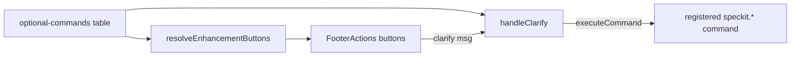

# Plan: Optional SpecKit Commands

**Spec**: [spec.md](./spec.md)

## Approach

Surface the three already-registered optional commands as **built-in,
workflow-agnostic enhancement buttons** scoped to the spec viewer's step tabs:
Clarify on the spec tab, Checklist on the plan tab, Analyze on the tasks tab.
Rather than building new prompt logic, the buttons reuse the existing registered
VS Code commands (`speckit.clarify` / `speckit.checklist` / `speckit.analyze`)
via `vscode.commands.executeCommand`, so dispatch, provider formatting, and step
tracking stay identical to invoking them from the Command Palette. A small
declarative table (command → tab → label/tooltip) drives both the render side
(`resolveEnhancementButtons`) and the click side (`handleClarify`), and the
buttons are de-duplicated against user `customCommands` so a user override always
wins.

## Architecture

## Files

### Create

- `src/features/spec-viewer/optionalCommands.ts` — declarative table of the
  three built-in optional commands (command id, target tab, label, tooltip) plus
  two pure helpers: `optionalCommandButtonsForTab(docType, seen)` returning
  `EnhancementButton[]` for a tab (skipping already-seen commands), and
  `isOptionalCommand(command)` predicate used by the dispatch fallback.
- `src/features/spec-viewer/__tests__/optionalCommands.test.ts` — unit tests for
  both helpers (per-tab mapping, dedup behavior, predicate).

### Modify

- `src/features/spec-viewer/specViewerProvider.ts` — in
  `resolveEnhancementButtons`, after merging `customCommands` and workflow
  commands, append `optionalCommandButtonsForTab(docType, seenCommands)` so the
  built-in buttons render on the matching tab, deduped against user commands.
- `src/features/spec-viewer/messageHandlers.ts` — in `handleClarify`, add a
  fallback (after the customCommands and workflow-command loops, before the
  "no command configured" log): if `buttonCommand` is an optional command,
  dispatch it via `vscode.commands.executeCommand(buttonCommand, targetPath)`
  and return.
- `src/features/spec-viewer/__tests__/messageHandlers.test.ts` — add cases:
  clicking a built-in optional button invokes the matching registered command
  with the spec dir; a user customCommand with the same id still wins.
- `README.md` — "Reading Specs" subsection: document the per-tab optional
  command buttons (Clarify / Checklist / Analyze).
- `docs/viewer-states.md` — footer button matrix: add the optional-command
  buttons row(s) showing which button appears on which step tab.
- `CHANGELOG.md` — add an entry under New Features.

## Testing Strategy

- **Unit**: Jest (extension-side) for `optionalCommands.ts` helpers — verify each
  tab yields the correct button, dedup against a `seen` set, and the predicate.
- **Integration**: extend `messageHandlers.test.ts` to assert
  `vscode.commands.executeCommand` is called with the right command id + target
  path on click, and that an identical user customCommand takes precedence.
- **Manual**: launch the Extension Development Host, open a spec, and confirm
  Clarify shows only on the spec tab, Checklist only on plan, Analyze only on
  tasks, and that clicking each runs the command in the AI CLI terminal.

## Risks

- Dispatch ordering: the built-in fallback must run only after user
  `customCommands` / workflow commands fail to match, so a user override of the
  same command id keeps its raw-prompt behavior — mirror the render-side dedup
  exactly so rendered button and click handler agree on which wins.
