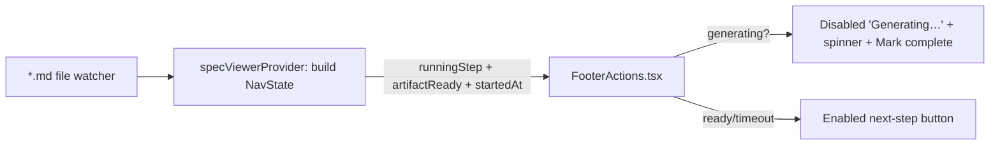

# Plan: Step Button Loading State

**Spec**: [spec.md](./spec.md)

## Approach

Replace the footer's current "hide every button while a step is in-flight"
behavior with an explicit, content-aware **Generating** state. The extension
already derives a `runningStep` (a step with `startedAt` and no `completedAt`)
and ships it to the webview in `NavState.activeStep`; we extend that derivation
with a filesystem check — does the running step's `{step}.md` exist with
non-trivial content — and pass `runningStepArtifactReady` + `runningStepStartedAt`
to the webview. `FooterActions.tsx` then renders a disabled `Generating {step}…`
button with a spinner while the artifact is missing, re-enables to the next
step's label once the artifact is detected (the existing `*.md` file watcher
already triggers a viewer refresh, so no new polling), and falls back to the
current step's label after a recovery timeout. A manual "Mark step complete"
button gives the user an escape hatch when auto-detection never fires.

## Architecture

## Files

### Create

- `src/features/spec-viewer/stepArtifact.ts` — `hasNonTrivialArtifact(specDir, step)`:
  maps a step name to its filename (`spec.md` / `plan.md` / `tasks.md`; `implement`
  has no single artifact → treated via task progress), strips frontmatter +
  whitespace, returns `true` only when the remaining body clears a small length /
  heading threshold (the non-trivial-content guard, R003/R008).

### Modify

- `src/features/spec-viewer/specViewerProvider.ts` — next to the existing
  `runningStep` derivation (~L862), compute `runningStepArtifactReady` via
  `hasNonTrivialArtifact` and capture the running entry's `startedAt`; add both to
  the `NavState` object (~L873).
- `src/features/spec-viewer/types.ts` — extend `NavState` with
  `runningStepArtifactReady?: boolean` and `runningStepStartedAt?: string | null`.
- `webview/src/spec-viewer/types.ts` — mirror the two `NavState` fields; add
  `{ type: 'markStepComplete' }` to `ViewerToExtensionMessage`.
- `webview/src/spec-viewer/components/FooterActions.tsx` — replace the
  `visible = isRunning ? [] : vs.footer` hide with a Generating branch: while the
  running step's artifact is not ready, render a disabled `Generating {label}…`
  button (spinner) plus a secondary "Mark step complete" button; re-enable to the
  next-step label once `runningStepArtifactReady` (or `completedAt`) is true; if
  `now - runningStepStartedAt` exceeds the recovery window, drop back to the
  current step's enabled label (R002, R005, R006). Apply to all transitions (R004).
- `webview/src/shared/components/Button.tsx` — add `loading?: boolean` that
  renders a spinner glyph and forces `disabled`.
- `webview/styles/spec-viewer/_actions.css` — spinner keyframes + `.btn-spinner`
  (reuse the existing pulse motion tokens if present).
- `src/features/spec-viewer/messageHandlers.ts` — handle `markStepComplete`:
  resolve the running step and call `completeStep(specDir, step, 'extension')`,
  then `updateContent` to refresh.
- `docs/viewer-states.md` — rewrite the "Hide-during-in-flight" note to
  "Generating-during-in-flight" (disabled button + spinner + manual completion +
  timeout recovery).
- `README.md` — update the "Reading Specs" footer-button description so the
  documented behavior matches the new Generating state.

## Testing Strategy

- **Unit**: `stepArtifact.test.ts` — non-trivial vs empty/stub/frontmatter-only
  files return correct readiness; missing file → `false`.
- **Unit**: extend `stateDerivation` / provider nav-state tests to assert
  `runningStepArtifactReady` / `runningStepStartedAt` are populated for an
  in-flight step and cleared when the artifact exists.
- **Edge cases**: half-written file stays "generating"; timeout recovery returns
  to current label; manual "Mark step complete" advances the button.

## Risks

- Re-introducing file-existence as a completion signal partially reverses
  spec-060 (which made completion context-only): scope it strictly to the
  *button render state*, not to the canonical badge/status derivation, to avoid
  regressing the documented model.
- Recovery-timeout window: too short strands fast machines mid-generation, too
  long hides a silent AI failure — pick a generous default and let the manual
  button cover the gap.
