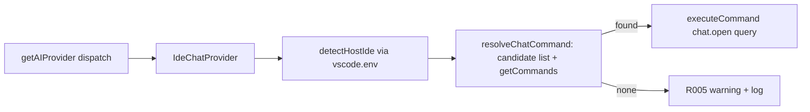

# Plan: IDE Chat Provider

**Spec**: [spec.md](./spec.md)

## Approach

Add a new `IdeChatProvider` that implements `IAIProvider` like every CLI provider, but instead of spawning a terminal it routes the already-assembled prompt to the host editor's built-in AI chat via a VS Code command. The provider detects the host (VS Code → Copilot, Cursor → Composer, Windsurf → Cascade) from `vscode.env`, resolves a chat-open command from a per-IDE ordered candidate list, and only dispatches after verifying the command actually exists (`vscode.commands.getCommands(true)`) — otherwise it shows the R005 graceful message. It registers identically to the other providers (constant + `package.json` enum + `PROVIDER_PATHS` + factory map), so no dispatch call site changes except a one-line return-type widening that the existing terminal tracker already tolerates.

## Architecture

## Open Questions — resolved

- **Q1 (chat command IDs)**: Use a per-IDE ordered list of candidate command IDs and verify each against `vscode.commands.getCommands(true)` before dispatch.
  - VS Code / Copilot: `workbench.action.chat.open` with arg `{ query, isPartialQuery: true }` (documented).
  - Cursor: try base `workbench.action.chat.open` first (forks usually inherit it), then known fork candidates (`aichat.newchataction`, `composer.startComposerPrompt`).
  - Windsurf: try base `workbench.action.chat.open` first, then `windsurf.prioritized.chat.open` / Cascade candidates.
  - First candidate present in `getCommands` wins; if none present → R005 path.
- **Q2 (auto-submit vs prefill)**: Auto-submit when the workspace is spec-kit-initialized (`isPartialQuery: false`); otherwise prefill (`isPartialQuery: true`) and warn. The prompt is already reviewed in the viewer, so auto-submit once the host chat can actually act on it — and never auto-fire a `/speckit.*` command the chat won't recognize. Readiness is read from `SpecKitDetector.checkWorkspaceInitialized()` (checks `.specify/` / host command files); the warning offers an action that runs `Commands.initWorkspace`.
- **Q3 (headless behavior)**: `executeHeadless` degrades to the interactive chat path (dispatches the prompt to chat) and returns `{ exitCode: undefined }`. Callers (`steeringManager`) already treat `undefined` exit code as a non-failure, so there is no spurious error.

## Files

### Create

- `src/ai-providers/ideChatProvider.ts` — `IdeChatProvider implements IAIProvider`. Host detection (`detectHostIde` via `vscode.env.appName`/`uriScheme` → `'vscode' | 'cursor' | 'windsurf'`), `resolveChatCommand` (candidate list + `getCommands(true)` verification), and dispatch via `vscode.commands.executeCommand(cmdId, { query, isPartialQuery })`. `isPartialQuery` is `false` (auto-submit) when `isWorkspaceSpecKitReady()` (delegates to `SpecKitDetector.checkWorkspaceInitialized()`) is true, else `true` (prefill) plus a `warnSpecKitNotReady` warning whose action runs `Commands.initWorkspace` (R007). `executeInTerminal`/`executeSlashCommand` dispatch to chat and return `undefined`; `executeHeadless` dispatches and returns `{ exitCode: undefined }`; `isInstalled` returns whether a chat target was resolvable; `getPermissionFlag` returns `''`. All paths wrapped so nothing throws (NFR001); R005 message points the user back to a CLI provider. Logs detected IDE + chosen command + readiness (R006).
- `src/ai-providers/__tests__/ideChatProvider.test.ts` — BDD tests: detection per `appName`/`uriScheme`, command resolution picks first available candidate, undetectable target → graceful warning (no throw), `executeInTerminal` returns `undefined`, `executeHeadless` returns `{ exitCode: undefined }`.

### Modify

- `src/core/constants.ts` — add `IDE_CHAT: 'ide-chat'` to the `AIProviders` const.
- `src/ai-providers/aiProvider.ts` — add a `PROVIDER_PATHS[AIProviders.IDE_CHAT]` entry (QuickPick metadata: `displayName: 'IDE Chat'`, icon e.g. `$(comment-discussion)`, description; neutral/empty steering·agents·skills config since steering sync is governed by the host editor and is out of scope; `autoApproveFlag: ''`, `supportsInteractivePermissions: true`). Widen `IAIProvider.executeInTerminal` and `executeSlashCommand` return types to `Promise<vscode.Terminal | undefined>`.
- `src/ai-providers/aiProviderFactory.ts` — add `[AIProviders.IDE_CHAT]: (ctx, out) => new IdeChatProvider(ctx, out)` to `PROVIDER_CONSTRUCTORS`.
- `src/ai-providers/index.ts` — `export * from './ideChatProvider'`.
- `package.json` — add `"ide-chat"` to `speckit.aiProvider.enum` and a matching `enumDescriptions` entry.
- `README.md` — add IDE Chat to the "Supported AI Providers" matrix and bump the provider count ("Six providers ship today").

## Testing Strategy

- **Unit (Jest + `tests/__mocks__/vscode.ts`)**: mock `vscode.env.appName`/`uriScheme` and `vscode.commands.getCommands`/`executeCommand`. Cover detection per host, candidate resolution order, and the no-target graceful path. May need to extend the vscode mock with `env`, `commands.getCommands`, and `commands.executeCommand`.
- **Edge cases**: appName/uriScheme that matches no known host; a host where no candidate command is registered (verify `showWarningMessage` fires and nothing throws — NFR001/R005).

## Risks

- **Undocumented Cursor/Windsurf command IDs / argument shapes**: Mitigate by verifying existence with `getCommands(true)` before dispatch and always trying the inherited base `workbench.action.chat.open` first; if a fork ignores the `query` argument the prompt still opens chat (degraded but not broken), and a missing command triggers the R005 message instead of an error.
- **`PROVIDER_PATHS` shape mismatch**: IDE Chat has no CLI or own config dir; the entry carries only QuickPick metadata + empty steering/agents/skills. Steering-sync features that read these paths will treat IDE Chat as a no-op surface — acceptable since dispatch-only is the spec's scope.
