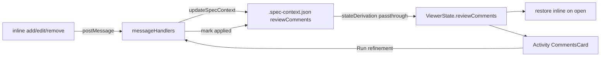

# Plan: Persist inline review comments + Activity view

**Spec**: [spec.md](./spec.md)

## Approach

Move review-comment state from the in-memory `pendingRefinements` signal + per-doc `<doc>-extra.md` files to a single persisted `reviewComments` array on the spec's `.spec-context.json`. The webview posts `addComment` / `editComment` / `removeComment` messages on every mutation; the extension persists them through `specContextWriter.updateSpecContext` (the only sanctioned write surface), then echoes the updated context back so the viewer state stays in sync. On reopen, the extension already ships `reviewComments` inside `ViewerState`, and the webview re-renders each comment inline by matching its stored block text against the freshly rendered DOM — falling back to the nearest matching heading when the source drifted. The Activity panel gains a `CommentsCard` that lists all comments cross-document with status, jump-to-line, and a per-doc **Run refinement** button. Refine no longer writes scratchpad files; it flips the submitted comments to `applied` and keeps them as history. The `<doc>-extra.md` scratchpad path and its "Notes" sub-tab are deleted.

## Architecture

## Files

### Create

- `webview/src/spec-viewer/components/cards/CommentsCard.tsx` — Activity-panel consolidated list of all comments grouped by document; per-comment status badge + jump-to-line; per-document **Run refinement** button.
- `webview/src/spec-viewer/editor/restoreComments.ts` — on-open re-anchoring: match a stored comment's block text against rendered lines; exact match → anchor to that line; else best-effort nearest-heading anchor; mounts each via the existing `renderComment` path.
- `src/features/spec-viewer/reviewComments.ts` — extension-side helpers: build a `ReviewComment` (id, doc, anchor via `extractBlock`, text, status, timestamp) and the pure add/edit/remove/mark-applied mutators passed to `updateSpecContext`.

### Modify

- `src/core/types/specContext.ts` — add `ReviewComment` interface (`id`, `doc`, `anchor: { heading, blockText, line }`, `comment`, `status: 'pending' | 'applied'`, `createdAt`); add optional `reviewComments?: ReviewComment[]` to `SpecContext` and `ViewerState`.
- `src/core/types/spec-context.schema.json` — add the optional `reviewComments` array schema (backward compatible; older files validate).
- `src/features/spec-viewer/stateDerivation.ts` — pass `reviewComments` through to `ViewerState` (new `pickReviewComments` like the existing pickers).
- `src/features/spec-viewer/messageHandlers.ts` — add `addComment` / `editComment` / `removeComment` / `runDocRefinement` cases routed through `specContextWriter`; rewrite `handleSubmitRefinements` to stop writing `<doc>-extra.md` and instead mark submitted comments `applied`; reuse the existing prompt-building (block + heading enrichment) for the AI dispatch.
- `webview/src/spec-viewer/editor/refinements.ts` — `addRefinement`/`addRefinementForRow`/`removeRefinement` post persist messages; `submitAllRefinements` posts the doc's pending comments and no longer clears them locally (they become `applied` on echo-back, not deleted).
- `webview/src/spec-viewer/signals.ts` + `webview/src/spec-viewer/types.ts` — comment/message types; derive the restore set from `viewerState.reviewComments`.
- `webview/src/spec-viewer/components/ActivityPanel.tsx` — render `CommentsCard`; include comments in `hasAnyData`.
- `webview/src/spec-viewer/editor/index.ts` — call `restoreComments` after markdown render completes (and on document switch).
- `src/features/spec-viewer/documentScanner.ts` — stop synthesizing the per-source scratchpad ("Notes") docs.
- `src/core/constants.ts` + `src/features/spec-viewer/types.ts` — remove `ScratchpadFiles` / `SCRATCHPAD_SUFFIX` and the `isScratchpad` / `scratchpadFor` doc fields (and their consumers).
- `README.md` + `docs/viewer-states.md` — document persisted comments, the Activity review surface, and removal of the Notes sub-tab.
- Tests: `src/features/spec-viewer/__tests__/messageHandlers.test.ts` (persist + mark-applied, no `-extra.md`), `documentScanner` (no Notes doc), plus webview re-anchor unit tests.

## Data Model

- `ReviewComment` — fields: `id`, `doc` (`'spec' | 'plan' | 'tasks'`), `anchor` (`{ heading: string | null, blockText: string, line: number }`), `comment`, `status` (`'pending' | 'applied'`), `createdAt` — new; stored as `reviewComments[]` on `.spec-context.json`.

## Testing Strategy

- **Unit (extension)**: comment add/edit/remove mutate `reviewComments` and preserve all other context fields + transitions; Refine marks `applied` and writes no `<doc>-extra.md`; `documentScanner` no longer emits Notes docs.
- **Unit (webview)**: re-anchor matches exact block; falls back to nearest heading on drift; never drops a comment.
- **Edge cases**: reopening a context written by an older extension (no `reviewComments`) loads cleanly; Activity off still persists inline comments.

## Risks

- Re-anchoring false matches when multiple identical blocks exist: anchor on stored `line` first, then block text, then heading — accept best-effort per spec R003.
- Removing `ScratchpadFiles`/`isScratchpad` touches several consumers (documentScanner, types, message handler): land the type removal and its consumers together so the build stays green.
