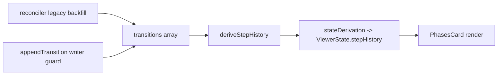

# Plan: Activity View Overhaul

**Spec**: [spec.md](./spec.md)

## Approach

The viewer already **derives** all phase timing from `transitions[]`
(`stepHistoryDerivation.ts` → consumed in `stateDerivation.ts:221`); the on-disk
`stepHistory` is ignored for display. So the data fixes land in that derivation, in the
reconciler's legacy backfill, and in the extension's transition writer — not in trusting
on-disk `stepHistory`. The PHASES card is then re-rendered to expose timing it already
receives (overall header, per-substep durations, in-flight-only "ago", de-duped rows,
author-only-at-start) with an `impeccable` horizontal layout; the sub-nav row is
suppressed while Activity is active; and the types + schema declare the three
viewer-relevant skill-authored fields.

## Architecture

## Files

### Modify

**A. Spec-context data correctness (extension)**

- `src/features/specs/stepHistoryDerivation.ts` — (1) accept the spec `status` (or a
  `completed` flag) and finalize the terminal step's `completedAt` from the last
  transition's `at` when the spec is `completed`/`archived` instead of leaving it `null`
  (R001); (2) collapse consecutive identical `(step, substep)` transitions before
  grouping so derived durations and substep lists are clean (R002, R010-support); keep
  `startedAt`/`completedAt` sourced from real transition `at` values.
- `src/features/spec-viewer/stateDerivation.ts` — pass `ctx.status` into
  `deriveStepHistory(...)` so the terminal-step finalize (R001) can fire.
- `src/features/specs/specContextReconciler.ts` — legacy backfill (R003, R006): replace
  the `now`-stamped fills (lines ~76–88) with best-available real timestamps (spec/plan/
  tasks file mtime, falling back to leaving absent) and only fill genuinely-missing
  `completedAt`; never overwrite an existing real value, never synthesize minute-rounded
  `at`. Idempotent + non-destructive (NFR001).
- `src/features/specs/specContextWriter.ts` — `appendTransition` skips the write when the
  incoming `(step, substep)` is identical to the last transition already in the array
  (R005); distinct substeps within a turn are preserved.

**B. PHASES timeline display (webview)**

- `webview/src/spec-viewer/components/cards/PhasesCard.tsx` — overall card header
  (started / ended / total via `formatDuration`) (R009); per-substep timing on each row
  via `formatStepOffset(group.startedAt, event.startedAt)` or `formatDuration` for
  tracked substeps (R008); de-duplicate consecutive identical `(step, substep)` rows
  (R010); show the `by` badge only on the first spec-start transition, drop it from
  per-substep rows (R011); restrict the relative "Xm ago" to the in-flight step only,
  completed steps show duration only (R012); render durations from the corrected
  stepHistory so no `<1s` on real elapsed time (R007); switch to a horizontal timeline
  layout (R013).
- `webview/styles/spec-viewer/_activity.css` — CSS for the new card header, per-substep
  time row, and horizontal timeline layout; `impeccable` pass (R013).

**C. Activity tab sub-navigation (webview)**

- `webview/src/spec-viewer/components/NavigationBar.tsx` — suppress the `step-children`
  sub-nav row when `activityVisible.value` is true; restore it (existing logic) when
  Activity is toggled off (R014). Minor supporting CSS in
  `webview/styles/spec-viewer/_navigation.css` if needed.

**D. Schema declaration (extension)**

- `src/core/types/specContext.ts` — declare `last_action`, `task_summaries`,
  `step_summaries` as optional fields on `SpecContext` with ownership comments (skill-
  authored, viewer-relevant); leave the rest tolerated via the existing index signature
  (R015).
- `src/core/types/spec-context.schema.json` — add `last_action`, `task_summaries`,
  `step_summaries` as optional properties (R015); extend the transition `by` enum to
  include `sdd` and `ai` so real authored values validate (R016). Keep
  `additionalProperties: true`.

## Testing Strategy

- **Unit (extension, Jest)**: `stepHistoryDerivation` — terminal step finalizes on
  `completed`/`archived`; consecutive identical transitions collapse; real `at` values
  produce non-zero durations. `specContextReconciler` — backfill is idempotent, fills
  only missing `completedAt`, never overwrites real values, no synthetic rounded `at`.
  `appendTransition` — drops a consecutive identical `(step, substep)`, keeps a distinct
  one.
- **Webview**: extend `PhasesCard.stories.tsx` with fixtures for overall header,
  per-substep timing, duplicate-row collapse, author-at-start, in-flight "ago", and the
  terminal-finalized completed spec.
- **Edge cases**: pre-logging spec (no transitions / no timing), in-flight spec
  (last step `completedAt: null`), single-phase spec, `phase1`-repeated implement spec.

## Risks

- **R004 source-label advancement is SDD-skill territory, not extension code.** The
  repeated `phase1` is written by the SDD implement `SKILL.md` (out of scope per spec),
  not by any extension writer. The extension fix is therefore (a) collapse the repeated
  rows at the view layer (R010) and (b) guard extension-authored transitions against
  consecutive duplicates (R005); the *written* label only advances where the extension
  itself authors implement substeps. Visible symptom (the `phase1 ×7` wall) is resolved
  by R010.
- **Legacy backfill is approximate.** Git/mtime timestamps are best-effort. Mitigation:
  fill only genuinely-missing `completedAt`, never overwrite a real transition `at`, and
  keep it idempotent (NFR001) so re-runs are safe.
