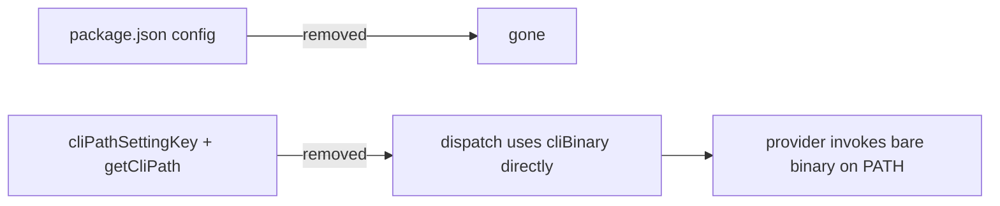

# Plan: Remove CLI Path Override Settings

**Spec**: [spec.md](./spec.md)

## Approach

Delete the path-override config surface and collapse every provider onto its bare CLI binary name. `getCliPath()` in the base `CliTerminalProvider` already falls back to `cliBinary` when `cliPathSettingKey` is `null`, so the cleanest cut is to remove the `cliPathSettingKey` abstraction entirely: drop the field from the base class and all subclasses, and have dispatch use `this.cliBinary` directly. The standalone Gemini provider (which sits outside the `CliTerminalProvider` hierarchy) loses its own `getCliPath` override and `geminiInitDelay` read, hard-coding the former 8000ms default. Finally strip the six properties from `package.json` and the orphaned keys from `constants.ts`.

## Architecture

## Files

### Modify

- `package.json` — remove `speckit.claudePath`, `speckit.geminiPath`, `speckit.copilotPath`, `speckit.qwenPath`, `speckit.opencodePath`, and `speckit.geminiInitDelay` from `contributes.configuration` properties.
- `src/core/constants.ts` — remove `claudePath`, `qwenPath`, `geminiInitDelay` from `ConfigKeys`; remove `geminiInitDelay` from `Timing`.
- `src/ai-providers/cliTerminalProvider.ts` — remove the abstract `cliPathSettingKey` field and the `getCliPath()` method; have `prepareDispatch` resolve `cliPath` from `this.cliBinary` directly.
- `src/ai-providers/geminiCliProvider.ts` — remove the `getCliPath()` override and the `geminiInitDelay` config read; use the bare `gemini` binary and a hard-coded 8000ms init delay.
- `src/ai-providers/copilotCliProvider.ts` — remove `cliPathSettingKey = 'copilotPath'`.
- `src/ai-providers/qwenCliProvider.ts` — remove `cliPathSettingKey = 'qwenPath'`.
- `src/ai-providers/openCodeProvider.ts` — remove `cliPathSettingKey = 'opencodePath'`.
- `src/ai-providers/claudeCodeProvider.ts` — remove `cliPathSettingKey = null` (field no longer exists on base).
- `src/ai-providers/codexCliProvider.ts` — remove `cliPathSettingKey = null` (field no longer exists on base).

## Testing Strategy

- **Build**: `npm run compile` must pass — removing the abstract field surfaces any subclass that still declares it.
- **Unit**: `npm test` — update/remove any provider test that stubs a path setting or asserts on `cliPathSettingKey` / `getCliPath`.
- **Edge cases**: a persisted `speckit.geminiPath` in user settings is silently ignored after removal (VS Code drops unknown keys); dispatch still resolves `gemini` from `PATH`.

## Risks

- A test or provider file may reference `cliPathSettingKey` / `getCliPath` beyond the listed files — the compile step will catch any stragglers; grep before finalizing.
